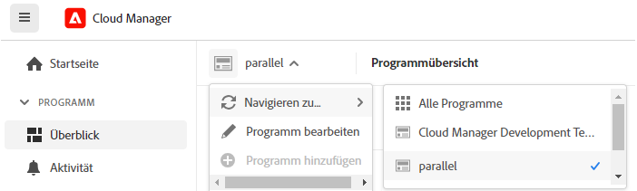
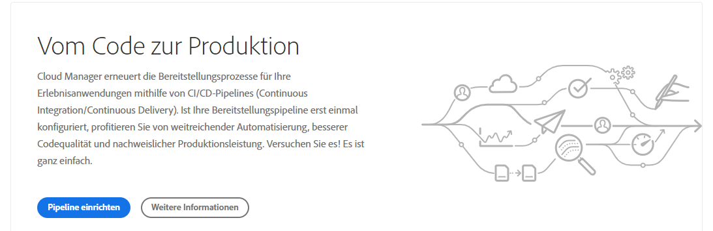

# Navigieren in der Benutzeroberfläche von Cloud Manager {#navigation}

Erfahren Sie, wie die Benutzeroberfläche von Cloud Manager aufgebaut ist und wie Sie Ihre Programme und Umgebungen verwalten.

Die Benutzeroberfläche für die Cloud-Verwaltung besteht in erster Linie aus zwei grafischen Schnittstellen:

* der [Konsole „Meine Programme“](#my-programs-console), in der Sie alle Ihre Programme anzeigen und verwalten können.
* [Das Fenster Programmübersicht](#program-overview) in dem Sie die Details eines einzelnen Programms anzeigen und verwalten können.

## Konsole „Meine Programme“ {#my-programs-console}

Wenn Sie sich bei Cloud Manager unter [experience.adobe.com](https://experience.adobe.com/experiencemanager) anmelden und das entsprechende Unternehmen auswählen, gelangen Sie zur Konsole **Meine Programme**.

Die **Meine Programme** bietet einen Überblick über alle Programme, auf die Sie in der ausgewählten Organisation Zugriff haben. Es besteht aus mehreren Teilen.

|   | Bereich | Beschreibung |
| --- | --- | --- |
| 1 | [Symbolleisten](#toolbars-my-programs-toolbars) | Für Organisationsauswahl, Warnhinweise und Kontoeinstellungen verwenden. |
| 2 | Registerkarte des linken Bedienfelds | Verschiedene Registerkarten, mit denen Sie die aktuelle Ansicht Ihrer Programme umschalten können, darunter die folgenden: <ul><li>**Experience Manager** Öffnet die Startseite für Ihre verschiedenen AEM-Lösungen</li><li>**Alle Programme** die alle verfügbaren Programme anzeigen.</li><li>**Lizenz** öffnet das Lizenz-Dashboard. Das Lizenz-Dashboard gilt nur für *AEM as a Cloud Service-* (AEMaaCS), nicht für Adobe Managed Services-Programme wie AEM 6.5 und AEM 6.5 LTS. Informationen zum Festlegen des Service-Typs Ihres Programms (AEMaaCS oder AMS) finden Sie [&#x200B; Abschnitt &quot;](#program-cards)&quot; in diesem Artikel. Die Registerkarten sind standardmäßig geschlossen und können über das  Dropdown-Menü auf der linken Seite der Kopfzeile [Cloud Manager angezeigt &#x200B;](#cloud-manager-header).</li></ol> |
| 3 | [Meine Programme](#my-programs-section) | Listet alle verfügbaren Programme auf, die Sie auswählen können. Einzelheiten zu [&#x200B; finden Sie unter &#x200B;](/help/getting-started/program-setup.md) und Programmtypen. |
| 4 | [Aktionsaufrufe und Statistiken](#cta-statistics) | Gibt einen Überblick über Ihre letzten Aktivitäten. |
| 5 | [Schnelllinks](#quick-links) | Schneller Zugriff auf zugehörige Ressourcen. |

### Symbolleisten {#my-programs-toolbars}

Es gibt zwei Symbolleisten.

#### Cloud Manager-Kopfzeile {#cloud-manager-header}

Der erste ist die Cloud Manager-Kopfzeile. Die Kopfzeile ist bei Verwendung von Cloud Manager immer sichtbar. Dies ist ein zentraler Speicherort, der Zugriff auf Einstellungen und Informationen bietet, die für alle Cloud Manager-Programme gelten.

| Bereich | Beschreibung |
| --- | --- |
|  | Ein Dropdown-Menü, das Zugriff auf Registerkarten für bestimmte Teile eines einzelnen Programms bietet. Informationen zum Festlegen des Service-Typs Ihres Programms (AMS oder AEMaaCS) finden Sie [&#x200B; Abschnitt &quot;](#program-cards)&quot; in diesem Dokument. |
|  Cloud Manager | Klicken Sie hier, um die **Meine Programme**-Konsole von Cloud Manager zu öffnen, unabhängig davon, wo Sie sich in Cloud Manager befinden. |
| *`Name of selected organization`* | Der Organisationsselektor zeigt die Organisation an, bei der Sie sich derzeit angemeldet haben (in diesem Beispiel *Foundation Internal*). Klicken Sie auf , um zu einer anderen Organisation zu wechseln, wenn Ihre Adobe ID mit mehreren Organisationen verknüpft ist. |
|  Feedback | Klicken Sie hier, um Adobe Feedback zu Cloud Manager zu geben. |
|  | Der KI-Assistent bietet eine Gesprächsoberfläche, mit der Sie Antworten auf Ihre AEM-bezogenen Abfragen finden können. Siehe [KI-Assistent](https://experienceleague.adobe.com/en/docs/experience-manager-65/content/ai-in-aem/ai-assistant/ai-assistant-in-aem#) |
|  | Klicken Sie hier, um schnellen Zugriff auf Lern- und Support-Ressourcen zu ermöglichen. |
|  | Klicken, um die Anzahl der aktuell zugewiesenen unvollständigen [Benachrichtigungen](/help/using/notifications.md) anzuzeigen |
|  | Klicken Sie hier, um schnell zwischen der AEM-Startseite und AEM-Lösungen zu wechseln |
| *`Dynamic Account icon`* | Klicken Sie auf Ihr Benutzerbild, um auf Ihre **Kontoeinstellungen** und **Programmeinstellungen** zuzugreifen oder sich abzumelden. Wenn Sie kein Benutzerbild hinzufügen möchten, wird ein zufälliges Symbol zugewiesen (wie im Symbolleistenbild oben angezeigt). |

<!--
1. The  icon on the left side of the header is  
   * The License Dashboard only applies to AEM as a Cloud Service programs, not AMS programs.
   * To determine the type of service your program has (AMS or AEMaaCS), see the [Program Cards section](#program-cards) of this document.
1. The **Adobe Cloud Manager** button takes you back to the **My Programs** console of Cloud Manager no matter where you are in Cloud Manager.
1. Click **Feedback** to provide feedback to Adobe about Cloud Manager.
1. The organization selector displays the organization that you are currently signed into (in this example, Foundation Internal). Click to switch to another organization if your Adobe ID is associated with multiple.
1. Clicking the solutions switcher lets you quickly jump to other Experience Cloud solutions.
1. The Help icon provides quick access to learning and support resources.
1. The notifications icon is badged with the number of currently assigned incomplete [notifications](/help/using/notifications.md)
1. Select the icon representing your user to access your user settings. If you do not select a user picture, an icon is randomly assigned. 
-->

#### Programmsymbolleiste {#program-toolbar}

Die Programmsymbolleiste bietet Links zum Wechseln zwischen Cloud Manager-Programmen und kontextbezogenen Aktionen.

|   | Bereich | Beschreibung |
| --- | --- | --- |
| 1 | Meine Programme | Klicken Sie hier, um eine Dropdown-Liste zu öffnen, in der Sie ein Programm hinzufügen, andere vorhandene Programme auswählen oder zur Experience Manager-Startseite zurückkehren können. |
| 2 |  Erste Schritte | Klicken Sie hier, um auf die [Onboarding-Dokumentations-Journey](https://experienceleague.adobe.com/de/docs/experience-manager-cloud-service/content/onboarding/journey/overview) zuzugreifen, um Cloud Manager zu verwenden. Die Onboarding-Journey wurde für Cloud Manager on Adobe Experience Manager as a Cloud Service (AEMaaCS) und nicht für Cloud Manager on Adobe Managed Services (AMS) entwickelt. Viele Konzepte sind jedoch gleich. |
| 3 | *`Dynamic action button`* | Die Aktionsschaltfläche bietet kontextbezogene Aktionen, auf die Sie klicken können, **. B.** Programm hinzufügen“ (im Beispiel oben) oder „Domain hinzufügen“. |

### Aktionsaufrufe und Statistiken {#cta-statistics}

Der Abschnitt call-to-action und Statistiken enthält aggregierte Daten für Ihr Unternehmen. Wenn Sie beispielsweise Ihre Programme erfolgreich konfiguriert haben, werden Statistiken zu Ihren Aktivitäten der letzten 90 Tage angezeigt, einschließlich der folgenden:

* Anzahl der [Bereitstellungen](/help/using/code-deployment.md)
* Anzahl der identifizierten [Code-Qualitätsprobleme](/help/using/code-quality-testing.md)
* Anzahl der Builds

Wenn Sie mit der Einrichtung Ihrer Organisation beginnen, finden Sie Anleitungen zu den nächsten Schritten oder Dokumentationsressourcen.

### Meine Programme {#my-programs-section}

Der Hauptinhalt der Konsole „Meine Programme“ ist der Abschnitt **Meine Programme**, in dem Ihre Programme als einzelne Karten aufgeführt sind. Klicken Sie auf eine Karte, um die Seite **Programmübersicht** des Programms aufzurufen, auf der Sie Details zum Programm finden.

Je nach Ihren Berechtigungen können Sie möglicherweise bestimmte Programme nicht auswählen.

Sie können die folgenden Sortieroptionen verwenden, um das gewünschte Programm schnell zu finden:

* Sortieren nach:
   * Erstellungsdatum
   * Programmname
   * Status
*  /  Sortieren von Programmen nach oben bzw. nach unten.
*  /  Zeigen Sie Programme in Rasterform oder Listenform an.

#### Programmkarten {#program-cards}

Eine Karte oder Zeile in einer Tabelle stellt jedes Programm dar und bietet einen Überblick über das Programm sowie schnelle Links, um Maßnahmen zu ergreifen.

* Programmbild (falls konfiguriert)
* Programmname (im obigen Beispiel *WKND-Magazin*)
* Diensttyp:
   * **Experience Manager** für AMS-Programme
   * **Experience Manager Cloud** für [AEM as a Cloud Service-Programme](https://experienceleague.adobe.com/de/docs/experience-manager-cloud-service/content/implementing/home)
* Status (im obigen Beispiel *Bereit*)
* Konfigurierte Lösungen
* Erstellungsdatum

Klicken Sie , um schnell auf zusätzliche Informationen über das Programm zuzugreifen (nützlich in der Listenansicht).

Durch Klicken auf ) erhalten Sie Zugriff auf zusätzliche Aktionen, die Sie im Programm ausführen können.

* Experience Manager - Startseite
* Navigieren zu einer bestimmten [Umgebung](/help/using/managing-environments.md) des Programms
* Öffnen der [Programmübersicht](#program-overview)
* [Bearbeiten des Programms](/help/getting-started/program-setup.md)
* Anzeigen der Überwachung

### Schnell-Links {#quick-links}

Der Abschnitt „Schnelllinks“ bietet Zugriff auf hilfreiche, verwandte Ressourcen.

## Fenster „Programmübersicht“ {#program-overview}

Wenn Sie ein Programm in der Konsole [**Meine Programme**](#my-programs-console) auswählen, gelangen Sie zur Seite **Programmübersicht**.

**Programmübersicht** bietet Zugriff auf alle Details eines Cloud Manager-Programms. Wie **Meine Programme** besteht es aus mehreren Teilen.

1. [Symbolleisten](#program-overview-toolbar), um schnell zur Konsole **Meine Programme** zurückzukehren und im Programm zu navigieren.
1. [Registerkartenbereich](#program-tabs), um zwischen verschiedenen Aspekten des Programms zu wechseln.
1. Einem [Aktionsaufruf](#cta) basierend auf den letzten Aktionen des Programms.
1. Zugeordnete [Umgebungen](#environments) des Programms.
1. Zugeordnete [Pipelines](#pipelines) des Programms.

### Symbolleisten {#program-overview-toolbar}

Die Symbolleisten für die Programmübersicht ähneln denen der Konsole [Meine Programme](#my-programs-toolbars). Hier werden nur die Unterschiede veranschaulicht.

#### Cloud Manager-Kopfzeile {#cloud-manager-header-2}

Die Cloud Manager-Kopfzeile verfügt über ein  Dropdown-Menü, das automatisch geöffnet wird, um die navigierbaren Registerkarten der Programmübersicht anzuzeigen.

Klicken Sie , um die Registerkarten auszublenden.

#### Programmsymbolleiste {#program-toolbar-2}

Die Programm-Symbolleiste bietet weiterhin Zugriff, um schnell zu anderen Programmen zu wechseln. Sie bietet außerdem Zugriff auf kontextbezogene Aktionen, z. B. das Hinzufügen und Bearbeiten des Programms.

Wenn Sie die Registerkarten mithilfe von  ausblenden, kann die Symbolleiste außerdem weiterhin die Registerkarte anzeigen, auf der Sie sich gerade befinden.

### Programmregisterkarten {#program-tabs}

Jedem Programm sind zahlreiche Optionen und Daten zugeordnet. Diese Daten sind in Registerkarten unterteilt, um die Programmnavigation zu vereinfachen. Die Registerkarten bieten Zugriff auf Folgendes:

* Übersicht: Die im aktuellen Dokument beschriebene Programmübersicht
* [Aktivität](/help/using/managing-pipelines.md#activity): Verlauf der Pipeline-Ausführungen des Programms
* [Pipelines](/help/using/managing-pipelines.md#pipelines): Alle für das Programm konfigurierten Pipelines
* [Repositorys](/help/managing-code/managing-repositories.md): Alle für das Programm konfigurierten Repositorys
* [Berichte](/help/using/monitoring-environments.md#system-monitoring-overview): Metriken wie SLA-Daten
* [Umgebungen](/help/using/managing-environments.md): Alle für das Programm konfigurierten Umgebungen
* [Content-Sets](/help/using/content-copy.md): Sätze von Inhalten, die zu Kopierzwecken festgelegt wurden
* [Aktivität zum Kopieren von Inhalten](/help/using/content-copy.md): Aktivitäten zum Kopieren von Inhalten
* Lernpfade: Zusätzliche Lernressourcen zu Cloud Manager

Wenn Sie ein Programm öffnen, gelangen Sie standardmäßig zur Registerkarte **Übersicht**. Die aktuelle Registerkarte ist hervorgehoben. Wählen Sie eine andere Registerkarte aus, um deren Details anzuzeigen.

Um die Registerkarten auszublenden, verwenden Sie  in der Kopfzeile [Cloud Manager](#cloud-manager-header-2).

### Aktionsaufruf {#cta}

Der Abschnitt mit dem Aktionsaufruf stellt Ihnen je nach Status Ihres Programms hilfreiche Informationen zur Verfügung. Für ein neues Programm sehen Sie die angebotenen nächsten Schritte und eine Erinnerung an einen Tag der Live-Schaltung ([&#x200B; bei der Programmerstellung festgelegt](/help/getting-started/program-setup.md).

Bei einem Live-Programm wird der Status der letzten Bereitstellung mit Links zu Details und zum Starten einer neuen Bereitstellung angezeigt.

### Karte „Umgebungen“ {#environments}

Die Karte **Umgebungen** gibt Ihnen einen Überblick über Ihre Umgebungen und stellt Links für Schnellaktionen bereit.

Auf der Karte **Umgebungen** sind nur drei Umgebungen aufgeführt. Klicken Sie auf **Alle anzeigen**, um alle Umgebungen des Programms zu sehen.

Weitere Informationen zur Verwaltung Ihrer Umgebungen finden Sie unter [Verwalten von Umgebungen](/help/using/managing-environments.md).

### Karte „Pipelines“ {#pipelines}

Die Karte **Pipelines** gibt Ihnen einen Überblick über Ihre Pipelines und stellt Links für Schnellaktionen bereit.

Auf der Karte **Pipelines** sind nur drei Pipelines aufgeführt. Klicken Sie auf **Alle anzeigen**, um alle Pipelines des Programms zu sehen.

Weitere Informationen zur Verwaltung Ihrer Pipelines finden Sie unter [Verwalten von Pipelines](/help/using/managing-pipelines.md).

### Nützliche Ressourcen {#useful-resources}

Der Abschnitt **Nützliche Ressourcen** enthält Links zu weiteren Lernressourcen für Cloud Manager.
