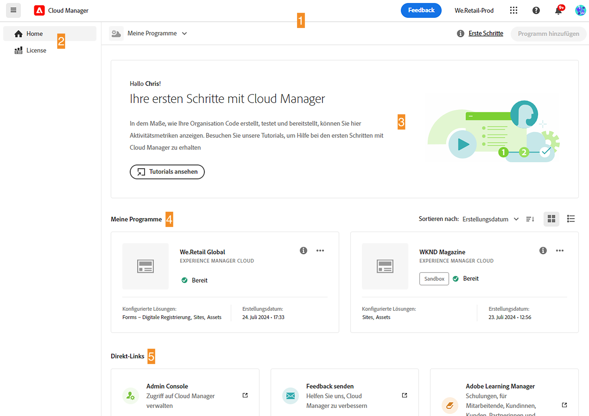
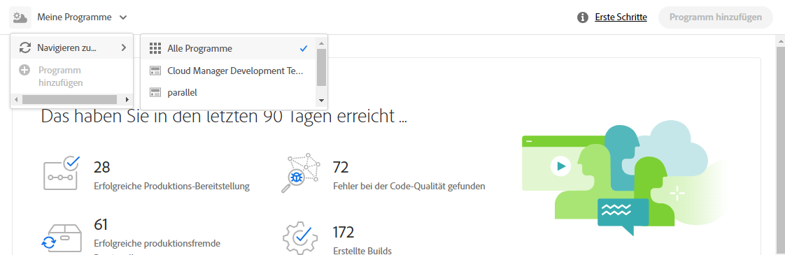

# Navigieren durch die Cloud Manager-Benutzeroberfläche {#navigation}

Erfahren Sie, wie die Benutzeroberfläche von Cloud Manager aufgebaut ist und wie Sie Ihre Programme und Umgebungen verwalten.

Die Benutzeroberfläche für die Cloud-Verwaltung besteht in erster Linie aus zwei grafischen Schnittstellen:

* der [Konsole „Meine Programme“](#my-programs-console), in der Sie alle Ihre Programme anzeigen und verwalten können.
* dem [Fenster „Programmübersicht“](#program-overview), in dem Sie die Details eines einzelnen Programms sehen und verwalten können.

## Konsole „Meine Programme“ {#my-programs-console}

Wenn Sie sich bei Cloud Manager unter [my.cloudmanager.adobe.com](https://my.cloudmanager.adobe.com/) anmelden und die entsprechende Organisation auswählen, gelangen Sie in die Konsole **Meine Programme**.

Die Konsole „Meine Programme“ bietet einen Überblick über alle Programme, auf die Sie in der ausgewählten Organisation Zugriff haben. Sie besteht aus mehreren Teilen.

1. [Symbolleisten](#toolbars-my-programs-toolbars) für die Auswahl von Organisationen, Warnmeldungen und Kontoeinstellungen.
1. Registerkarten, um die aktuelle Ansicht der Programme zu wechseln:

   * Ansicht **Startseite** (Standard) mit Auswahl der Ansicht **Meine Programme**, die einen Überblick über alle Programme enthält.
   * **Lizenz** für den Zugriff auf das Lizenz-Dashboard. Das Lizenz-Dashboard gilt nur für *AEM as a Cloud Service(AEMaaCS)-Programme* und nicht für AMS-Programme. Informationen zum Ermitteln des Diensttyps Ihres Programms (AMS oder AEMaaCS) finden Sie in diesem Artikel unter [Programmkarten](#program-cards).
   * Die Registerkarten sind standardmäßig geschlossen und können über das Dropdown-Menü mit dem Hamburger-Symbol auf der linken Seite der [Cloud Manager-Kopfzeile](#cloud-manager-header) angezeigt werden.

1. [Aktionsaufrufe und Statistiken](#cta-statistics) für einen Überblick über Ihre aktuellen Aktivitäten
1. [**Meine Programme**](#my-programs-section) mit einem Überblick über Ihre gesamten Programme
1. [Schnell-Links](#quick-links) für den einfachen Zugriff auf zugehörige Ressourcen

>[!TIP]
>
>Weitere Informationen zu Programmen finden Sie unter [Programme und Programmtypen](/help/getting-started/program-setup.md).

### Symbolleisten {#my-programs-toolbars}

Es gibt zwei Symbolleisten übereinander.

#### Cloud Manager-Kopfzeile {#cloud-manager-header}

Der erste ist die Cloud Manager-Kopfzeile. Die Kopfzeile bleibt beim Navigieren in Cloud Manager bestehen. Er ist ein Anker, der Ihnen Zugriff auf Einstellungen und Informationen bietet, die für alle Cloud Manager-Programme gelten.

1. Bei dem Hamburger-Symbol auf der linken Seite der Kopfzeile handelt es sich um ein Dropdown-Menü, das den Zugriff auf Registerkarten für bestimmte Teile eines einzelnen Programms ermöglicht. Je nach Kontext können Sie damit auch zwischen dem Lizenz-Dashboard und der Konsole **[Meine Programme](#my-programs-console)** wechseln.
   * Das Lizenz-Dashboard gilt nur für AEM as a Cloud Service-Programme und nicht für AMS-Programme.
   * Informationen zum Ermitteln des Diensttyps Ihres Programms (AMS oder AEMaaCS) finden Sie in diesem Dokument unter [Programmkarten](#program-cards).
1. Über die Schaltfläche „Cloud Manager“ gelangen Sie zurück zur Konsole „Meine Programme“ von Cloud Manager, unabhängig davon, wo Sie sich in Cloud Manager befinden.
1. Klicken Sie auf die Schaltfläche „Feedback“, um Adobe Feedback zu Cloud Manager bereitzustellen.
1. Der Organisationsauswahl zeigt die Organisation an, bei der Sie derzeit angemeldet sind (in diesem Beispiel „We.Retail-Prod“). Klicken Sie auf diese Option, um zu einer anderen Organisation zu wechseln, wenn Ihre Adobe ID mit mehreren Organisationen verknüpft ist.
1. Durch Klicken auf den Lösungsumschalter können Sie schnell zu anderen Experience Cloud-Lösungen wechseln.
1. Das Hilfesymbol bietet Schnellzugriff auf Lern- und Support-Ressourcen.
1. Dieses Benachrichtigungssymbol ist mit der Anzahl der aktuell zugewiesenen unvollständigen [Benachrichtigungen](/help/using/notifications.md) gekennzeichnet.
1. Wählen Sie das Symbol für Ihre Benutzerin bzw. Ihren Benutzer aus, um auf Ihre Benutzereinstellungen zuzugreifen. Wenn Sie kein Benutzerbild auswählen, wird ein zufälliges Symbol zugewiesen.

#### Programmsymbolleiste {#program-toolbar}

Die Programmsymbolleiste enthält Links zum Wechseln zwischen Cloud Manager-Programmen und -Aktionen, die dem Kontext entsprechen.

1. Die Programmauswahl wird in einer Dropdown-Liste geöffnet, in der Sie schnell andere Programme auswählen oder kontextbezogene Aktionen ausführen können, z. B. die Erstellung eines neuen Programms.
1. Über den Link „Erste Schritte“ erhalten Sie Zugriff auf die [Onboarding-Tour](https://experienceleague.adobe.com/de/docs/experience-manager-cloud-service/content/onboarding/journey/overview), die Ihnen den Einstieg in Cloud Manager erleichtert.
Die Onboarding-Tour wurde für Cloud Manager auf Adobe Experience Manager as a Cloud Service (AEMaaCS) und nicht für Cloud Manager auf Adobe Managed Services (AMS) entwickelt. Viele Konzepte sind jedoch gleich.
1. Die Aktionsschaltfläche bietet kontextbezogene Aktionen, z. B. die Erstellung eines neuen Programms.

### Aktionsaufrufe und Statistiken {#cta-statistics}

Im Abschnitt für Aktionsaufrufe und Statistiken finden Sie zusammengefasste Daten zu Ihrer Organisation. Wenn Sie z. B. Ihre Programme erfolgreich eingerichtet haben, können Sie hier Statistiken über Ihre Aktivitäten der letzten 90 Tage einsehen, u. a.:

* Anzahl der [Bereitstellungen](/help/using/code-deployment.md)
* Anzahl der identifizierten [Code-Qualitätsprobleme](/help/using/code-quality-testing.md)
* Anzahl der Builds

Oder wenn Sie gerade mit der Einrichtung Ihrer Organisation beginnen, gibt es Tipps zu den nächsten Schritten oder Dokumentationsressourcen.

### Meine Programme {#my-programs-section}

Der Hauptinhalt der Konsole „Meine Programme“ ist der Abschnitt **Meine Programme**, in dem Ihre Programme als einzelne Karten aufgeführt sind. Klicken Sie auf eine Karte, um die Seite **Programmübersicht** des Programms aufzurufen, auf der Sie Details zum Programm finden.

>[!NOTE]
>
>Abhängig von Ihren Berechtigungen können Sie bestimmte Programme möglicherweise nicht auswählen.

Verwenden Sie die Sortieroptionen, damit Sie das von Ihnen benötigte Programm einfacher finden können:

* Sortieren nach
   * Erstellungsdatum (Standard)
   * Programmname
   * Status
* Aufsteigend (Standard)/Absteigend
* Rasteransicht (Standard)
* Listenansicht

#### Programmkarten {#program-cards}

Jedes Programm wird durch eine Karte oder eine Zeile in einer Tabelle dargestellt, die einen Überblick über das Programm und Schnell-Links bietet, um Maßnahmen zu ergreifen.

* Programmbild (falls konfiguriert)
* Programmname
* Diensttyp:
   * **Experience Manager** für AMS-Programme
   * **Experience Manager Cloud** für [AEM as a Cloud Service-Programme](https://experienceleague.adobe.com/de/docs/experience-manager-cloud-service/content/implementing/home)
* Status
* Konfigurierte Lösungen
* Erstellungsdatum

Über das Informationssymbol erhalten Sie auch Schnellzugriff auf zusätzliche Informationen zum Programm (nützlich in der Listenansicht).

Über das Symbol mit den Auslassungspunkten gelangen Sie zu weiteren Aktionen, die Sie im Programm ausführen können.

* Navigieren zu einer bestimmten [Umgebung](/help/using/managing-environments.md) des Programms
* Öffnen der [Programmübersicht](#program-overview)
* [Bearbeiten des Programms](/help/getting-started/program-setup.md)
* Anzeigen der Überwachung

### Schnell-Links {#quick-links}

Über den Abschnitt „Schnell-Links“ erhalten Sie Zugriff auf hilfreiche, zugehörige Ressourcen.

## Fenster „Programmübersicht“ {#program-overview}

Wenn Sie ein Programm in der Konsole [**Meine Programme**](#my-programs-console) auswählen, gelangen Sie zur Seite **Programmübersicht**.

Die Programmübersicht bietet Zugriff auf alle Details eines Cloud Manager-Programms. Wie die Konsole „Meine Programme“ besteht es aus mehreren Teilen.

1. [Symbolleisten](#program-overview-toolbar), um schnell zur Konsole **Meine Programme** zurückzukehren und durch das Programm zu navigieren.
1. [Registerkarten](#program-tabs), um zwischen verschiedenen Aspekten des Programms zu wechseln
1. Einem [Aktionsaufruf](#cta) basierend auf den letzten Aktionen des Programms.
1. Einer [Übersicht über die Umgebungen](#environments) des Programms.
1. Einer [Übersicht über die Pipelines](#pipelines) des Programms.
1. Links zu [nützlichen Ressourcen](#useful-resources).

### Symbolleisten {#program-overview-toolbar}

Die Symbolleisten für die Programmübersicht ähneln denen der Konsole [Meine Programme](#my-programs-toolbars). Hier werden nur die Unterschiede veranschaulicht.

#### Cloud Manager-Kopfzeile {#cloud-manager-header-2}

Die Cloud Manager-Kopfzeile verfügt über ein Dropdown-Menü mit einem Hamburger-Symbol, das automatisch geöffnet wird, um die navigierbaren Registerkarten der Programmübersicht anzuzeigen.

Klicken Sie auf das Hamburger-Symbol, um die Registerkarten auszublenden.

#### Programmsymbolleiste {#program-toolbar-2}

Die Programmsymbolleiste ermöglicht weiterhin einen schnellen Wechsel zu anderen Programmen, bietet aber auch Zugriff auf kontextbezogene Aktionen wie das Hinzufügen und Bearbeiten des Programms.

Wenn Sie die Registerkarten über das Hamburger-Symbol ausblenden, kann in der Symbolleiste trotzdem die Registerkarte angezeigt werden, auf der Sie sich gerade befinden.

### Programmregisterkarten {#program-tabs}

Jedem Programm sind zahlreiche Optionen und Daten zugeordnet. Diese Daten werden in Registerkarten zusammengefasst, um die Navigation im Programm zu vereinfachen. Die Registerkarten bieten Zugriff auf:

* Übersicht: Die im aktuellen Dokument beschriebene Programmübersicht
* [Aktivität](/help/using/managing-pipelines.md#activity): Verlauf der Pipeline-Ausführungen des Programms
* [Pipelines](/help/using/managing-pipelines.md#pipelines): Alle für das Programm konfigurierten Pipelines
* [Repositorys](/help/managing-code/managing-repositories.md): Alle für das Programm konfigurierten Repositorys
* [Berichte](/help/using/monitoring-environments.md#system-monitoring-overview): Metriken wie SLA-Daten
* [Umgebungen](/help/using/managing-environments.md): Alle für das Programm konfigurierten Umgebungen
* [Content-Sets](/help/using/content-copy.md): Sätze von Inhalten, die zu Kopierzwecken festgelegt wurden
* [Aktivität „Inhalt kopieren“](/help/using/content-copy.md): Aktivitäten zur Inhaltskopie
* Lernpfade: Zusätzliche Lernressourcen zu Cloud Manager

Wenn Sie ein Programm öffnen, gelangen Sie standardmäßig zur Registerkarte **Übersicht**. Die aktuelle Registerkarte ist hervorgehoben. Wählen Sie eine andere Registerkarte aus, um deren Details anzuzeigen.

Verwenden Sie das Hamburger-Menü in der [Cloud Manager-Kopfzeile](#cloud-manager-header-2), um die Registerkarten auszublenden.

### Aktionsaufruf {#cta}

Der Abschnitt mit dem Aktionsaufruf stellt Ihnen je nach Status Ihres Programms hilfreiche Informationen zur Verfügung. Für ein neues Programm werden Ihnen möglicherweise die nächsten Schritte angeboten sowie eine Erinnerung an den Tag der Live-Schaltung, [das bei der Programmerstellung festgelegt wurde](/help/getting-started/program-setup.md).

Bei einem Live-Programm den Status Ihrer letzten Bereitstellung mit Links zu Details und zum Beginn einer neuen Bereitstellung.

### Karte „Umgebungen“ {#environments}

Die Karte **Umgebungen** gibt Ihnen einen Überblick über Ihre Umgebungen und stellt Links für Schnellaktionen bereit.

Die Karte **Umgebungen** listet nur drei Umgebungen auf. Klicken Sie auf **Alle anzeigen**, um alle Umgebungen des Programms zu sehen.

Weitere Informationen zur Verwaltung Ihrer Umgebungen finden Sie unter [Verwalten von Umgebungen](/help/using/managing-environments.md).

### Karte „Pipelines“ {#pipelines}

Die Karte **Pipelines** gibt Ihnen einen Überblick über Ihre Pipelines und stellt Links für Schnellaktionen bereit.

Auf der Karte **Pipelines** sind nur drei Pipelines aufgeführt. Klicken Sie auf **Alle anzeigen**, um alle Pipelines des Programms zu sehen.

Weitere Informationen zur Verwaltung Ihrer Pipelines finden Sie unter [Verwalten von Pipelines](/help/using/managing-pipelines.md).

### Nützliche Ressourcen {#useful-resources}

Der Abschnitt **Nützliche Ressourcen** enthält Links zu weiteren Lernressourcen für Cloud Manager.
