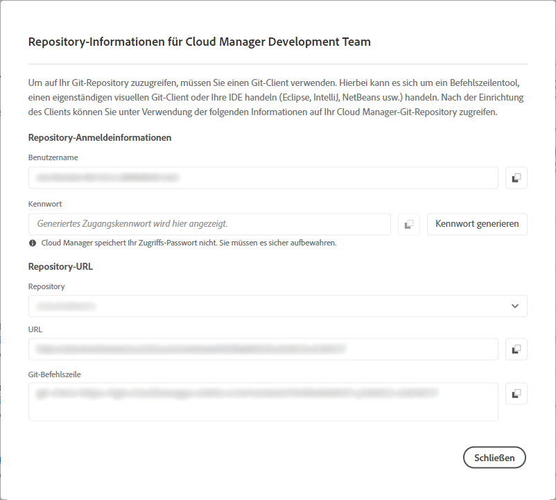

# Repository-Zugriffsinformationen {#accessing-repos}

Erfahren Sie, wie Sie mithilfe der Self-Service-Git-Kontoverwaltung in Cloud Manager auf Ihre von Adobe verwalteten Git-Repositorys zugreifen und diese verwalten können.

## Zugriff auf Repository-Informationen von der Übersichtsseite aus {#overview-page}

Cloud Manager erleichtert das Abrufen Ihrer Repository-Zugriffsinformationen für von Adobe verwaltete Repositorys mithilfe von **Access Repo Info** über die Karte **Pipelines** .

Im Dialogfeld **Repository Info** können Sie die folgenden Zugriffsinformationen für von Adobe verwaltete Repositorys anzeigen:

* Den Git-Benutzernamen.
* Das Git-Kennwort.
* Die URL zum Git-Repository von Cloud Manager.
* Vordefinierte Git-Befehle zum schnellen Hinzufügen einer Remote-Verbindung zu Ihrem Git-Repository und Push-Code.

  

Zugriffsinformationen über [private Repositorys](/help/managing-code/private-repositories.md) sind in Cloud Manager nicht verfügbar.

Die Funktion **Zugriff auf Repo Info** ist für Benutzer mit den Rollen **Entwickler** oder **Bereitstellungs-Manager** sichtbar.

**So greifen Sie auf Repository-Informationen von der Seite &quot;Übersicht&quot;zu:**

1. Melden Sie sich unter [my.cloudmanager.adobe.com](https://my.cloudmanager.adobe.com/) bei Cloud Manager an und wählen Sie die entsprechende Organisation sowie das entsprechende Programm aus.

1. Klicken Sie auf der Seite **Programmübersicht** unter der Karte **Pipelines** auf **Auf Repo Info zugreifen**.

   

1. Um auf das Kennwort zugreifen zu können, muss ein neues Kennwort generiert werden. Wählen Sie im Dialogfeld **Repository Info** die Option **Kennwort generieren**.

1. Wählen Sie im Bestätigungsdialogfeld **Kennwort generieren** aus.

1. Klicken Sie rechts neben dem Feld **Kennwort** auf das Symbol  , um das Kennwort in die Zwischenablage zu kopieren.

   * Durch das Generieren eines Kennworts wird das vorherige Kennwort ungültig.
   * Cloud Manager speichert das Kennwort nicht. Es liegt in Ihrer Verantwortung, das Kennwort sicher zu speichern.
   * Da Cloud Manager das Kennwort nicht speichert, müssen Sie ein neues Kennwort neu generieren, wenn Sie das Kennwort verlieren.

   

Mithilfe dieser Anmeldeinformationen können Sie eine lokale Kopie des Repositorys klonen, Änderungen an diesem lokalen Repository vornehmen und etwaige Code-Änderungen wieder in das Remote-Code-Repository in Cloud Manager übertragen.

## Zugreifen auf Repository-Informationen über das Fenster „Repositorys“ {#repositories-window}

Die Funktion **Zugriff auf Repo Info** ist auch auf der Seite [**Repositorys**](/help/managing-code/managing-repositories.md) verfügbar. Es werden dieselben Informationen zum Zugriff auf von Adobe verwaltete Repositorys angezeigt.

## Widerrufen eines Zugangskennworts {#revoke-password}

Sie können jederzeit ein Zugangskennwort sperren.

Erstellen Sie dazu ein Support-Ticket für diese Anfrage](https://experienceleague.adobe.com/?lang=de?support-solution=Experience+Manager&amp;support-tab=home#support). [ Das Ticket wird mit hoher Priorität behandelt und normalerweise innerhalb eines Tages widerrufen.
