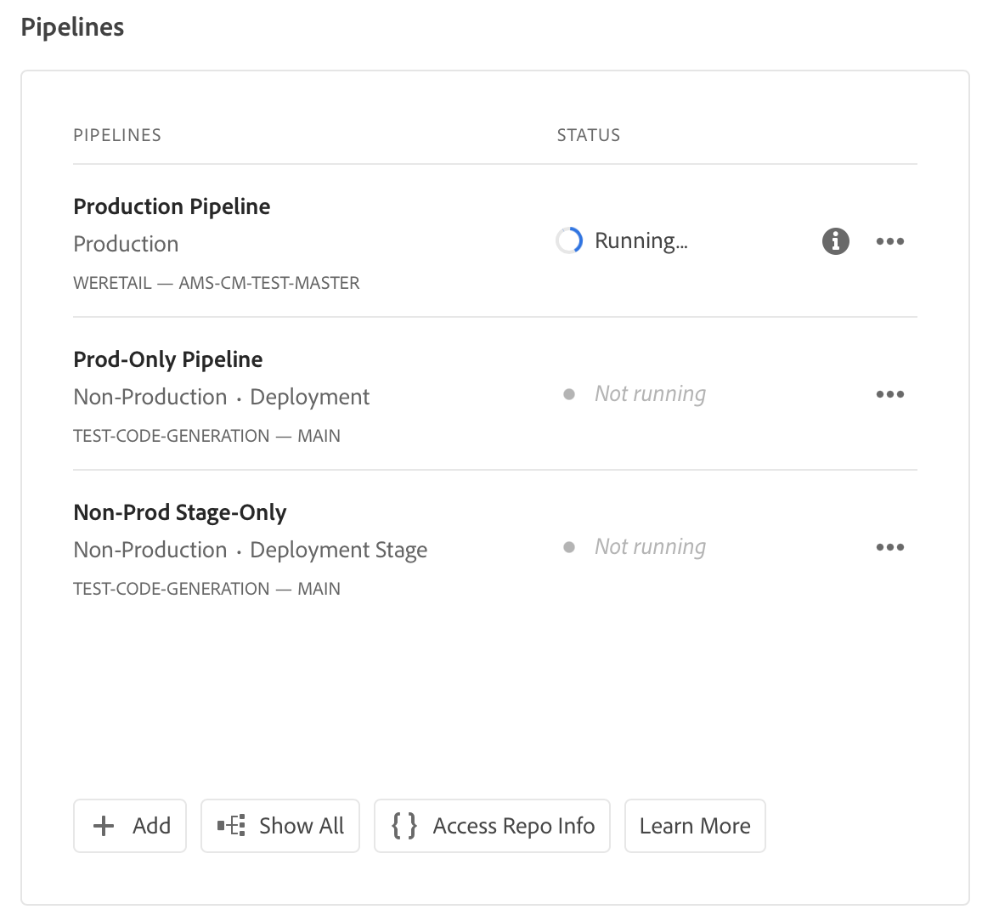

# Zugriff auf Repository-Informationen {#accessing-repos}

Erfahren Sie, wie Sie mithilfe der Self-Service-Git-Kontoverwaltung über Cloud Manager auf Ihre von Adobe verwalteten Git-Repositorys zugreifen und diese verwalten können.

## Zugriff auf Repository-Informationen von der Übersichtsseite aus {#overview-page}

Cloud Manager macht es Ihnen leicht, Ihre Repository-Zugriffsinformationen für von Adobe verwaltete Repositorys abzurufen, indem Sie die Schaltfläche **Auf Repository-Informationen zugreifen** verwenden, die sich auf der Pipeline-Karte befindet.

1. Melden Sie sich unter [my.cloudmanager.adobe.com](https://my.cloudmanager.adobe.com/) bei Cloud Manager an und wählen Sie die entsprechende Organisation sowie das entsprechende Programm aus.

1. Gehen Sie von Ihrer Seite **Programmübersicht** aus zur Karte **Pipelines**.

   

1. Tippen oder klicken Sie auf die Schaltfläche **Auf Repository-Informationen zugreifen**, um das Dialogfeld **Repository-Informationen** zu öffnen, das Ihnen Folgendes anzeigt:

   * Der Git-Benutzername.
   * Das Git-Kennwort.
   * Die URL zum Git-Repository von Cloud Manager.
   * Vordefinierte Git-Befehle zum schnellen Hinzufügen einer Remote-Verbindung zu Ihrem Git-Repository und Push-Code.

   

1. Um auf das Kennwort zugreifen zu können, muss ein neues Kennwort generiert werden. Tippen oder klicken Sie hierzu auf die Schaltfläche **Kennwort generieren**.

1. Bestätigen Sie die Generierung des Kennworts im Dialogfeld **Sind Sie sicher …?** durch Tippen oder Klicken auf **Kennwort generieren**.

   

1. Das Kennwort wird generiert und ist für das Kopieren in das Feld **Kennwort** sichtbar.

   * Durch das Generieren eines Kennworts wird das vorherige Kennwort ungültig.
   * Cloud Manager speichert das Kennwort nicht. Es liegt in Ihrer Verantwortung, dieses Kennwort sicher zu speichern.
   * Da Cloud Manager das Kennwort nicht speichert, müssen Sie ein neues Kennwort generieren, wenn Sie ihr Kennwort verlieren.

   

Mithilfe dieser Anmeldeinformationen können Benutzende eine lokale Kopie des Repositorys klonen, Änderungen an diesem lokalen Repository vornehmen und etwaige Code-Änderungen wieder in das Remote-Code-Repository in Cloud Manager übertragen.

>[!NOTE]
>
>* Die Option **Auf Repository-Informationen zugreifen** ist für Benutzende mit der Rolle **Entwickler** oder **Bereitstellungs-Manager** sichtbar.
>* Durch die Schaltfläche **Auf Repository-Informationen zugreifen** werden nur die Repository-Zugriffsinformationen für von Adobe verwaltete Repositorys angezeigt. Zugriffsinformationen über [private Repositorys](private-repositories.md) sind in Cloud Manager nicht verfügbar.

## Zugriff auf Repository-Informationen über das Fenster „Repositorys“ {#repositories-window}

Eine Schaltfläche **Auf Repository-Informationen zugreifen** ist auch in der Symbolleiste des Fensters [**Repositorys** verfügbar.](managing-repositories.md) Es werden dieselben Informationen zum Zugriff auf von Adobe verwaltete Repositorys angezeigt.

## Sperren eines Zugangskennworts {#revoke-password}

Sie können jederzeit ein Zugangskennwort sperren lassen. [Erstellen Sie für diese Anfrage ein entsprechendes Support-Ticket.](https://experienceleague.adobe.com/?lang=de?support-solution=Experience+Manager&amp;support-tab=home#support)

Das Ticket wird mit hoher Priorität behandelt und die Sperrung sollte innerhalb eines Tages erfolgen.