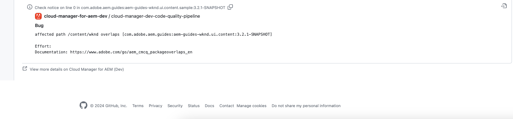

# Anmerkungen zur GitHub-Prüfung {#github-annotations}

Erfahren Sie, wie GitHub-Prüfungen PRs für Ihre privaten Repositorys kommentieren, um Ihnen Feedback zu geben.

## Überblick {#overview}

Wenn Sie [private Repositorys](private-repositories.md) für Ihr Cloud Manager-Programm verwenden, werden bei jeder Pull-Anfrage automatisch Prüfungen in GitHub ausgeführt. Diesen Prüfungen werden Informationen hinzugefügt, die Ihnen helfen, Probleme mit Ihrem Code so schnell wie möglich zu identifizieren.

Von [SonarQube](/help/using/custom-code-quality-rules.md) erkannte Probleme mit der [Code-Qualität](/help/using/code-quality-testing.md) werden eindeutig aufgeführt.

Die genaue Codezeile mit dem Problem wird angegeben und Sie können sie auswählen, um den entsprechenden Code anzuzeigen. Diese Anmerkungen werden für alle Code-Probleme bereitgestellt, nicht nur für die in der Pull-Anfrage.

Alle kommentierten Zeilen werden auf der Registerkarte **Geänderte Dateien** für die GitHub-Pull-Anfrage zusammengetragen. Anmerkungen für Dateien, die in der Pull-Anfrage nicht geändert wurden, werden in einem separaten Abschnitt angezeigt.

## Code-Qualitäts-Pipelines {#code-quality-pipelines}

Die [Code](/help/using/code-quality-testing.md)Qualitätsergebnisse sind auch in der Pipeline sichtbar, die von Cloud Manager automatisch Trigger wird, am unteren Rand der Registerkarte **Prüfungen**. Auf sie kann auch über die **Details** der Prüfung für die Pull-Anfrage zugegriffen werden.

Sie können die Probleme auch als CSV-Datei anzeigen. Sie können auf diese Informationen zugreifen, indem Sie [die Details der Pipeline-Ausführung in Cloud Manager anzeigen](/help/using/managing-pipelines.md).
