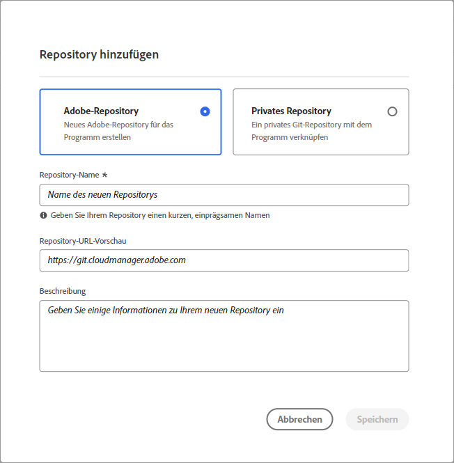
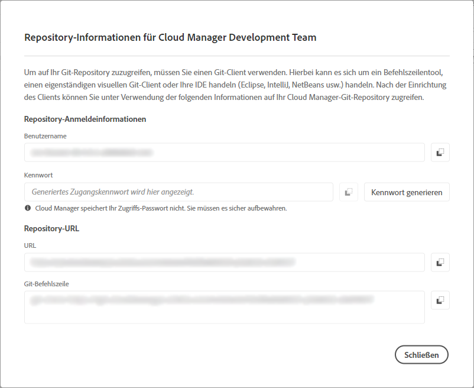
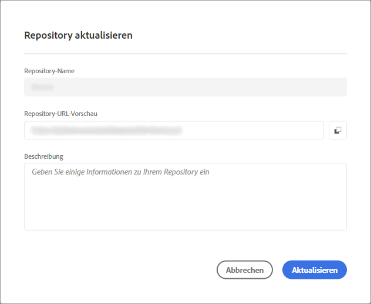

# Repositorys in Cloud Manager verwalten {#cloud-manager-repos}

Erfahren Sie, wie Sie ein Git-Repository in Cloud Manager anzeigen, hinzufügen und löschen.

## Übersicht {#overview}

Repositorys in Cloud Manager werden zum Speichern und Verwalten des Projektcodes mithilfe von Git verwendet. Für jedes von Ihnen hinzugefügte *Programm* wird automatisch ein von Adobe verwaltetes Repository erstellt.

Darüber hinaus haben Sie die Möglichkeit, weitere von Adobe verwaltete Repositorys zu erstellen oder eigene private Repositorys hinzuzufügen. Alle mit Ihrem Programm verknüpften Repositorys können auf der Seite **Repositorys** angezeigt werden.

In Cloud Manager erstellte Repositorys können auch beim Hinzufügen oder Bearbeiten von Pipelines ausgewählt werden. Weitere Informationen zum Konfigurieren von Pipelines finden Sie unter [CI/CD Pipelines](/help/overview/ci-cd-pipelines.md).

Jede Pipeline ist mit einem primären Repository oder einer Verzweigung verknüpft. Mit der Unterstützung von [Git-Untermodulen](/help/managing-code/git-submodules.md) können jedoch während des Build-Prozesses mehrere sekundäre Zweige einbezogen werden.

## Anzeigen der Seite &quot;Repositorys&quot; {#repositories-window}

Auf der Seite **Repositorys** können Sie Details zum ausgewählten Repository anzeigen. Diese Informationen enthalten den Typ des verwendeten Repositorys. Wenn das Repository als **Adobe** markiert ist, bedeutet dies, dass es sich um ein von Adobe verwaltetes Repository handelt. Wenn es als **GitHub** bezeichnet wird, bezieht es sich auf ein privates GitHub-Repository, das Sie verwalten. Darüber hinaus enthält die Seite Details wie den Zeitpunkt der Erstellung des Repositorys und die damit verbundenen Pipelines.

Um Aktionen für ein ausgewähltes Repository auszuführen, können Sie auf das Repository klicken und das Symbol  verwenden, um ein Dropdown-Menü zu öffnen. Für von Adobe verwaltete Repositorys können Sie **[Verzweigungen überprüfen/Projekt erstellen](#check-branches)**.

*Dropdown-Menü auf der Seite &quot;Repositorys&quot;.*

Weitere verfügbare Aktionen im Dropdown-Menü sind **[Repository-URL kopieren](#copy-url)**, **[Anzeigen und Aktualisieren](#view-update)** und **[Löschen](#delete)** des Repositorys.

**Anzeigen der Seite &quot;Repositorys&quot;:**

1. Melden Sie sich unter [my.cloudmanager.adobe.com](https://my.cloudmanager.adobe.com/) bei Cloud Manager an und wählen Sie die entsprechende Organisation sowie das entsprechende Programm aus.

1. Klicken Sie auf der Seite **Programmübersicht** im Seitenmenü auf das Symbol  **Repositorys**.

1. Auf der Seite **Repositorys** werden alle Repositorys angezeigt, die mit Ihrem ausgewählten Programm verknüpft sind.

   
   *Die Seite &quot;Repositorys&quot;in Cloud Manager.*

## Repository hinzufügen {#adding-repositories}

Ein Benutzer muss über die Rolle **Bereitstellungsmanager** oder **Business Owner** verfügen, um ein Repository hinzuzufügen.

Klicken Sie auf der Seite **Repositorys** in der rechten oberen Ecke auf **Repository hinzufügen** .

*Dialogfeld &quot;Repository hinzufügen&quot;.*

Cloud Manager unterstützt zwei Typen von Repositorys: Adobe-verwaltete Repositorys (**Adobe-Repository**) und selbstverwaltete Repositorys (**Privates Repository**). Die für die Einrichtung erforderlichen Felder variieren je nach dem Typ des Repositorys, das Sie hinzufügen möchten. Weitere Informationen finden Sie in den folgenden Themen:

* [Hinzufügen von Adobe-Repositorys in Cloud Manager](/help/managing-code/adobe-repositories.md)
* [Hinzufügen von privaten Repositorys in Cloud Manager](/help/managing-code/private-repositories.md)

Für jedes Unternehmen oder IMS-Organisation gibt es eine Grenze von 300 Repositorys über alle Programme hinweg.

## Auf Repository-Informationen zugreifen {#repo-info}

Wenn Sie sich Ihre Repositorys im Fenster **Repositorys** ansehen, können Sie die Details zum programmgesteuerten Zugriff auf die von Adobe verwalteten Repositorys anzeigen, indem Sie in der Symbolleiste auf die Schaltfläche **Auf Repository-Informationen zugreifen** klicken.

Das Fenster **Repository-Informationen** mit den Details wird geöffnet. Weitere Informationen zum Zugreifen auf Repository-Informationen finden Sie unter [Zugriff auf Repository-Informationen](/help/managing-code/accessing-repositories.md).

## Zweige prüfen/Projekt erstellen {#check-branches}

In **AEM Cloud Manager** dient die Aktion **Verzweigungen überprüfen/Projekt erstellen** je nach dem aktuellen Status des Repositorys zwei Zwecken.

* Wenn das Repository neu erstellt wurde, generiert diese Aktion ein Beispielprojekt mit [dem AEM Projektarchetyp](https://experienceleague.adobe.com/de/docs/experience-manager-core-components/using/developing/archetype/overview).
* Wenn das Beispielprojekt bereits im Repository erstellt wurde, prüft die Aktion den Status des Repositorys und seiner Verzweigungen und gibt Feedback dazu, ob das Beispielprojekt bereits vorhanden ist.

  

## Repository-URL kopieren {#copy-url}

Mit der Aktion &quot;**Repository-URL kopieren**&quot;wird die URL des auf der Seite &quot;**Repositorys**&quot;ausgewählten Repositorys in die Zwischenablage kopiert, damit sie an anderer Stelle verwendet werden kann.

## Repository anzeigen und aktualisieren {#view-update}

Mit der Aktion **Anzeigen und Aktualisieren** wird das Dialogfeld **Repository aktualisieren** geöffnet, in dem Sie die Vorschau der Repository-URL **Name** und **Repository-URL-Vorschau** anzeigen können. Außerdem können Sie damit die **Beschreibung** des Repositorys aktualisieren.

## Repository löschen {#delete}

Die Aktion **Löschen** entfernt das Repository aus Ihrem Projekt. Ein Repository kann nicht gelöscht werden, wenn es mit einer Pipeline verknüpft ist.

Wenn ein Repository in Cloud Manager gelöscht wird, wird es als gelöscht markiert und steht Benutzenden nicht mehr zur Verfügung. Es wird jedoch zu Wiederherstellungszwecken im System beibehalten.

Wenn Sie versuchen, ein neues Repository zu erstellen, nachdem Sie ein Repository mit demselben Namen gelöscht haben, erhalten Sie die folgende Fehlermeldung:

`An error has occurred while trying to create repository. Contact your CSE or Adobe Support.`

Wenn Sie diese Fehlermeldung erhalten, wenden Sie sich an den Adobe-Support. Sie können Ihnen dabei helfen, das gelöschte Repository umzubenennen oder einen anderen Namen für das neue Repository auszuwählen.
