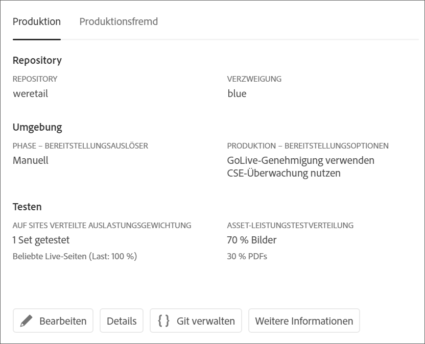
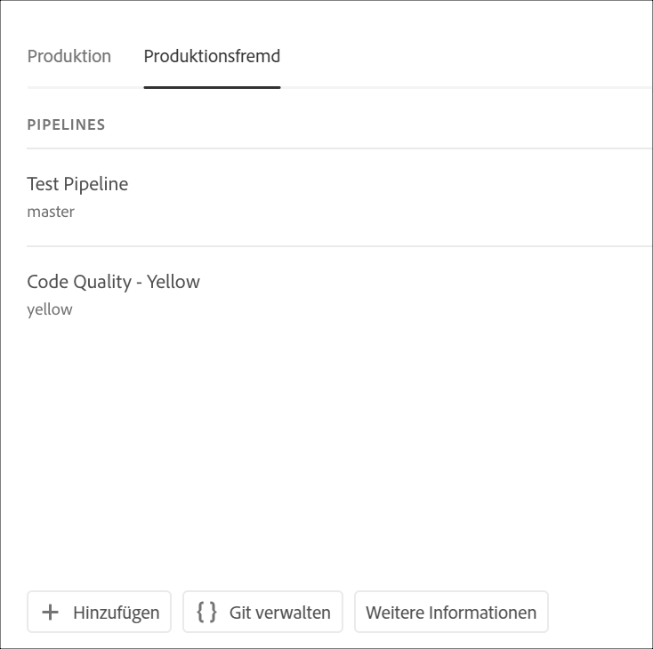
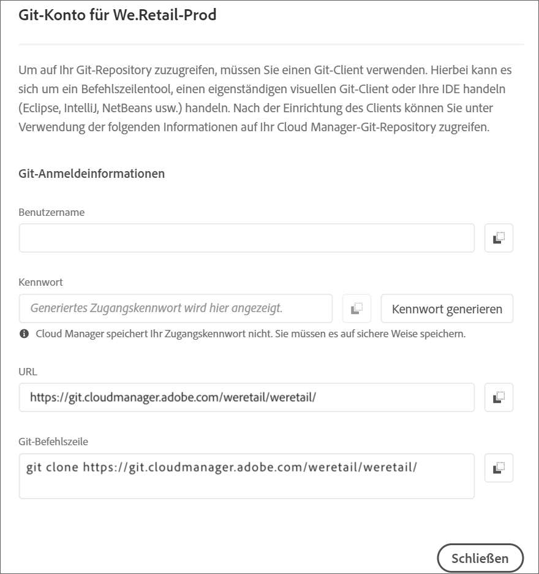

# Zugriff auf Git {#accessing-git}

Sie können über die Benutzeroberfläche von Cloud Manager auf Ihr Git-Repository zugreifen und es mithilfe der Self-Service-Git-Kontoverwaltung verwalten.

## Verwenden der Self-Service-Git-Kontoverwaltung {#self-service-git}

Verwenden Sie die Schaltfläche Git **** verwalten, die in der Benutzeroberfläche von Cloud Manager verfügbar ist, besonders auf der Pipeline-Karte.

1. Navigieren Sie zur Seite Übersicht *Ihres* Programms und zur Pipelines-Karte.

1. Sie sehen die Option Git **verwalten** , um auf Ihr Git-Repository zuzugreifen und es zu verwalten.

   

   Wenn Sie außerdem die Registerkarte &quot;Pipeline **ohne Produktion** &quot;auswählen, wird auch dort die Option &quot;Git **verwalten&quot;angezeigt** .

   

>[!NOTE]
>Die Option &quot;Git **** verwalten&quot;ist für Benutzer in der Rolle &quot;Entwickler&quot;oder &quot;Deployment Manager&quot;sichtbar. Wenn Sie auf diese Schaltfläche klicken, wird ein Dialogfeld geöffnet, in dem der Benutzer die URL zum Cloud Manager-Git-Repository sowie den Benutzernamen und das Kennwort finden kann.

