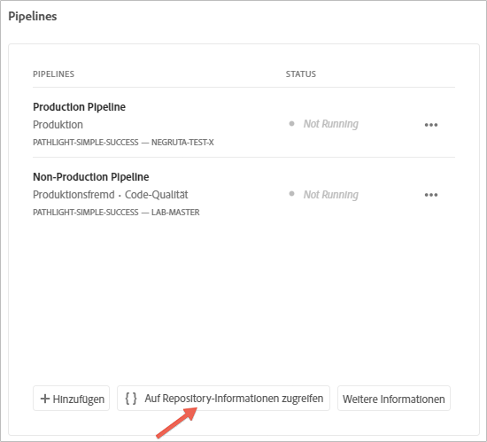
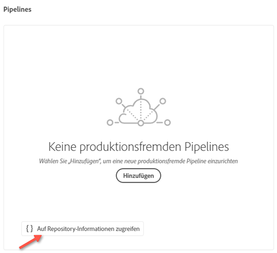
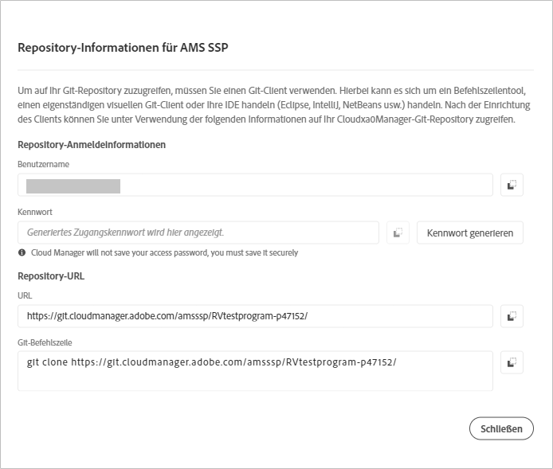

# Zugriff auf Repositorys {#accessing-repos}

Sie können über die Benutzeroberfläche von Cloud Manager mit der Self-Service-Git-Kontoverwaltung auf Ihr Git-Repository zugreifen und es verwalten.

## Verwenden der Self-Service-Git-Kontoverwaltung {#self-service-git}

Verwenden Sie den Button **Auf Repository-Informationen zugreifen**, den Sie in der Benutzeroberfläche von Cloud Manager an prominenter Stelle auf der Pipeline-Karte finden.

1. Gehen Sie von Ihrer Seite **Programmübersicht** aus zur Karte **Pipelines**.

1. Sie sehen die Option **Auf Repository-Informationen zugreifen**, mit der Sie auf Ihr Git-Repository zugreifen und es verwalten können.

   

   Wenn Sie außerdem die Registerkarte für **produktionsfremde** Pipelines auswählen, wird auch dort die Option **Auf Repository-Informationen zugreifen** angezeigt.

   

   >[!NOTE]
   >Die Option **Auf Repository-Informationen zugreifen** ist für Benutzer mit den Rollen „Entwickler“ und „Implementierungs-Manager“ sichtbar. Wenn Sie auf diesen Button klicken, wird ein Dialogfeld geöffnet, in dem der Benutzer die URL zum Cloud Manager-Git-Repository sowie den Benutzernamen und das Passwort findet.

   

   Wichtige Aspekte bei der Verwaltung Ihres Git-Repositorys in Cloud Manager:

   * **URL**: Die Repository-URL
   * **Benutzername**: Der Benutzername
   * **Kennwort**: Der Wert, der angezeigt wird, wenn auf die Schaltfläche **Kennwort generieren** geklickt wird.

      >[!NOTE]
      >Ein Benutzer kann eine Kopie seines Codes auschecken und Änderungen am lokalen Code-Repository vornehmen. Sobald die Änderungen vorgenommen wurden, kann der Benutzer die Code-Änderungen wieder in das Remote-Code-Repository in Cloud Manager übertragen.
