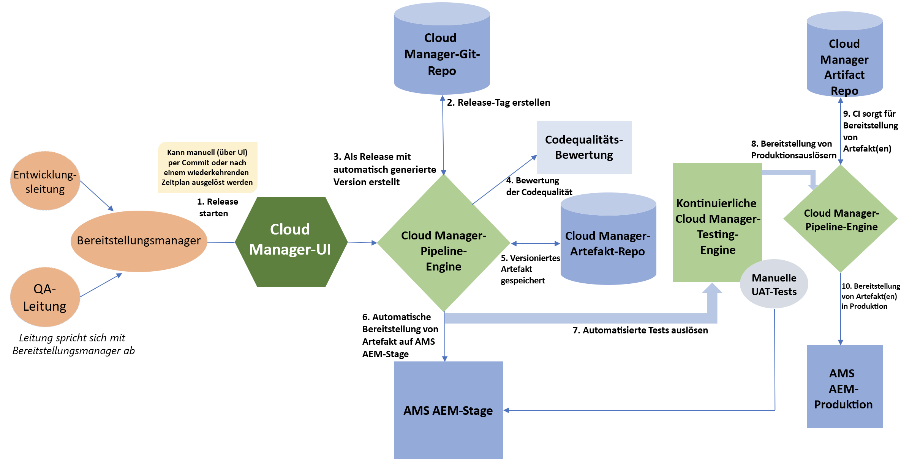
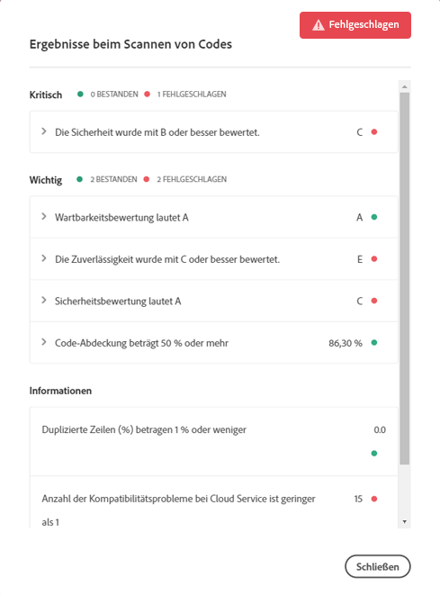

# CI/CD-Pipeline {#ci-cd-pipeline}

## Pipelineübersicht {#pipeline-overview}

[!UICONTROL Cloud Manager] enthält ein CI-Framework (Continuous Integration) und ein CD-Framework (Continuous Delivery), mit denen Implementierungs-Teams schnell neuen oder aktualisierten Code testen und bereitstellen können. Beispielsweise können Implementierungs-Teams eine automatisierte CI/CD-Pipeline einrichten, konfigurieren und starten, die Best Practices von Adobe für die Kodierung nutzt, um einen umfassenden Codescan durchzuführen und die höchste Code-Qualität sicherzustellen.

Die CI/CD-Pipeline automatisiert außerdem die Einheiten- und Leistungstests, um die Bereitstellungseffizienz zu erhöhen und proaktiv wichtige Probleme zu identifizieren, deren Behebung nach der Bereitstellung hohe Kosten verursacht. Implementierungs-Teams können auf einen umfassenden Codeleistungsbericht zugreifen, um einen Überblick über die potenziellen Auswirkungen auf KPIs und kritische Sicherheitsprüfungen für den Fall zu erhalten, dass der Code in der Produktion bereitgestellt wird.

## Pipelineprozess {#pipeline-process}

Das folgende Diagramm zeigt, was nach dem Auslösen einer Veröffentlichung in [!UICONTROL Cloud Manager] geschieht. In der zugehörigen Tabelle werden die einzelnen Schritte des Arbeitsablaufs erläutert.

In der folgenden Tabelle finden Sie Details zu den Vorgängen in jedem Schritt des Prozesses:

| Pipelineprozessschritt | Was passiert? |
|---|---|
| 1. Start einer Release-Veröffentlichung | Ein Implementierungs-Manager löst die Veröffentlichung entweder manuell (per Git-Commit) oder basierend auf einem wiederkehrenden Zeitplan aus. |
| 2. Erstellung des Release-Tags | [!UICONTROL Cloud Manager] erstellt ein Git-Tag, um die Release-Version mit einer automatisch generierten Versionsnummer zu kennzeichnen, zum Beispiel: 2018.531.245527.0000001222. |
| 3. Erstellung als Release-Version mit automatisch generierter Versionsnummer | [!UICONTROL Cloud Manager] erstellt die Anwendung mit der neu zugewiesenen Versionsnummer. |
| 4. Bewertung der Code-Qualität | [!UICONTROL Cloud Manager] scannt den Quell-Code und stellt eine Zusammenfassung bereit, bevor der Code in der Staging-Umgebung bereitgestellt werden kann. |
| 5. Speicherung versionierter Artefakte | Die Release-Artefakte werden zur späteren Verwendung in den Bereitstellungsschritten gespeichert. |
| 6. Automatische Bereitstellung von Artefakten für AMS AEM-Staging-Umgebung | Das Release-Artefakt wird in der Staging-Umgebung bereitgestellt. |
| 7. Auslösung automatisierter Tests | [!UICONTROL Cloud Manager] führt die Leistungs- und Sicherheitstests für das Artefakt aus. |
| 8. Bereitstellung für Produktionsauslöser | Sobald die automatisierten Tests abgeschlossen sind, startet [!UICONTROL Cloud Manager] die Bereitstellung in der Produktionsumgebung. |
| 9. Abruf der Artefakte durch [!UICONTROL Cloud Manager] für die Bereitstellung | [!UICONTROL Cloud Manager] ruft die gespeicherten Release-Artefakte ab. |
| 10. Bereitstellung der Artefakte in der Produktionsumgebung | Die Release-Artefakte werden in der Produktionsumgebung bereitgestellt. |

### Einrichten einer CI/CD-Pipeline {#how-to-setup-a-ci-cd-pipeline}

Weitere Informationen zur Pipeline-Konfiguration finden Sie in den Dokumenten . [Konfigurieren von Produktions-Pipelines](configuring-production-pipelines.md) und [Konfigurieren von Nicht-Produktions-Pipelines.](configuring-non-production-pipelines.md)

## Quality Gates {#quality-gates}

Die CI/CD-Pipeline bietet Quality Gates (bzw. Akzeptanzkriterien), die erfüllt werden müssen, bevor der Code aus der Staging-Umgebung in die Bereitstellungsumgebung verschoben werden kann. Die Pipeline muss drei Akzeptanztests bestehen:

* Code-Qualität
* Leistungstests
* Sicherheitstests

Für jeden dieser Akzeptanztests sind drei Stufen von Problemen definiert:

* **Kritisch:** Beim Test festgestellte Probleme, die ein sofortiges Fehlschlagen der Pipeline verursachen.
* **Wichtig:** Beim Test festgestellte Probleme, durch die die Pipeline angehalten wird. Implementierungs-Manager, Projekt-Manager oder Geschäftsinhaber können die Probleme außer Kraft setzen. In diesem Fall wird die Pipeline fortgesetzt. Sie können die Probleme aber auch akzeptieren. In diesem Fall stoppt die Pipeline mit einem Fehler.
* **Information:** Beim Test festgestellte Probleme, die ausschließlich zu Informationszwecken genannt werden und keine Auswirkungen auf die Pipeline-Ausführung haben.

Nachfolgend sehen Sie ein Beispiel für einen Codescan mit erkannten Codeproblemen:

### Einrichten der Gate-Tests {#how-to-setup-gates}

Siehe Dokument . [Konfigurieren von Produktions-Pipelines](configuring-production-pipelines.md) für Details zum Einrichten von Code-, Qualitäts- und Leistungstests.
