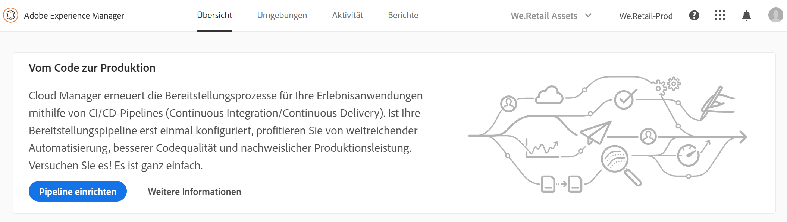
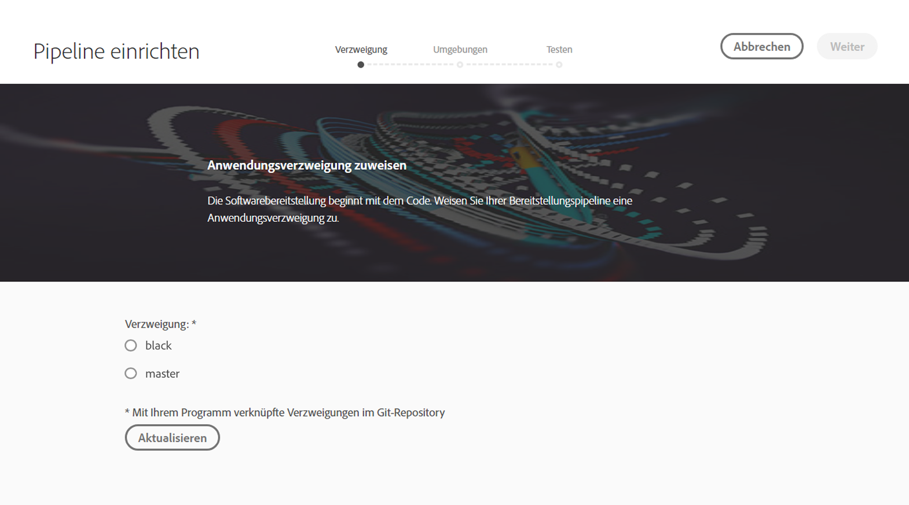
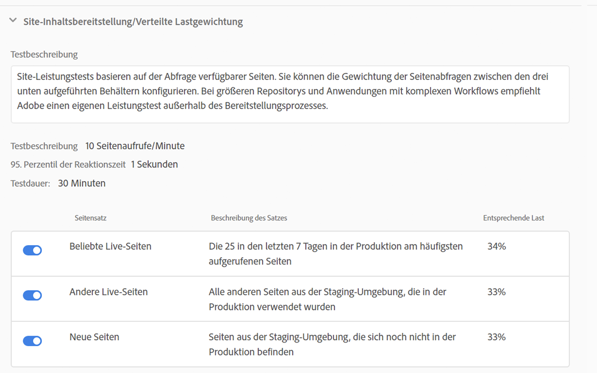
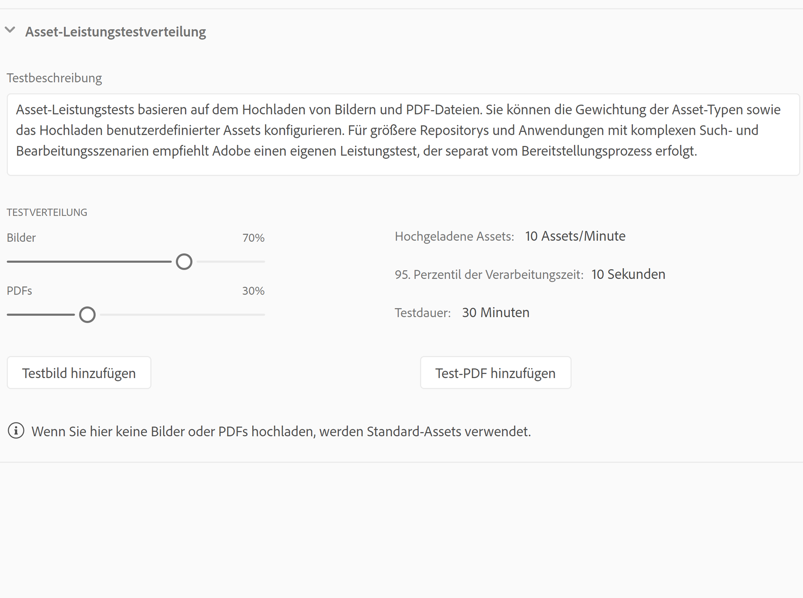
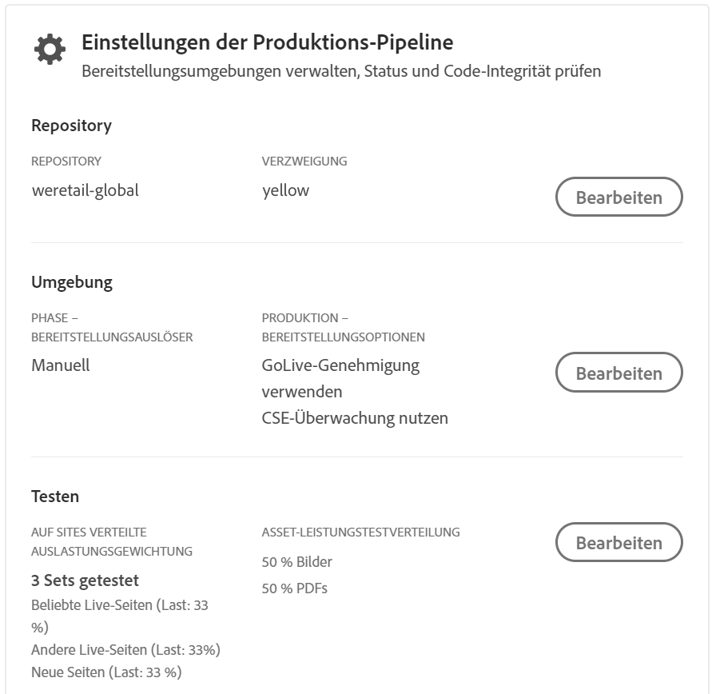
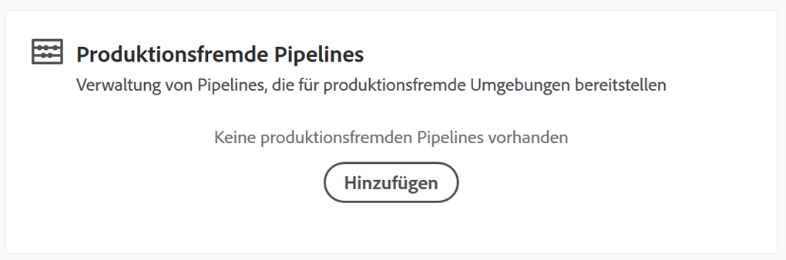
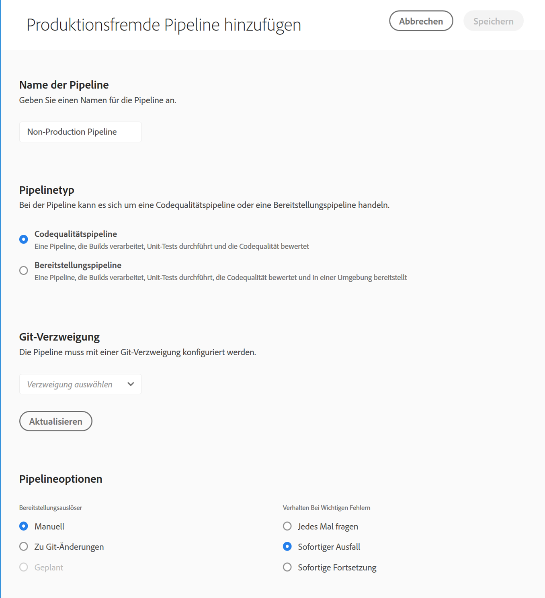
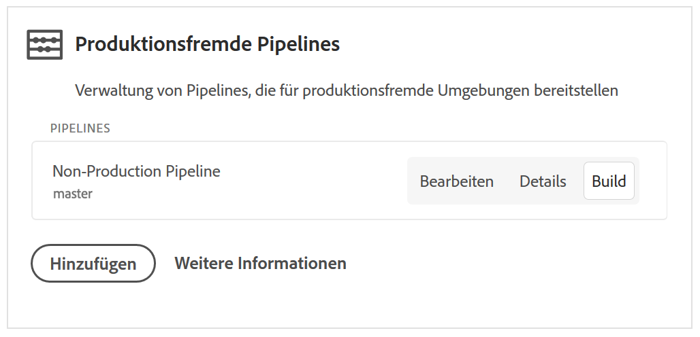

# Konfigurieren Ihrer CI/CD-Pipeline {#configure-your-ci-cd-pipeline}

Auf der folgenden Seite wird beschrieben, wie Sie die **Pipeline** konfigurieren. Weitere grundlegende Informationen zur Funktionsweise der Pipeline finden Sie unter [Übersicht zur CI/CD-Pipeline](ci-cd-pipeline.md).

## Videoschulung {#video-tutorial-one}

### Konfigurieren von Pipeline in Cloud Manager {#config-pipeline-video}

Die Konfiguration der CI/CD-Produktionspipeline definiert den Auslöser, der die Pipeline auslöst, Parameter, die die Bereitstellung der Produktion steuern, und Leistungstest-Parameter.

>[!VIDEO](https://video.tv.adobe.com/v/26314/?captions=ger)

## Wissenswertes zum Ablauf {#understanding-the-flow}

Sie können Ihre Pipeline über die Kachel **Pipeline-Einstellungen** in der [!UICONTROL Cloud Manager]-Benutzeroberfläche konfigurieren.

Der Bereitstellungsmanager ist für die Einrichtung der Pipeline verantwortlich. Wählen Sie hierfür zunächst eine Verzweigung im **Git-Repository** aus. Die Pipelinekonfiguration besteht aus folgenden Schritten:

* Definition des Auslösers, der die Pipeline startet
* Definition der Parameter zur Steuerung der Produktionsbereitstellung
* Konfiguration der Leistungstestparameter

## Einrichten der Pipeline {#setting-up-the-pipeline}

>[!CAUTION]
>
>Die Pipeline kann erst eingerichtet werden, wenn das Git-Repository mindestens eine Verzweigung hat und die [Programmeinrichtung](setting-up-program.md) abgeschlossen ist.

Bevor Sie Code bereitstellen, müssen Sie Ihre Pipelineeinstellungen über [!UICONTROL Cloud Manager] konfigurieren.

>[!NOTE]
>
>Sie können die Pipelineeinstellungen nach der Ersteinrichtung ändern.

### Konfigurieren der Pipeline-Einstellungen in [!UICONTROL Cloud Manager] {#configuring-the-pipeline-settings-from-cloud-manager}

Sobald Sie Ihr Programm auf der [!UICONTROL Cloud Manager]-Benutzeroberfläche eingerichtet haben, können Sie Ihre Pipeline einrichten.

Führen Sie folgende Schritte aus, um das Verhalten und die Voreinstellungen für Ihre Pipeline zu konfigurieren:

1. Klicken Sie auf **Pipeline einrichten**, um Ihre Pipeline einzurichten und zu konfigurieren.

   

1. Der Bildschirm **Pipeline einrichten** wird angezeigt.

   Mit dem dreistufigen Assistenten können Sie Ihre **Verzweigungen**, **Umgebungen** und eine **Test**-Umgebung einrichten.
Wählen Sie Ihre Git-Verzweigung aus und klicken Sie auf **Weiter**.

   >[!NOTE]
   >
   >Verzweigungen im Git-Repository sind mit Ihrem Programm verknüpft.

   

1. Wählen Sie auf der Registerkarte **Umgebungen** die Optionen **Phase** und **Produktion** aus.

   Sie können den Auslöser definieren, mit dem die Pipeline gestartet wird:

   * **Zu Git-Änderungen**: Startet die CI/CD-Pipeline, wenn zur konfigurierten Git-Verzweigung Commits hinzugefügt werden. Wenn Sie diese Option auswählen, können Sie die Pipeline weiterhin manuell starten.
   * **Manuell**: Die Pipeline wird über die Benutzeroberfläche manuell gestartet.
   * **Geplant**: Diese Option wird demnächst in einer kommenden Version verfügbar sein.
   Bei der Einrichtung oder Bearbeitung der Pipeline kann der Bereitstellungsmanager festlegen, wie sich die Pipeline verhält, wenn bei einem der Quality Gates (Test der Codequalität, Sicherheitstest und Leistungstest) ein wichtiger Fehler auftritt.

   Das ist für Kunden nützlich, die die Prozesse stärker automatisieren möchten. Die verfügbaren Optionen sind:

* **Jedes Mal fragen**: Das ist die Standardeinstellung und erfordert manuelles Eingreifen bei einem wichtigen Fehler.
* **Schlagen sofort fehl**: Wenn diese Option ausgewählt ist, wird die Pipeline bei einem wichtigen Fehler abgebrochen. Damit wird im Grunde ein Benutzer simuliert, der manuell jeden Fehler ablehnt.
* **Sofort fortfahren**: Wenn diese Option ausgewählt ist, wird die Pipeline bei einem wichtigen Fehler automatisch fortgesetzt. Damit wird im Grunde ein Benutzer simuliert, der manuell jeden Fehler genehmigt.

   Jetzt definieren Sie die Parameter zur Steuerung der Produktionsbereitstellung. Die drei verfügbaren Optionen sind:

* **GoLive-Genehmigung verwenden**: Für die Bereitstellung ist eine manuelle Genehmigung durch einen Business Owner, einen Projektmanager oder Bereitstellungsmanager über die [!UICONTROL Cloud Manager]-Benutzeroberfläche erforderlich.
* **CSE-Überwachung nutzen**: Ein CSE ist involviert, der die eigentliche Bereitstellung startet. Während der Einrichtung oder Bearbeitung der Pipeline wurde die CSE-Überwachung aktiviert. In diesem Fall kann der Bereitstellungsmanager Folgendes auswählen:

   * **Beliebiger CSE**: Schließt alle verfügbaren CSE ein.
   * **Mein CSE**: Bezieht sich auf einen bestimmten CSE, der dem Kunden zugewiesen wurde, bzw. auf dessen Backup, falls der zugewiesene CSE nicht im Hause ist.

* **Geplant**: Mit dieser Option kann der Benutzer die geplante Bereitstellung in der Produktionsumgebung aktivieren.

>[!NOTE]
>
>Wenn die Option **Geplant** ausgewählt ist, können Sie Ihre Produktionsbereitstellung für die Pipeline **nach** der Staging-Bereitstellung (und nach der **GoLive-Genehmigung verwenden**, sofern diese Option aktiviert ist) planen, um auf einen Zeitplan zu warten. Der Benutzer kann die Produktionsbereitstellung aber auch sofort ausführen.
>
>Unter [**Bereitstellen Ihres Codes**](deploying-code.md) erfahren Sie, wie Sie den Bereitstellungsplan festlegen oder den Code sofort in der Produktionsumgebung ausführen.

>[!NOTE]
>
>Die Option **CSE-Überwachung nutzen** steht nicht allen Kunden zur Verfügung.

**Nach Stage-Implementierung genehmigen**

There is an optional step **Approve after Stage Deployment** which can be configured in the Production Pipeline.
Dies ist in einer neuen Option im Anzeigebereich " **Pipeline-Bearbeitung** "aktiviert:

Es wird dann während der Ausführung der Pipeline als separater Schritt angezeigt:

>[!NOTE]
>
>**Nach der Staging-Bereitstellung genehmigen** funktioniert ähnlich wie die Genehmigung vor der Produktionsbereitstellung, findet aber unmittelbar nach dem Schritt der Staging-Bereitstellung statt (d. h. bevor Tests durchgeführt werden). Das unterscheidet sich von der Genehmigung vor der Produktionsbereitstellung, die nach Abschluss aller Tests erfolgt.

**Ungültigmachung des Dispatchers**

Als Bereitstellungsmanager haben Sie die Möglichkeit, eine Reihe von Pfaden zu konfigurieren, die entweder **ungültig gemacht** oder aus dem AEM Dispatcher-Cache **entfernt** werden, wenn Sie die Pipeline einrichten oder bearbeiten.

Sie können verschiedene Pfade für die Bereitstellung in der Staging- und Produktionsumgebung konfigurieren. Wenn diese Cache-Aktionen konfiguriert sind, werden sie im Rahmen der Einrichtung der Bereitstellungspipeline direkt nach der Bereitstellung etwaiger Inhaltspakete durchgeführt. Diese Einstellungen verwenden standardmäßiges AEM Dispatcher-Verhalten: Ungültiges Verhalten führt zu einer Ungültigmachung des Caches, vergleichbar mit einer Aktivierung von Autoreninhalten zur Veröffentlichung. Beim „Leeren“ wird der Cache-Inhalt gelöscht.

Generell ist die Ungültigmachung vorzuziehen. In einigen Fällen ist jedoch eine Leerung erforderlich, insbesondere bei Verwendung von AEM-HTML-Client-Bibliotheken.

>[!NOTE]
>
>Weitere Informationen zum Dispatcher-Cache finden Sie unter [Dispatcher – Übersicht](dispatcher-configurations.md).

Gehen Sie wie folgt vor, um Dispatcher-Ungültigmachungen zu konfigurieren:

1. Klicken Sie unter der Überschrift „Dispatcher-Konfiguration“ auf **Konfigurieren**.

   

1. Geben Sie den Pfad ein, wählen Sie im Menü **Typ** die Aktion aus und klicken Sie auf **Hinzufügen**. Sie können bis zu 100 Pfade pro Umgebung angeben. Wenn Sie die Pfade hinzugefügt haben, klicken Sie auf **Übernehmen**.

   

1. Auf der Seite **Pipeline-Einstellungen** wird eine aktualisierte Zusammenfassung der Auswahlen angezeigt.

   Klicken Sie auf **Speichern**, um diese Konfiguration beizubehalten.

   

1. Definieren Sie auf der Registerkarte **Testen** Ihre Testkriterien für Ihr Programm.

   Jetzt können Sie die Leistungstestparameter konfigurieren.

   Je nachdem, welche Produkte Sie lizenziert haben, können Sie Leistungstests für *AEM Sites* und *AEM Assets* konfigurieren.

   **AEM Sites:**

   Cloud Manager führt Leistungstests für AEM Sites-Programme durch, indem Seiten (durch einen nicht authentifizierten Benutzer) auf dem Staging-Veröffentlichungsserver für einen 30-minütigen Testzeitraum abgerufen und die Antwortzeit für die einzelnen Seiten sowie verschiedene Metriken auf Systemebene gemessen werden. Die Seiten werden durch drei **Seitensätze** ausgewählt. Sie können wählen, ob ein, zwei oder alle drei Sätze getestet werden sollen. Die Verteilung des Traffics basiert auf der Anzahl der ausgewählten Sätze, d. h. wenn alle drei Sätze ausgewählt sind, entfallen je 33 % aller Seitenansichten auf jeden Satz, bei zwei Sätzen sind es 50 % und bei einem ausgewählten Satz entfallen 100 % des Traffics auf diesen Satz.

   Wenn zum Beispiel zwischen den beliebten Live-Seiten und den neuen Seiten eine 50:50-Aufteilung erfolgt (in diesem Beispiel werden andere Live-Seiten nicht verwendet) und der Satz neuer Seiten 3000 Seiten enthält, ist für die KPI der Seitenansichten pro Minute ein Wert von 200 festgelegt. Für den 30-minütigen Testzeitraum gilt in diesem Fall:

   * Jede der 25 Seiten der beliebten Live-Seiten wird 240-mal aufgerufen: ((200 * 0,5) / 25) * 30 = 120

   * Jede der 3000 Seiten der neuen Seiten wird einmal aufgerufen: ((200 * 0,5) / 3000) * 30 = 1
   

   **AEM Assets:**

   Cloud Manager führt die Leistungstests für AEM Assets-Programme durch, indem Assets wiederholt für einen 30-minütigen Testzeitraum hochgeladen und die Verarbeitungszeit für jedes Asset sowie verschiedene Metriken auf Systemebene gemessen werden. Mit dieser Funktion können sowohl Bilder als auch PDF-Dokumente hochgeladen werden. Die Verteilung der Anzahl der Assets jedes Typs, die pro Minute hochgeladen werden, wird bei der Pipeline-Einrichtung oder auf dem Bildschirm „Bearbeiten“ festgelegt.

   Die unten stehende Abbildung zeigt beispielsweise eine Aufteilung von 70:30. Pro Minute werden 10 Assets hochgeladen, davon 7 Bilder und 3 Dokumente.

   

   >[!NOTE]
   >
   >Es gibt ein Standardbild und ein PDF-Dokument, aber in den meisten Fällen möchten Kunden ihre eigenen Assets hochladen. Dies kann bei der Pipeline-Einrichtung oder auf dem Bildschirm „Bearbeiten“ festgelegt werden. Dabei werden typische Bildformate wie JPEG, PNG, GIF und BMP sowie Photoshop-, Illustrator- und Postscript-Dateien unterstützt.

1. Klicken Sie auf **Speichern**, um die Einrichtung des Pipelineprozesses abzuschließen.

   >[!NOTE]
   >
   >Nach der Einrichtung der Pipeline können Sie die Einstellungen weiterhin bearbeiten. Verwenden Sie dazu die Kachel **Einstellungen der Produktions-Pipeline** in der [!UICONTROL Cloud Manager]-Benutzeroberfläche.

   

## Produktionsfremde Pipelines und Pipelines für Tests der Codequalität

Zusätzlich zur Haupt-Pipeline, die für die Staging- und Produktionsumgebung bereitgestellt wird, können Kunden weitere Pipelines einrichten, die als **produktionsfremde Pipelines** bezeichnet werden. Diese Pipelines führen immer die Schritte Build-Erstellung und Tests der Codequalität aus. Sie können optional auch für die Adobe Managed Services-Umgebung bereitgestellt werden.

## Videoschulung {#video-tutorial-two}

### Cloud Manager - Nur Pipelines für Nicht-Produktion und Codequalität {#non-prod-video}

CI/CD-Nicht-Produktions-Pipelines sind in zwei Kategorien unterteilt: Codequalität-Pipelines und Implementierungs-Pipelines. Codequalität-Pipelines leiten den gesamten Code aus einer Git-Verzweigung, der erstellt und anhand der Code-Qualitätsprüfung von Cloud Manager geprüft werden soll.

>[!VIDEO](https://video.tv.adobe.com/v/26316/?captions=ger)

Auf dem Startbildschirm werden diese Pipelines in einer neuen Karte aufgeführt:

1. Access the **Non-Production Pipelines** tile from the Cloud Manager home screen.

   

1. Klicken Sie auf die Schaltfläche „Hinzufügen“, um den Pipeline-Namen, den Pipelinetyp und die Git-Verzweigung anzugeben.

   Außerdem können Sie in den Pipeline-Optionen Bereitstellungsauslöser und das Verhalten bei wichtigen Fehlern festlegen.

   

1. Klicken Sie auf **Speichern**, damit die Pipeline auf der Karte auf dem Startbildschirm mit drei Aktionen angezeigt wird:

   * **Bearbeiten**: Ermöglicht die Bearbeitung der Pipeline-Einstellungen.
   * **Detail**: Zeigt die letzte Pipeline-Ausführung an (sofern vorhanden).
   * **Build**: Wechselt zur Ausführungsseite, von der die Pipeline ausgeführt werden kann.
   

   >[!NOTE]
   >
   >Während die Pipeline ausgeführt wird, wird der aktuelle Schritt angezeigt und nur die Aktion **Details** ist verfügbar.

## Die nächsten Schritte {#the-next-steps}

Nachdem die Konfiguration der Pipeline abgeschlossen ist, müssen Sie Ihren Code bereitstellen.

Weitere Informationen finden Sie unter [Bereitstellen Ihres Codes](deploying-code.md).
