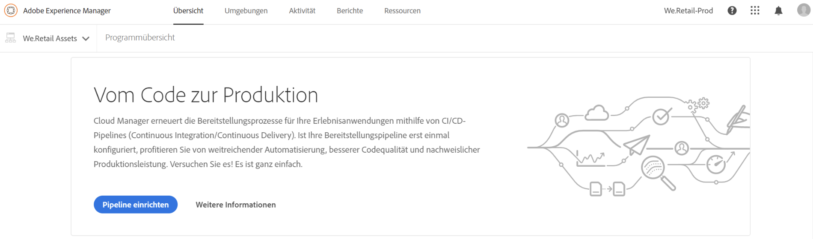
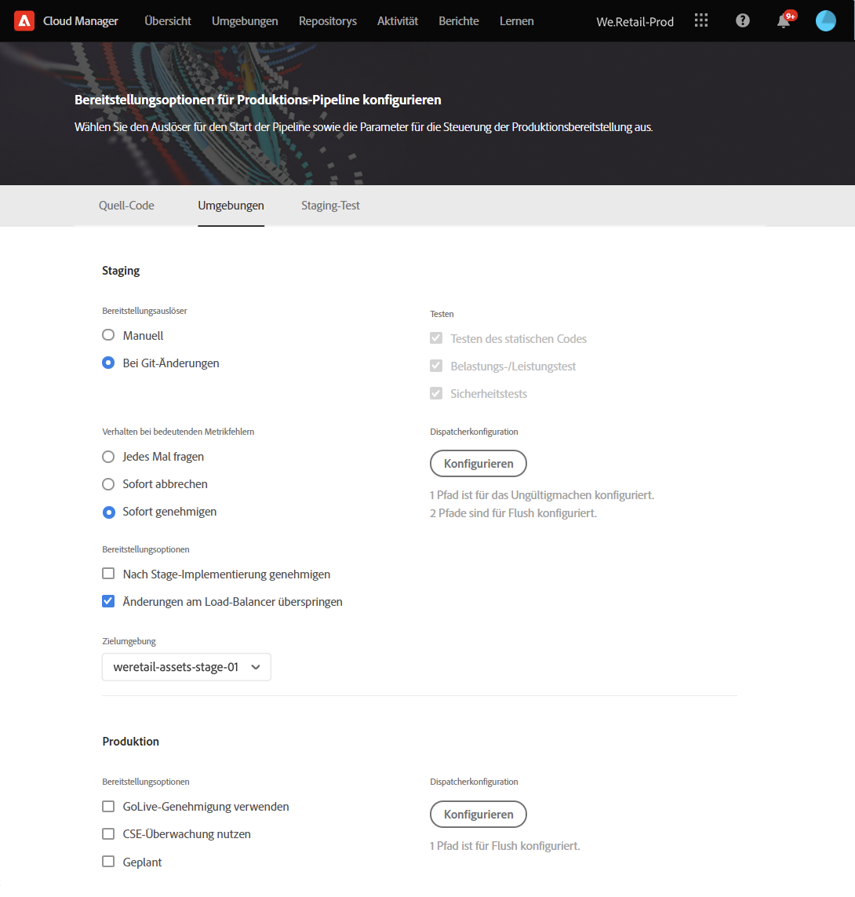
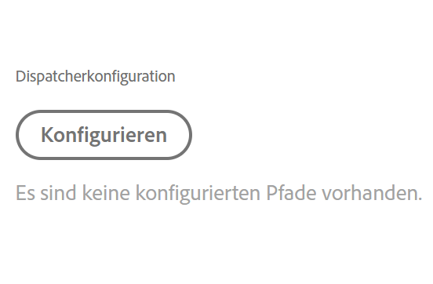
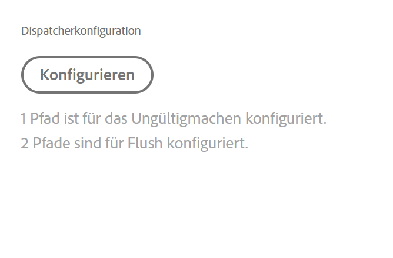
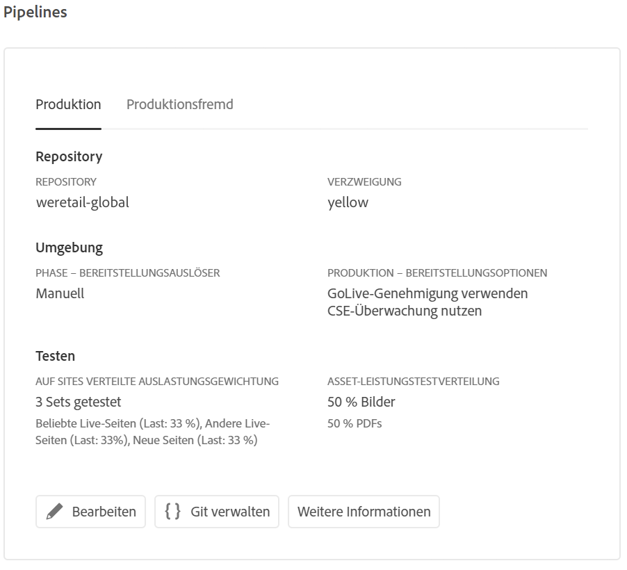

# Konfigurieren Ihrer CI/CD-Pipeline {#configure-your-ci-cd-pipeline}

>[!NOTE]
>Informationen zum Konfigurieren der CI/CD-Pipeline für Cloud Manager in AEM as a Cloud Service finden Sie [hier](https://experienceleague.adobe.com/docs/experience-manager-cloud-service/implementing/using-cloud-manager/configure-pipeline.html?lang=de#using-cloud-manager).

Auf der folgenden Seite wird beschrieben, wie Sie die **Pipeline** konfigurieren. Weitere grundlegende Informationen zur Funktionsweise der Pipeline finden Sie unter [Übersicht zur CI/CD-Pipeline](ci-cd-pipeline.md).

## Video-Tutorial {#video-tutorial-one}

### Konfigurieren von Pipelines in Cloud Manager {#config-pipeline-video}

Die Konfiguration der CI/CD-Produktions-Pipeline definiert den Auslöser, der die Pipeline initiiert, sowie Parameter zur Steuerung der Produktionsbereitstellung und Leistungstestparameter.

>[!VIDEO](https://video.tv.adobe.com/v/26314/)

## Wissenswertes zum Ablauf {#understanding-the-flow}

Sie können Ihre Pipeline über die Kachel **Pipeline-Einstellungen** in der [!UICONTROL Cloud Manager]-Benutzeroberfläche konfigurieren.

Der Implementierungs-Manager ist für die Einrichtung der Pipeline verantwortlich. Wählen Sie hierfür zunächst eine Verzweigung im **Git-Repository** aus. Die Pipelinekonfiguration besteht aus folgenden Schritten:

* Definition des Auslösers, der die Pipeline startet
* Definition der Parameter zur Steuerung der Produktionsbereitstellung
* Konfiguration der Leistungstestparameter

## Einrichten der Pipeline {#setting-up-the-pipeline}

>[!CAUTION]
>
>Die Pipeline kann erst eingerichtet werden, wenn das Git-Repository mindestens eine Verzweigung hat und die [Programmeinrichtung](setting-up-program.md) abgeschlossen ist.

Bevor Sie Code bereitstellen, müssen Sie Ihre Pipelineeinstellungen über [!UICONTROL Cloud Manager] konfigurieren.

>[!NOTE]
>
>Sie können die Pipelineeinstellungen nach der Ersteinrichtung ändern.

### Konfigurieren der Pipeline-Einstellungen in [!UICONTROL Cloud Manager] {#configuring-the-pipeline-settings-from-cloud-manager}

Sobald Sie Ihr Programm auf der [!UICONTROL Cloud Manager]-Benutzeroberfläche eingerichtet haben, können Sie Ihre Pipeline einrichten.

Führen Sie folgende Schritte aus, um das Verhalten und die Voreinstellungen für Ihre Pipeline zu konfigurieren:

1. Klicken Sie auf **Pipeline einrichten**, um Ihre Pipeline einzurichten und zu konfigurieren.

   

1. Der Bildschirm **Pipeline einrichten** wird angezeigt.

   Mit dem dreistufigen Assistenten können Sie Ihre **Verzweigungen**, **Umgebungen** und eine **Test**-Umgebung einrichten.
Wählen Sie Ihre Git-Verzweigung aus und klicken Sie auf **Weiter**.

   >[!NOTE]
   >
   >Verzweigungen im Git-Repository sind mit Ihrem Programm verknüpft.

1. Wählen Sie auf der Registerkarte **Umgebungen** die Optionen **Phase** und **Produktion** aus.

   Sie können den Auslöser definieren, mit dem die Pipeline gestartet wird:

   * **Bei Git-Änderungen**: Startet die CI/CD-Pipeline, wenn zur konfigurierten Git-Verzweigung Commits hinzugefügt werden. Wenn Sie diese Option auswählen, können Sie die Pipeline weiterhin manuell starten.
   * **Manuell**: Die Pipeline wird über die Benutzeroberfläche manuell gestartet.

   Bei der Einrichtung oder Bearbeitung der Pipeline kann der Implementierungs-Manager festlegen, wie sich die Pipeline verhält, wenn bei einem der Quality Gates (Test der Code-Qualität, Sicherheitstest und Leistungstest) ein wichtiger Fehler auftritt.

   Das ist für Kunden nützlich, die die Prozesse stärker automatisieren möchten. Die verfügbaren Optionen sind:

* **Jedes Mal fragen**: Das ist die Standardeinstellung und erfordert manuelles Eingreifen bei einem wichtigen Fehler.
* **Sofort abbrechen**: Wenn diese Option ausgewählt ist, wird die Pipeline bei einem wichtigen Fehler abgebrochen. Damit wird im Grunde ein Benutzer simuliert, der manuell jeden Fehler ablehnt.
* **Sofort genehmigen**: Wenn diese Option ausgewählt ist, wird die Pipeline bei einem wichtigen Fehler automatisch fortgesetzt. Damit wird im Grunde ein Benutzer simuliert, der manuell jeden Fehler genehmigt.

   Jetzt definieren Sie die Parameter zur Steuerung der Produktionsbereitstellung. Die drei verfügbaren Optionen sind:

* **GoLive-Genehmigung verwenden**: Für die Bereitstellung ist eine manuelle Genehmigung durch einen Business Owner, einen Projektmanager oder Implementierungs-Manager über die [!UICONTROL Cloud Manager]-Benutzeroberfläche erforderlich.
* **CSE-Überwachung nutzen**: Ein CSE ist involviert, der die eigentliche Bereitstellung startet. Während der Einrichtung oder Bearbeitung der Pipeline wurde die CSE-Überwachung aktiviert. In diesem Fall kann der Implementierungs-Manager Folgendes auswählen:

   * **Beliebiger CSE**: Schließt alle verfügbaren CSE ein.
   * **Mein CSE**: Bezieht sich auf einen bestimmten CSE, der dem Kunden zugewiesen wurde, bzw. auf dessen Backup, falls der zugewiesene CSE nicht im Hause ist.

* **Geplant**: Mit dieser Option kann der Benutzer die geplante Bereitstellung in der Produktionsumgebung aktivieren.

>[!NOTE]
>Wenn die Option **Geplant** ausgewählt ist, können Sie Ihre Produktionsbereitstellung für die Pipeline **nach** der Staging-Bereitstellung (und nach der **GoLive-Genehmigung verwenden**, sofern diese Option aktiviert ist) planen, um auf einen Zeitplan zu warten. Der Benutzer kann die Produktionsbereitstellung aber auch sofort ausführen.
>
>Unter [**Bereitstellen Ihres Codes**](deploying-code.md) erfahren Sie, wie Sie den Bereitstellungsplan festlegen oder den Code sofort in der Produktionsumgebung ausführen.

>[!NOTE]
>
>Die Option **CSE-Überwachung nutzen** steht nicht allen Kunden zur Verfügung.

**Nach Staging-Implementierung genehmigen**

Es gibt einen optionalen Schritt **Nach Staging-Implementierung genehmigen**, der in der Produktions-Pipeline konfiguriert werden kann.
Dieser wird in einer neuen Option auf dem Bildschirm **Pipeline bearbeiten** aktiviert:

Er wird dann während der Ausführung der Pipeline als separater Schritt angezeigt:

>[!NOTE]
>
>**Nach Staging-Implementierung genehmigen** funktioniert ähnlich wie die Genehmigung vor der Produktionsbereitstellung, findet aber unmittelbar nach dem Schritt der Staging-Bereitstellung statt (d. h. bevor Tests durchgeführt werden). Das unterscheidet sich von der Genehmigung vor der Produktionsbereitstellung, die nach Abschluss aller Tests erfolgt.

**Ungültigmachung des Dispatchers**

Als Bereitstellungs-Manager haben Sie die Möglichkeit, eine Reihe von Inhaltspfaden zu konfigurieren, die entweder **ungültig gemacht** oder aus dem AEM Dispatcher-Cache für Veröffentlichungsinstanzen **entfernt** werden, wenn Sie die Pipeline einrichten oder bearbeiten.

Sie können verschiedene Pfade für die Bereitstellung in der Staging- und Produktionsumgebung konfigurieren. Wenn diese Cache-Aktionen konfiguriert sind, werden sie im Rahmen der Einrichtung der Bereitstellungspipeline direkt nach der Bereitstellung etwaiger Inhaltspakete durchgeführt. Diese Einstellungen verwenden standardmäßiges AEM Dispatcher-Verhalten: Ungültiges Verhalten führt zu einer Ungültigmachung des Caches, vergleichbar mit einer Aktivierung von Autoreninhalten zur Veröffentlichung. Beim „Leeren“ wird der Cache-Inhalt gelöscht.

Generell ist die Ungültigmachung vorzuziehen. In einigen Fällen ist jedoch eine Leerung erforderlich, insbesondere bei Verwendung von AEM-HTML-Client-Bibliotheken.

>[!NOTE]
>
>Weitere Informationen zum Dispatcher-Cache finden Sie unter [Dispatcher – Übersicht](dispatcher-configurations.md).

Gehen Sie wie folgt vor, um Dispatcher-Ungültigmachungen zu konfigurieren:

1. Klicken Sie unter der Überschrift „Dispatcher-Konfiguration“ auf **Konfigurieren**.

   

1. Geben Sie den Pfad ein, wählen Sie im Menü **Typ** die Aktion aus und klicken Sie auf **Hinzufügen**. Sie können bis zu 100 Pfade pro Umgebung angeben. Wenn Sie die Pfade hinzugefügt haben, klicken Sie auf **Übernehmen**.

   

1. Auf der Seite **Pipeline-Einstellungen** wird eine aktualisierte Zusammenfassung der Auswahlen angezeigt.

   Klicken Sie auf **Speichern**, um diese Konfiguration beizubehalten.

   

1. Definieren Sie auf der Registerkarte **Testen** Ihre Testkriterien für Ihr Programm. Jetzt können Sie die Leistungstestparameter konfigurieren.

   Je nachdem, welche Produkte Sie lizenziert haben, können Sie Leistungstests für *AEM Sites* und *AEM Assets* konfigurieren. Weitere Informationen finden Sie unter [Leistungstests](understand-your-test-results.md#performance-testing).

1. Klicken Sie auf **Speichern**, um die Einrichtung des Pipeline-Prozesses abzuschließen.

   >[!NOTE]
   >Nach der Einrichtung der Pipeline können Sie die Einstellungen weiterhin bearbeiten. Verwenden Sie dazu die Kachel **Einstellungen der Produktions-Pipeline** in der [!UICONTROL Cloud Manager]-Benutzeroberfläche.

   

## Produktionsfremde Pipelines und Pipelines für Tests der Code-Qualität

Zusätzlich zur Haupt-Pipeline, die für die Staging- und Produktionsumgebung bereitgestellt wird, können Kunden weitere Pipelines einrichten, die als **Produktionsfremde Pipelines** bezeichnet werden. Diese Pipelines führen immer die Schritte Build-Erstellung und Tests der Code-Qualität aus. Sie können optional auch für die Adobe Managed Services-Umgebung bereitgestellt werden.

## Video-Tutorial {#video-tutorial-two}

### Nicht-Produktions- und Nur-Code-Qualität-Pipelines in Cloud Manager {#non-prod-video}

CI/CD-Produktionsfremde Pipelines sind in zwei Kategorien unterteilt: Code-Qualitäts-Pipelines und Bereitstellungs-Pipelines. Code-Qualitäts-Pipelines leiten den gesamten Code aus einer Git-Verzweigung, der erstellt und anhand der Code-Qualitätsprüfung von Cloud Manager geprüft werden soll.

>[!VIDEO](https://video.tv.adobe.com/v/26316/)

### Hinzufügen einer produktionsfremden Pipeline {#add-non-production-pipeline}

Auf dem Startbildschirm werden diese Pipelines in einer neuen Karte aufgeführt:

1. Greifen Sie über den Cloud Manager-Startbildschirm auf die Karte **Pipelines** zu. Klicken Sie auf **+Add** und wählen Sie **Add Non-Production Pipeline** aus.

   

1. **Das Dialogfeld Nicht-Produktions-**  Pipelineprojekt hinzufügen wird angezeigt. Wählen Sie den Pipeline-Typ aus, den Sie erstellen möchten, entweder **Code Quality Pipeline** oder **Deployment Pipeline**.

   Darüber hinaus können Sie **Deployment Trigger** und **Wichtiges Fehlerverhalten** unter **Bereitstellungsoptionen** einrichten. Klicken Sie auf **Weiter**.

   

1. Die neu erstellte Nicht-Produktions-Pipeline wird jetzt auf der Karte **Pipelines** angezeigt.

   

   Die Pipeline wird auf der Karte auf dem Startbildschirm mit drei Aktionen angezeigt, wie unten dargestellt:

   * **Hinzufügen**  - ermöglicht das Hinzufügen einer neuen Pipeline.
   * **Auf Repository-Informationen zugreifen**: Ermöglicht es dem Benutzer, die für den Zugriff auf das Cloud Manager-Git-Repository erforderlichen Informationen abzurufen.
   * **Weitere Informationen**: Führt zu weiteren Informationen über die Dokumentation zur CI/CD-Pipeline.

### Bearbeiten einer produktionsfremden Pipeline {#editing-nonprod-pipeline}

Sie können die Pipeline-Konfigurationen auf der Seite **Pipelines-Karte** von **Programmübersicht** bearbeiten.

Gehen Sie wie folgt vor, um die konfigurierte Nicht-Produktions-Pipeline zu bearbeiten:

1. Navigieren Sie auf der Seite **Programmübersicht** zur Karte **Pipelines** .

1. Wählen Sie die produktionsfremde Pipeline aus und klicken Sie auf **...**. Klicken Sie auf **Bearbeiten**, wie in der folgenden Abbildung dargestellt.

1. Das Dialogfeld **Produktions-Pipeline bearbeiten** wird angezeigt.

   1. Auf der Registerkarte **Configuration** können Sie den **Pipeline-Namen**, **Deployment Trigger** und **Wichtiges Verhalten bei Metrikfehlern** aktualisieren.

      >[!NOTE]
      >Informationen zum Hinzufügen und Verwalten von Repositorys in Cloud Manager finden Sie unter [Hinzufügen und Verwalten von Repositorys](/help/implementing/cloud-manager/managing-code/cloud-manager-repositories.md) .

1. Klicken Sie auf **Aktualisieren** , sobald Sie die Bearbeitung der produktionsfremden Pipeline abgeschlossen haben.

## Die nächsten Schritte {#the-next-steps}

Nachdem die Konfiguration der Pipeline abgeschlossen ist, müssen Sie Ihren Code bereitstellen.

Weitere Informationen finden Sie unter [Bereitstellen Ihres Codes](deploying-code.md).
