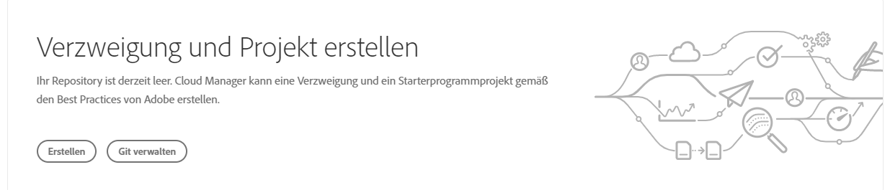
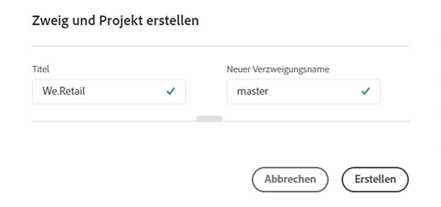
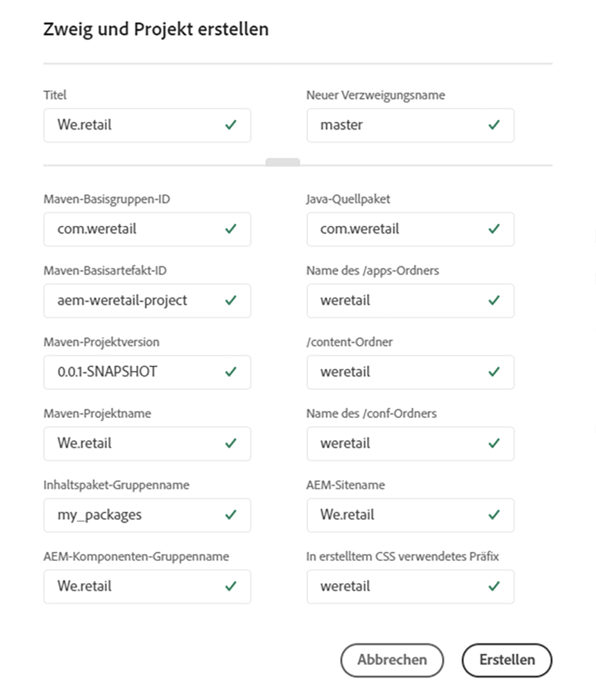

# Erstellen eines AEM-Anwendungsprojekts {#create-an-aem-application-project}

## Arbeiten mit dem Assistenten zum Erstellen eines AEM-Anwendungsprojekts {#using-wizard-to-create-an-aem-application-project}

Wenn Kunden Cloud Manager erstmals verwenden, erhalten sie ein leeres Git-Repository. Kunden, die bereits Adobe Managed Services (AMS) verwenden (oder ihre lokale AEM-Lösung zu AMS migrieren), verfügen im Allgemeinen bereits über Projektcode in Git (oder einem anderen Versionskontrollsystem) und importieren ihr Projekt in das Cloud Manager-Repository. Neue Kunden verfügen jedoch nicht über vorhandene Projekte.

Um neuen Kunden die ersten Schritte zu erleichtern, kann Cloud Manager jetzt als Ausgangspunkt ein minimales AEM-Projekt erstellen. Dieser Vorgang basiert auf dem [**AEM-Projektarchetyp **](https://github.com/Adobe-Marketing-Cloud/aem-project-archetype).


Gehen Sie wie folgt vor, um ein AEM-Anwendungsprojekt in Cloud Manager zu erstellen:

1. Wenn Sie sich bei Cloud Manager anmelden und die grundlegende Programmeinrichtung abgeschlossen haben und das Repository zu diesem Zeitpunkt leer ist, wird im Bildschirm **Überblick** eine spezielle Aktionskarte angezeigt.

   

1. Klicken Sie auf **Erstellen**, um einen Dialogfeld zu öffnen, in dem Sie die für den AEM-Projektarchetyp erforderlichen Parameter angeben. Der Dialogfeld fragt standardmäßig zwei Werte ab:

   * **Titel**: Hier ist standardmäßig der *Programmname* angegeben.

   * **Neuer Verzweigungsname**: Hier ist standardmäßig *Master* angegeben.

   

   Sie können den Dialogfeld über einen Ziehpunkt am unteren Rand des Dialogfelds erweitern. Der erweiterte Dialogfeld zeigt alle Konfigurationsparameter für den Archetyp an. Viele dieser Parameter verfügen über Standardwerte, die basierend auf dem **Titel** erstellt werden.

   

   >[!NOTE]
   >
   >Wenn der **Titel** beispielsweise ***We.Finance*** lautet, wird der Parameter „Base Maven Artifact ID“ als ***com.wefinance*** generiert. Diese Werte können bei Bedarf geändert werden.
   >
   >
   >Den generierten Wert ***com.wefinance*** können Sie zum Beispiel in ***net.wefinance*** ändern.

1. Klicken Sie im vorherigen Schritt auf **Erstellen**, um das Starterprojekt mit dem Archetyp zu erstellen und in die benannte Git-Verzweigung zu übertragen. Anschließend können Sie die Pipeline einrichten.

## Einrichten des Projekts {#setting-up-your-project}

### Ändern der Projekteinstellungen {#modifying-project-setup-details}

Damit vorhandene AEM-Projekte erfolgreich in Cloud Manager erstellt und bereitgestellt werden können, müssen einige grundlegende Regeln berücksichtigt werden:

* Projekte müssen mit Apache Maven erstellt werden.
* Im Stammverzeichnis des Git-Repositorys muss eine Datei *pom.xml* vorhanden sein. Diese *pom.xml*-Datei kann ggf. auf beliebig viele Untermodule verweisen (die wiederum weitere Untermodule umfassen usw.) wie nötig.

* Sie können Verweise auf weitere Maven-Artefakt-Repositorys in Ihren *pom.xml*-Dateien hinzufügen. Der Zugriff auf [kennwortgeschützte Artefakt-Repositorys](#password-protected-maven-repositories) wird bei entsprechender Konfiguration unterstützt. Allerdings wird der Zugriff auf netzwerkgeschützte Artefakte nicht unterstützt.
* Bereitstellbare Inhaltspakete werden erkannt, wenn Sie nach Inhaltspaketen im *ZIP*-Format suchen, die in einem Verzeichnis mit dem Namen *target* enthalten sind. Eine beliebige Anzahl von Untermodulen kann Inhaltspakete produzieren.

* Bereitstellbare Dispatcher-Artefakte werden erkannt, wenn Sie nach *ZIP*-Dateien (ebenfalls in einem Verzeichnis namens *target*) suchen, die Verzeichnisse mit den Namen *conf* und *conf.d* enthalten.

* Wenn mehrere Inhaltspakete vorhanden sind, ist die Reihenfolge der Paketbereitstellungen nicht garantiert. Wenn eine bestimmte Reihenfolge benötigt wird, können die Abhängigkeiten des Inhaltspakets zum Definieren der Reihenfolge verwendet werden. Pakete können bei der Bereitstellung [übersprungen](#skipping-content-packages) werden.

<!-- 

Comment Type: annotation
Last Modified By: jsyal
Last Modified Date: 2018-10-08T09:20:10.106-0400

2018.8.0: added existing in the opening sentence

 -->

## Details der Build-Umgebung {#build-environment-details}

Cloud Manager erstellt und testet Ihren Code mithilfe einer speziellen Erstellungsumgebung. Diese Umgebung weist die folgenden Attribute auf:

* Die Erstellungsumgebung ist Linux-basiert und von Ubuntu 18.04 abgeleitet.
* Apache Maven 3.6.0 ist installiert.
* Die installierten Java-Versionen sind Oracle JDK 8u202 und 11.0.2.
* Es sind einige zusätzliche erforderliche Systempakete installiert:

   * bzip2
   * unzip
   * libpng
   * imagemagick
   * graphicsmagick

* Andere Pakete können zur Erstellungszeit wie [unten](#installing-additional-system-packages) beschrieben installiert werden.
* Jeder Build wird in einer unberührten Umgebung erstellt, der Build-Container speichert zwischen den Ausführungen keinen Status.
* Maven wird immer mit folgendem Befehl ausgeführt: *mvn --batch-mode clean org.jacoco:jacoco-maven-plugin:prepare-agent package*
* Maven wird auf Systemebene mit einer settings.xml-Datei konfiguriert, die automatisch das öffentliche Adobe-**Artefakt**-Repository enthält. (Weitere Informationen dazu finden Sie im [Adobe Public Maven Repository](https://repo.adobe.com/)).

>[!NOTE]
>Obwohl Cloud Manager keine bestimmte Version des Programms des `jacoco-maven-plugin` definiert, muss mindestens die Version `0.7.5.201505241946` verwendet werden.

### Verwendung von Java 11 {#using-java-11}

Cloud Manager unterstützt jetzt das Erstellen von Kundenprojekten mit Java 8 und Java 11. Standardmäßig werden Projekte mit Java 8 erstellt. Kunden, die Java 11 in ihren Projekten verwenden möchten, können dies mit dem [Apache Maven Toolchain-Plug-in](https://maven.apache.org/plugins/maven-toolchains-plugin/) tun.

Fügen Sie dazu der Datei „pom.xml“ einen `<plugin>`-Eintrag hinzu, der wie folgt aussieht:

```xml
        <plugin>
            <groupId>org.apache.maven.plugins</groupId>
            <artifactId>maven-toolchains-plugin</artifactId>
            <version>1.1</version>
            <executions>
                <execution>
                    <goals>
                        <goal>toolchain</goal>
                    </goals>
                </execution>
            </executions>
            <configuration>
                <toolchains>
                    <jdk>
                        <version>11</version>
                        <vendor>oracle</vendor>
                    </jdk>
                </toolchains>
            </configuration>
        </plugin>
```

>[!NOTE]
>Die unterstützten `vendor`-Werte sind `oracle` und `sun`, die unterstützten `version`-Werte sind `1.8`, `1.11` und `11`.

## Umgebungsvariablen {#environment-variables}

### Standard-Umgebungsvariablen {#standard-environ-variables}

In einigen Fällen müssen Kunden den Build-Prozess je nach Informationen zum Programm oder zur Pipeline variieren.

Wenn beispielsweise eine JavaScript-Minimierung während der Build-Erstellung mithilfe eines Tools wie gulp durchgeführt wird, soll beim Erstellen für eine Entwicklungsumgebung möglicherweise eine andere Minimierungsstufe verwendet werden als beim Erstellen für eine Staging- oder Produktionsumgebung.

Um dies zu unterstützen, fügt Cloud Manager diese Standard-Umgebungsvariablen bei jeder Ausführung dem Build-Container hinzu.

| **Variablenname** | **Definition** |
|---|---|
| CM_BUILD | Immer auf „true“ (wahr) festgelegt |
| BRANCH | Die konfigurierte Verzweigung für die Ausführung |
| CM_PIPELINE_ID | Numerische Pipeline-Kennung |
| CM_PIPELINE_NAME | Name der Pipeline |
| CM_PROGRAM_ID | Numerische Programmkennung |
| CM_PROGRAM_NAME | Name des Programms |
| ARTIFACTS_VERSION | Die von Cloud Manager generierte synthetische Version bei einer Staging- oder Produktions-Pipeline |

### Pipeline-Variablen {#pipeline-variables}

In einigen Fällen kann der Build-Prozess eines Kunden von bestimmten Konfigurationsvariablen abhängen, die nicht im Git-Repository platziert werden können oder zwischen Pipeline-Ausführungen mit derselben Verzweigung variieren müssen.

Cloud Manager ermöglicht die Konfiguration dieser Variablen über die Cloud Manager-API oder die Cloud Manager-CLI individuell für die Pipelines. Variablen können entweder als reiner Test oder mit Data-at-Rest-Verschlüsselung gespeichert werden. In beiden Fällen werden Variablen innerhalb der Build-Umgebung als Umgebungsvariable bereitgestellt, die in der `pom.xml`-Datei oder anderen Build-Skripten referenziert werden kann.

Um eine Variable mithilfe der CLI festzulegen, führen Sie einen Befehl wie den folgenden aus:

`$ aio cloudmanager:set-pipeline-variables PIPELINEID --variable MY_CUSTOM_VARIABLE test`

Aktuelle Variablen können aufgelistet werden:

`$ aio cloudmanager:list-pipeline-variables PIPELINEID`

Variablennamen dürfen nur alphanumerische Zeichen und Unterstriche (_) enthalten. Dabei sollten Großbuchstaben verwendet werden. Pro Pipeline sind maximal 200 Variablen zulässig. Jeder Name darf maximal 100 Zeichen und jeder Wert maximal 2048 Zeichen lang sein.

Bei Verwendung in einer `Maven pom.xml`-Datei ist es in der Regel hilfreich, diese Variablen Maven-Eigenschaften mit einer ähnlichen Syntax zuzuordnen:

```xml
        <profile>
            <id>cmBuild</id>
            <activation>
                <property>
                    <name>env.CM_BUILD</name>
                </property>
            </activation>
            <properties>
                <my.custom.property>${env.MY_CUSTOM_VARIABLE}</my.custom.property> 
            </properties>
        </profile>
```

## Aktivieren von Maven-Profilen in Cloud Manager {#activating-maven-profiles-in-cloud-manager}

In einigen wenigen Fällen müssen Sie den Build-Prozess möglicherweise etwas anders gestalten, wenn er in Cloud Manager und auf Entwickler-Workstations ausgeführt wird. In diesen Fällen können Sie mit [Maven-Profilen](https://maven.apache.org/guides/introduction/introduction-to-profiles.html) definieren, wie der Build in verschiedenen Umgebungen (einschließlich Cloud Manager) abweichen soll.

Die Aktivierung eines Maven-Profils in der Cloud Manager-Build-Umgebung sollte über die oben beschriebene Umgebungsvariable CM_BUILD erfolgen. Beim Erstellen eines Profils, das nur außerhalb der Cloud Manager-Build-Umgebung verwendet werden soll, sollte hingegen das Nichtvorhandensein dieser Variable verifiziert werden.

Wenn zum Beispiel eine einfache Nachricht nur dann ausgegeben werden soll, wenn der Build innerhalb von Cloud Manager ausgeführt wird, verwenden Sie Folgendes:

```xml
        <profile>
            <id>cmBuild</id>
            <activation>
                  <property>
                        <name>env.CM_BUILD</name>
                  </property>
            </activation>
            <build>
                <plugins>
                    <plugin>
                        <artifactId>maven-antrun-plugin</artifactId>
                        <version>1.8</version>
                        <executions>
                            <execution>
                                <phase>initialize</phase>
                                <configuration>
                                    <target>
                                        <echo>I'm running inside Cloud Manager!</echo>
                                    </target>
                                </configuration>
                                <goals>
                                    <goal>run</goal>
                                </goals>
                            </execution>
                        </executions>
                    </plugin>
                </plugins>
            </build>
        </profile>
```

>[!NOTE]
>
>Um dieses Profil auf einer Entwickler-Workstation zu testen, können Sie es entweder in der Befehlszeile (mit `-PcmBuild`) oder in der integrierten Entwicklungsumgebung (IDE) aktivieren.

Wenn zum Beispiel eine einfache Nachricht nur dann ausgegeben werden soll, wenn der Build außerhalb von Cloud Manager ausgeführt wird, verwenden Sie Folgendes:

```xml
        <profile>
            <id>notCMBuild</id>
            <activation>
                  <property>
                        <name>!env.CM_BUILD</name>
                  </property>
            </activation>
            <build>
                <plugins>
                    <plugin>
                        <artifactId>maven-antrun-plugin</artifactId>
                        <version>1.8</version>
                        <executions>
                            <execution>
                                <phase>initialize</phase>
                                <configuration>
                                    <target>
                                        <echo>I'm running outside Cloud Manager!</echo>
                                    </target>
                                </configuration>
                                <goals>
                                    <goal>run</goal>
                                </goals>
                            </execution>
                        </executions>
                    </plugin>
                </plugins>
            </build>
        </profile>
```

## Unterstützung für kennwortgeschütztes Maven-Repository {#password-protected-maven-repositories}

Um ein kennwortgeschütztes Maven-Repository aus Cloud Manager zu verwenden, geben Sie das Kennwort (und optional den Benutzernamen) als geheime [Pipeline-Variable](#pipeline-variables) an und verweisen Sie dann in einer Datei im git-Repository mit dem Namen `.cloudmanager/maven/settings.xml` auf dieses Geheimnis. Diese Datei folgt dem Schema der [Maven-Einstellungsdatei](https://maven.apache.org/settings.html). Wenn der Build-Vorgang von Cloud Manager gestartet wird, wird das `<servers>`-Element in dieser Datei mit der von Cloud Manager bereitgestellten `settings.xml`-Standarddatei zusammengeführt. Server-IDs, die mit `adobe` und `cloud-manager` als reserviert gelten, sollten nicht von benutzerdefinierten Servern verwendet werden. Wenn diese Datei vorhanden ist, wird die Server-ID von innerhalb eines `<repository>`- und/oder `<pluginRepository>`-Elements in der `pom.xml`-Datei referenziert. Im Allgemeinen wären diese `<repository>`- und/oder `<pluginRepository>`-Elemente in einem [Cloud Manager-spezifischen Profil](/help/using/create-an-application-project.md#activating-maven-profiles-in-cloud-manager) enthalten, auch wenn dies nicht unbedingt erforderlich ist.

Beispiel: Das Repository befindet sich unter https://repository.myco.com/maven2, der von Cloud Manager zu verwendende Benutzername lautet `cloudmanager` und das Kennwort lautet `secretword`.

Legen Sie zunächst in der Pipeline das Kennwort als geheim fest:

`$ aio cloudmanager:set-pipeline-variables PIPELINEID --secret CUSTOM_MYCO_REPOSITORY_PASSWORD secretword`

Verweisen Sie anschließend aus der `.cloudmanager/maven/settings.xml`-Datei darauf:

```xml
<?xml version="1.0" encoding="UTF-8"?>
<settings xmlns="http://maven.apache.org/SETTINGS/1.0.0" xmlns:xsi="http://www.w3.org/2001/XMLSchema-instance"
        xsi:schemaLocation="http://maven.apache.org/SETTINGS/1.0.0 http://maven.apache.org/xsd/settings-1.0.0.xsd">
    <servers>
        <server>
            <id>myco-repository</id>
            <username>cloudmanager</username>
            <password>${env.CUSTOM_MYCO_REPOSITORY_PASSWORD}</password>
        </server>
    </servers>
</settings>
```

Verweisen Sie schließlich auf die Server-ID in der `pom.xml`-Datei:

```xml
<profiles>
    <profile>
        <id>cmBuild</id>
        <activation>
                <property>
                    <name>env.CM_BUILD</name>
                </property>
        </activation>
        <build>
            <repositories>
                <repository>
                    <id>myco-repository</id>
                    <name>MyCo Releases</name>
                    <url>https://repository.myco.com/maven2</url>
                    <snapshots>
                        <enabled>false</enabled>
                    </snapshots>
                    <releases>
                        <enabled>true</enabled>
                    </releases>
                </repository>
            </repositories>
            <pluginRepositories>
                <pluginRepository>
                    <id>myco-repository</id>
                    <name>MyCo Releases</name>
                    <url>https://repository.myco.com/maven2</url>
                    <snapshots>
                        <enabled>false</enabled>
                    </snapshots>
                    <releases>
                        <enabled>true</enabled>
                    </releases>
                </pluginRepository>
            </pluginRepositories>
        </build>
    </profile>
</profiles>
```

## Installieren zusätzlicher Systempakete {#installing-additional-system-packages}

Einige Builds erfordern die Installation zusätzlicher Systempakete, damit sie vollumfänglich funktionieren. So ist es z. B. möglich, dass ein Build ein Python- oder Ruby-Skript aufruft, wofür der entsprechende Sprach-Interpreter installiert sein muss. Dies kann durch Abfrage von [exec-maven-plugin](https://www.mojohaus.org/exec-maven-plugin/) erfolgen, wodurch APT aufgerufen wird. Diese Ausführung sollte im Allgemeinen in einem Cloud Manager-spezifischen Maven-Profil eingeschlossen sein. So installieren Sie beispielsweise Python:

```xml
        <profile>
            <id>install-python</id>
            <activation>
                <property>
                        <name>env.CM_BUILD</name>
                </property>
            </activation>
            <build>
                <plugins>
                    <plugin>
                        <groupId>org.codehaus.mojo</groupId>
                        <artifactId>exec-maven-plugin</artifactId>
                        <version>1.6.0</version>
                        <executions>
                            <execution>
                                <id>apt-get-update</id>
                                <phase>validate</phase>
                                <goals>
                                    <goal>exec</goal>
                                </goals>
                                <configuration>
                                    <executable>apt-get</executable>
                                    <arguments>
                                        <argument>update</argument>
                                    </arguments>
                                </configuration>
                            </execution>
                            <execution>
                                <id>install-python</id>
                                <phase>validate</phase>
                                <goals>
                                    <goal>exec</goal>
                                </goals>
                                <configuration>
                                    <executable>apt-get</executable>
                                    <arguments>
                                        <argument>install</argument>
                                        <argument>-y</argument>
                                        <argument>--no-install-recommends</argument>
                                        <argument>python</argument>
                                    </arguments>
                                </configuration>
                            </execution>
                        </executions>
                    </plugin>
                </plugins>
            </build>
        </profile>
```

Mit derselben Methode können Sie auch sprachspezifische Pakete installieren, d. h. mit `gem` für RubyGems oder mit `pip` für Python-Pakete.

>[!NOTE]
>
>Wenn Sie ein Systempaket auf diese Weise installieren, wird es **nicht** in der Laufzeitumgebung installiert, die für die Ausführung von Adobe Experience Manager verwendet wird. Wenn Sie ein Systempaket in der AEM-Umgebung installieren möchten, wenden Sie sich an Ihre Customer Success Engineers (CSE).

## Überspringen von Inhaltspaketen {#skipping-content-packages}

In Cloud Manager können Builds eine beliebige Anzahl von Inhaltspaketen generieren.
Aus vielerlei Gründen kann es sinnvoll sein, ein Inhaltspaket zu erstellen, es jedoch nicht bereitzustellen. Dies kann nützlich sein, etwa für Inhaltspakete, die nur zum Testen erstellt wurden, oder für Pakete, die in einem anderen Schritt im Build-Prozess (also als Unterpaket eines anderen Pakets) neu verpackt werden.

Um diese Szenarien zu berücksichtigen, sucht Cloud Manager in den Eigenschaften erstellter Inhaltspakete nach einer Eigenschaft namens ***cloudManagerTarget***. Wenn diese Eigenschaft auf „Ohne“ festgelegt ist, wird das Paket übersprungen und nicht bereitgestellt. Der Mechanismus zum Festlegen dieser Eigenschaft hängt davon ab, wie der Build das Inhaltspaket erzeugt. Mit dem filevault-maven-Plugin würden Sie beispielsweise das Plugin wie folgt konfigurieren:

```xml
        <plugin>
            <groupId>org.apache.jackrabbit</groupId>
            <artifactId>filevault-package-maven-plugin</artifactId>
            <extensions>true</extensions>
            <configuration>
                <properties>
                    <cloudManagerTarget>none</cloudManagerTarget>
                </properties>
        <!-- other configuration -->
            </configuration>
        </plugin>
```

Mit dem content-package-maven-Plugin ist es ähnlich:

```xml
        <plugin>
            <groupId>com.day.jcr.vault</groupId>
            <artifactId>content-package-maven-plugin</artifactId>
            <extensions>true</extensions>
            <configuration>
                <properties>
                    <cloudManagerTarget>none</cloudManagerTarget>
                </properties>
        <!-- other configuration -->
            </configuration>
        </plugin>
```

## Entwickeln von Code basierend auf Best Practices {#develop-your-code-based-on-best-practices}

Die Entwicklungs- und Beratungsteams von Adobe haben einen [umfassenden Satz an Best Practices für AEM-Entwickler zusammengestellt](https://helpx.adobe.com/experience-manager/6-4/sites/developing/using/best-practices.html).
