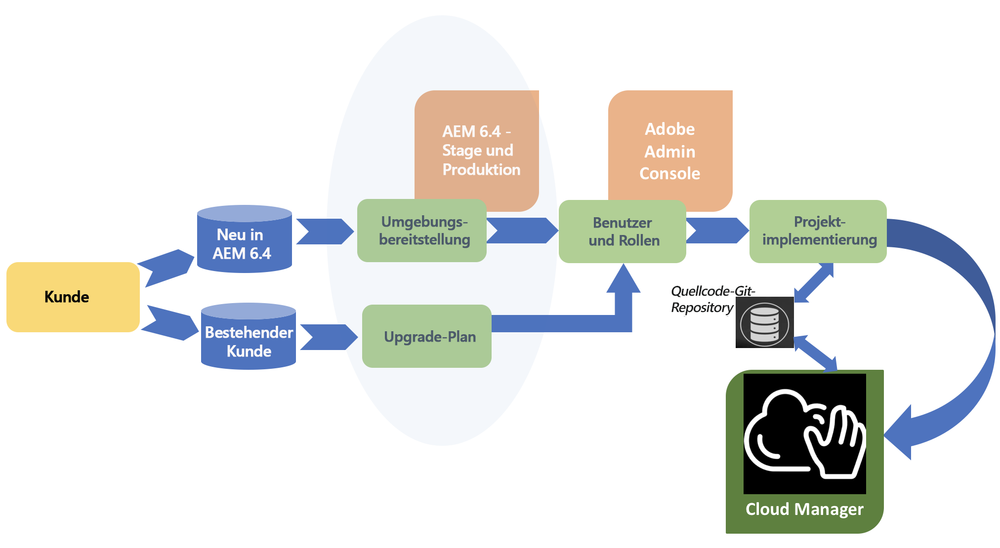

# Customer Journey {#customer-journey}

Möglicherweise sind Sie neuer Kunde von Adobe Experience Manager (AEM) und verwenden derzeit AEM 6.4 oder Sie müssen auf die AEM-Version 6.4 aktualisieren, um [!UICONTROL Cloud Manager] verwenden zu können. In den folgenden Szenarien erfahren Sie, wohin Sie Ihr Weg als neuer oder bestehender Kunde führt und welche ersten Schritte in [!UICONTROL Cloud Manager] erforderlich sind.

>[!NOTE]
>
>[!UICONTROL Cloud Manager] ist nur für Kunden von Adobe Managed Services mit AEM 6.4 oder höher verfügbar.

## Onboarding-Schritte für [!UICONTROL Cloud Manager]{#on-boarding-to-cloud-manager}

1. **Neue AEM-Kunden bei Adobe Managed Services**

   Bei neuen Kunden erfolgt das [!UICONTROL Cloud Manager]-Onboarding im Rahmen des Onboarding-Prozesses für den Adobe Managed Cloud-Dienst.

   Sie erhalten die URL für den Zugriff auf [!UICONTROL Cloud Manager] in der Begrüßungs-E-Mail zusammen mit Anweisungen zum Anmelden bei [!UICONTROL Experience Cloud]. Diese E-Mail enthält auch Informationen zum Verwenden der Adobe Admin Console für die Verwaltung Ihrer Benutzer und der entsprechenden Zugriffsrechte für die Benutzer, die auf [!UICONTROL Cloud Manager] zugreifen müssen.

1. **Bestehende AEM-Kunden bei Adobe Managed Services**

   Als bestehender Kunde müssen Sie zunächst Ihre vorhandenen Produktions- und Nicht-Produktionsumgebungen auf Version AEM 6.4 aktualisieren. Während der Aktualisierung wird das Onboarding durchgeführt und Sie erhalten die URL für den Zugriff auf [!UICONTROL Cloud Manager]. Darüber hinaus müssen Sie in der Adobe Admin Console Ihre Benutzer und die entsprechenden Zugriffsrechte für die Benutzer verwalten, die auf [!UICONTROL Cloud Manager] zugreifen müssen.

   Auch vorhandene AEM-Projekte müssen Best-Practice-Verfahren entsprechen, wenn Sie mit [!UICONTROL Cloud Manager] neue Code-Änderungen in Ihren AEM-Umgebungen bereitstellen.

   To get additional information on the benefits of upgrading to AEM 6.4, see [Upgrading to AEM 6.4](https://helpx.adobe.com/experience-manager/6-4/sites/deploying/using/upgrade.html).

## Zugriff auf [!UICONTROL Cloud Manager] {#accessing-cloud-manager}

Für den Zugriff auf [!UICONTROL Cloud Manager] und Ihre AEM-Umgebungen müssen Sie sich lediglich auf der [!UICONTROL Experience Cloud]-Landingpage mit Ihren Adobe Identity Management-Anmeldeinformationen anmelden und im Solution Switcher „AEM“ auswählen.

Nach der erstmaligen Anmeldung bei [!UICONTROL Cloud Manager] können Sie direkt über die [!UICONTROL Cloud Manager]-Benutzeroberfläche auf Ihre AEM-Umgebungen zugreifen. Sobald die erste Codeverzweigung in Ihrer Staging- und Produktionsumgebung bereitgestellt werden kann, können Sie hier alle Möglichkeiten von [!UICONTROL Cloud Manager] erkunden.

Wenn Sie [!UICONTROL Cloud Manager] besser kennenlernen und die ersten Schritte umsetzen möchten, finden Sie weitere Informationen unter [Erste Anmeldung](first-time-login.md). For additional information about AEM, see [Getting Started with AEM 6.4](https://helpx.adobe.com/de/experience-manager/6-4/sites/deploying/using/deploy.html). Weitere Informationen finden Sie unter [AEM-Ressourcen](https://www.adobe.com/marketing-cloud/experience-manager/resources.html?promoid=759X6WV8&amp;mv=other) .

## Erste Schritte mit [!UICONTROL Cloud Manager]{#getting-started-with-cloud-manager}

Once you are logged in to [!UICONTROL Cloud Manager], the first thing to do will be to set up your code repository environment, then your team and roles. Für die Zuweisung der Rollenmitgliedschaften werden die Benutzer über die Admin Console-Benutzeroberfläche zu einem [!UICONTROL Cloud Manager]-Profil hinzugefügt.

Anschließend müssen Sie Ihre Quellcodeverzweigungen im **Git-Repository** einrichten, Ihre Ziele in Bezug auf Lasten- und Leistungs-KPIs definieren und Szenarien testen, damit Sie Ihren Code nach erfolgreichem Abschluss aller Qualitätsprüfungen erfolgreich in Ihrer Staging- und Produktionsumgebung bereitstellen können.

## Durchgängige Customer Journey {#end-to-end-journey}

Das folgende Diagramm zeigt die allgemeine Customer Journey auf, wenn Sie die CI-/CD-Pipeline von [!UICONTROL Cloud Manager] für die Bereitstellung Ihrer Code-Änderungen in Ihrer Staging- und Produktionsumgebung verwenden.

