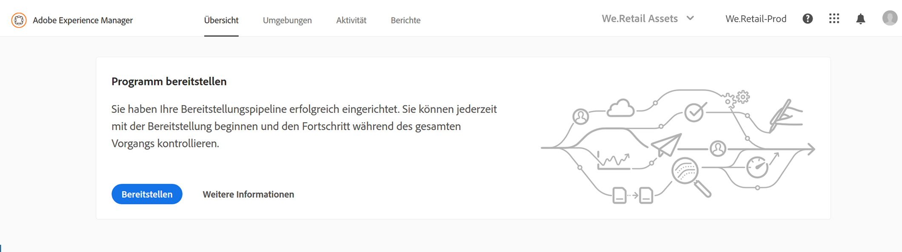
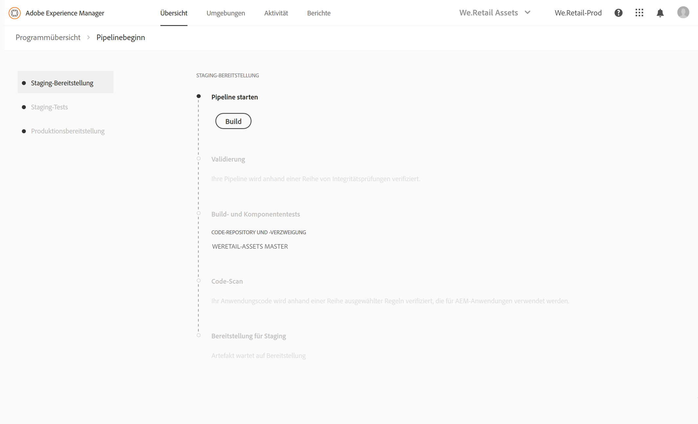
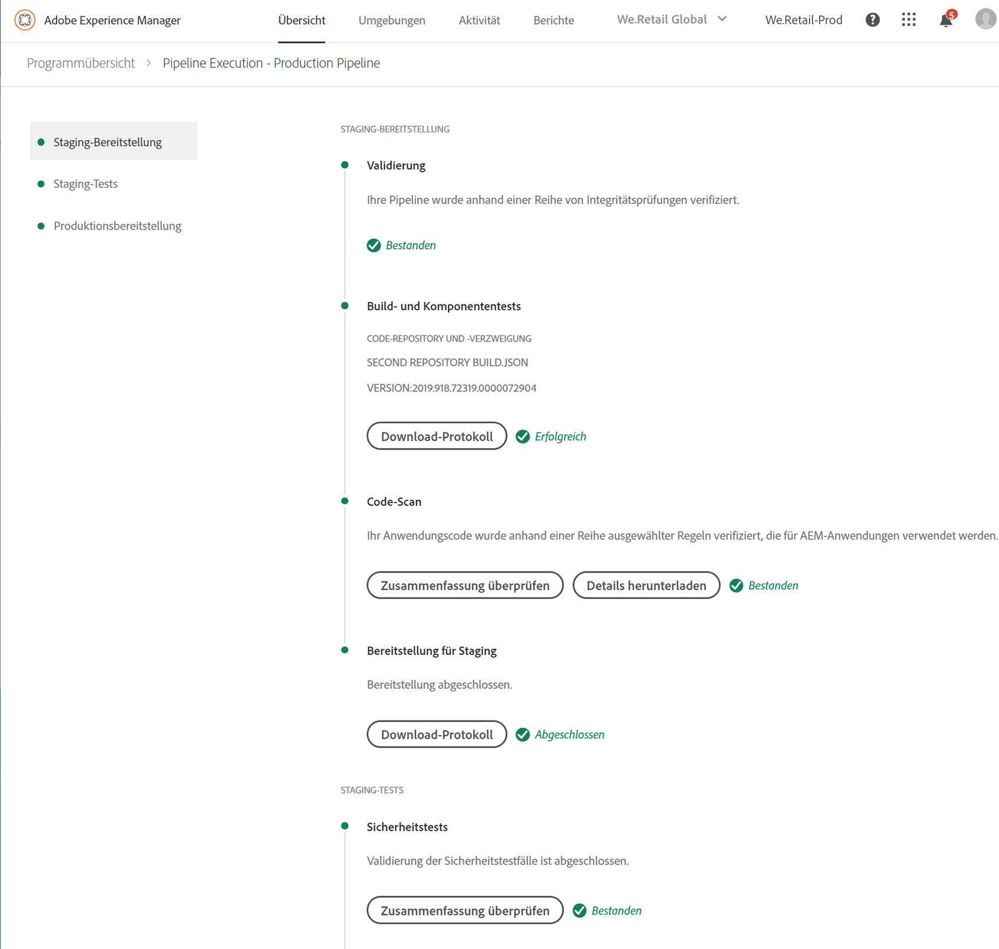
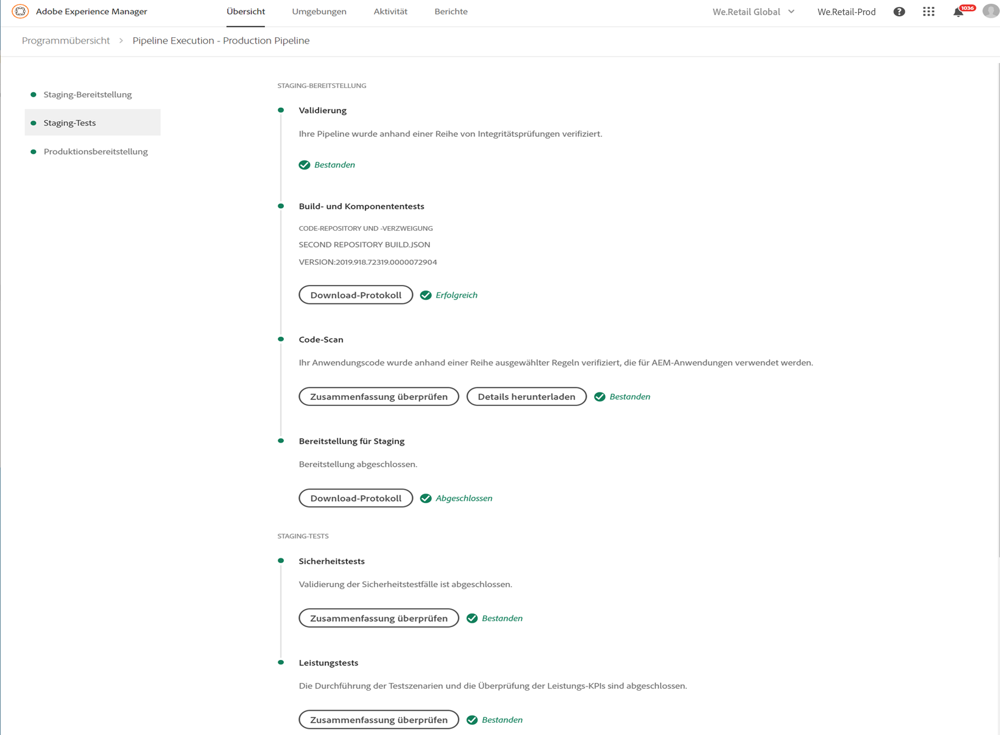
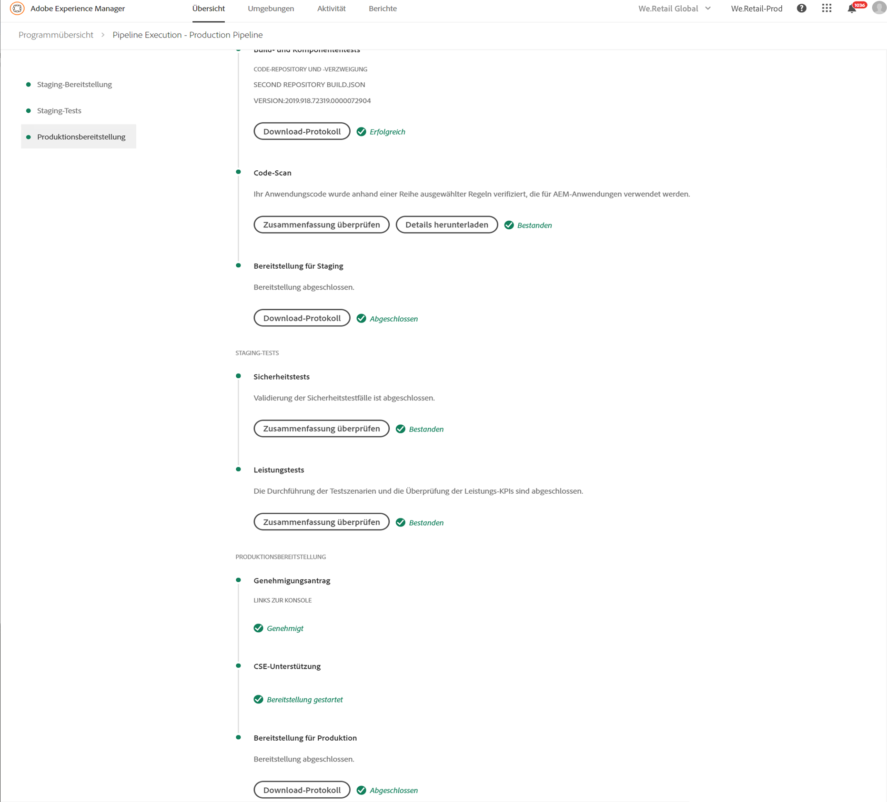
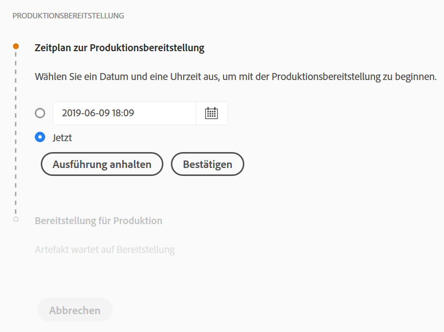
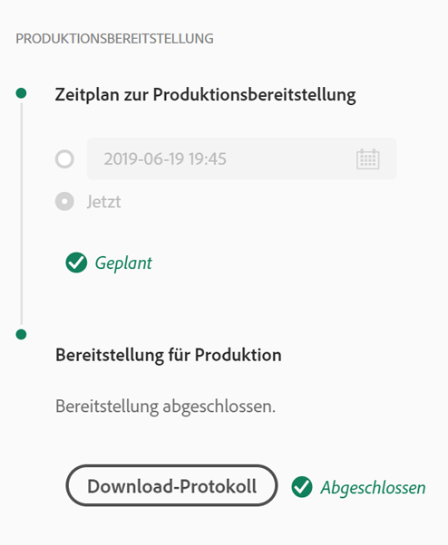
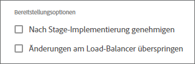

# Bereitstellen Ihres Codes {#deploy-your-code}

## Bereitstellen von Code mit Cloud Manager {#deploying-code-with-cloud-manager}

>[!NOTE]
>Weitere Informationen zum Bereitstellen von Code für Cloud Manager in AEM as a Cloud Service finden Sie [hier](https://experienceleague.adobe.com/docs/experience-manager-cloud-service/implementing/using-cloud-manager/deploy-code.html?lang=de#using-cloud-manager).

Sobald Sie Ihre Produktions-Pipeline (Repository, Umgebung und Testumgebung) konfiguriert haben, können Sie Ihren Code bereitstellen.

1. Klicken Sie in Cloud Manager auf **Bereitstellen**, um den Implementierungsprozess zu starten.

   

1. Der Bildschirm **Pipeline-Ausführung** wird angezeigt.

   Klicken Sie auf **Build**, um den Prozess zu starten.

   

1. Der vollständige Build-Prozess stellt Ihren Code bereit.

   Der Build-Prozess umfasst die folgenden Phasen:

   1. Staging-Bereitstellung
   1. Staging-Tests
   1. Produktionsimplementierung

   >[!NOTE]
   >
   >Außerdem können Sie die Schritte der verschiedenen Implementierungsprozesse überprüfen, indem Sie die Protokolle anzeigen oder die Ergebnisse anhand der Testkriterien überprüfen.

   Die **Staging-Bereitstellung** umfasst die folgenden Schritte:

   * Validierung: Dieser Schritt stellt sicher, dass die Pipeline so konfiguriert ist, dass die derzeit verfügbaren Ressourcen verwendet werden. So wird z. B. überprüft, ob die konfigurierte Verzweigung vorhanden ist und die Umgebungen verfügbar sind.
   * Build- und Komponententests: Dieser Schritt führt einen containerisierten Build-Prozess aus. Weitere Informationen zur Build-Umgebung finden Sie unter [Grundlagen zur Build-Umgebung](/help/using/build-environment-details.md).
   * Code-Scan: Dieser Schritt bewertet die Qualität Ihres Anwendungs-Codes. Weitere Informationen zum Testprozess finden Sie unter [Testergebnisse verstehen](understand-your-test-results.md).
   * Bereitstellung für Staging

   

   **Staging-Tests** umfassen die folgenden Schritte:

   * Sicherheitstests: Dieser Schritt bewertet die Auswirkungen Ihres Anwendungs-Codes auf die Sicherheit der AEM-Umgebung. Weitere Informationen zum Testprozess finden Sie unter [Testergebnisse verstehen](understand-your-test-results.md).
   * Leistungstests: Dieser Schritt bewertet die Leistung Ihres Anwendungs-Codes. Weitere Informationen zum Testprozess finden Sie unter [Testergebnisse verstehen](understand-your-test-results.md).

   

   Die **Produktionsbereitstellung** umfasst die folgenden Schritte:

   * **Genehmigungsantrag** (sofern aktiviert)
   * **Zeitplan zur Produktionsbereitstellung** (sofern aktiviert)
   * **CSE-Unterstützung** (sofern aktiviert)
   * **Bereitstellung für Produktion**

   

   >[!NOTE]
   >
   >Der **Zeitplan zur Produktionsbereitstellung** wird bei der Konfiguration der Pipeline aktiviert.
   >
   >
   >Mit dieser Option können Sie die Produktionsbereitstellung planen. Oder klicken Sie auf **Jetzt**, um die Produktionsbereitstellung sofort auszuführen.
   >
   >
   >Datum und Uhrzeit für den Zeitplan beziehen sich auf die Zeitzone des Benutzers.
   >
   >
   >Klicken Sie auf **Bestätigen**, um die Einstellungen zu überprüfen.

   

   Sobald Sie den Bereitstellungsplan bestätigt haben, wird die Codebereitstellung abgeschlossen.

   Der folgende Bildschirm wird angezeigt, wenn im obigen Schritt die Option **Jetzt** ausgewählt wurde.

   

## Zeitüberschreitungen {#timeouts}

Die folgenden Schritte führen zu einer Zeitüberschreitung, wenn auf Benutzer-Feedback gewartet wird:

| Schritt | Zeitüberschreitung |
|--- |--- |
| Testen der Code-Qualität | 14 Tage |
| Sicherheitstests | 14 Tage |
| Leistungstests | 14 Tage |
| Genehmigungsantrag | 14 Tage |
| Planen der Bereitstellung für die Produktion | 14 Tage |
| CSE-Unterstützung | 14 Tage |

## Implementierungsprozess {#deployment-process}

Im folgenden Abschnitt wird beschrieben, wie AEM- und Dispatcher-Pakete in der Staging- und Produktionsphase bereitgestellt werden.

Cloud Manager lädt alle beim Build-Prozess generierten target/*.zip-Dateien in einen Speicherort hoch.  Diese Artefakte werden in der Pipeline-Bereitstellungsphase von diesem Speicherort abgerufen.

Wenn Cloud Manager in produktionsfremden Topologien bereitgestellt wird, besteht das Ziel darin, die Implementierung so schnell wie möglich abzuschließen. Daher werden die Artefakte wie folgt auf allen Knoten gleichzeitig bereitgestellt:

1. Cloud Manager bestimmt für jedes Artefakt, ob es sich um ein AEM- oder Dispatcher-Paket handelt.
1. Cloud Manager entfernt alle Dispatcher aus dem Lastenausgleich, um die Umgebung während der Implementierung zu isolieren.

   Sofern nicht anders konfiguriert, können Sie die Load-Balancer-Änderungen in Entwicklungs- und Staging-Umgebungen überspringen, d. h. das Trennen und Anfügen in beiden produktionsfremden Pipelines bei Entwicklungsumgebungen und in der Produktions-Pipeline bei Staging-Umgebungen.

   

   >[!NOTE]
   >
   >Diese Funktion wird voraussichtlich hauptsächlich von 1-1-1-Kunden verwendet.

1. Jedes AEM-Artefakt wird über Package Manager-APIs in jeder AEM-Instanz bereitgestellt, wobei Paketabhängigkeiten die Implementierungsreihenfolge bestimmen.

   Weitere Informationen dazu, wie Sie mit Paketen neue Funktionen installieren, Inhalte zwischen Instanzen übertragen und Repository-Inhalte sichern können, finden Sie unter „Arbeiten mit Paketen“.

   >[!NOTE]
   >
   >Alle AEM-Artefakte werden für Autor und Publisher bereitgestellt. Wenn knotenspezifische Konfigurationen erforderlich sind, sollten Ausführungsmodi genutzt werden. Weitere Informationen dazu, wie Sie mit Ausführungsmodi die AEM-Instanz für einen bestimmten Zweck anpassen können, finden Sie unter „Ausführungsmodi“.

1. Das Dispatcher-Artefakt wird wie folgt für jeden Dispatcher bereitgestellt:

   1. Aktuelle Konfigurationen werden gesichert und in einen temporären Speicherort kopiert.
   1. Alle Konfigurationen (mit Ausnahme der unveränderlichen Dateien) werden gelöscht. Weitere Informationen finden Sie unter „Verwalten von Dispatcher-Konfigurationen“. Mit diesem Schritt werden die Verzeichnisse gelöscht, damit keine verwaisten Dateien übrig bleiben.
   1. Das Artefakt wird in das `httpd`-Verzeichnis extrahiert.  Unveränderliche Dateien werden nicht überschrieben. Alle Änderungen an unveränderlichen Dateien in Ihrem Git-Repository werden bei der Implementierung ignoriert.  Diese Dateien bilden den Kern des AMS Dispatcher-Frameworks und können nicht geändert werden.
   1. Apache führt einen Konfigurationstest durch. Wenn keine Fehler gefunden werden, wird der Service neu geladen. Falls ein Fehler auftritt, werden die Konfigurationen aus der Sicherung wiederhergestellt, der Service wird neu geladen und der Fehler wird an Cloud Manager gemeldet.
   1. Jeder in der Pipelinekonfiguration angegebene Pfad wird ungültig oder aus dem Dispatcher-Cache entfernt.

   >[!NOTE]
   >Cloud Manager geht davon aus, dass das Dispatcher-Artefakt alle Dateien enthält.  Alle Dispatcher-Konfigurationsdateien müssen im Git-Repository vorhanden sein. Fehlende Dateien oder Ordner führen zu Implementierungsfehlern.

1. Nach der erfolgreichen Implementierung aller AEM- und Dispatcher-Pakete auf allen Knoten werden die Dispatcher wieder zum Lastenausgleich hinzugefügt und die Implementierung wird abgeschlossen.

   >[!NOTE]
   >Sie können Änderungen am Load-Balancer in Entwicklungs- und Staging-Implementierungen überspringen, d. h. das Trennen und Anfügen in beiden produktionsfremden Pipelines bei Entwicklungsumgebungen und in der Produktions-Pipeline bei Staging-Umgebungen.

### Implementierung in der Produktionsphase {#deployment-production-phase}

Der Prozess zur Bereitstellung auf Produktionstopologien unterscheidet sich geringfügig, um die Auswirkungen auf AEM Sites-Besucher zu minimieren.

Produktionsimplementierungen nutzen im Allgemeinen die oben beschriebenen Schritte, aber auf rollierende Weise:

1. AEM-Pakete werden für den Autor bereitgestellt
1. dispatcher1 wird aus dem Lastenausgleich gelöst
1. AEM-Pakete werden in publish1 und das Dispatcher-Paket parallel in dispatcher1 bereitgestellt, der Dispatcher-Cache wird geleert
1. dispatcher1 wird in den Lastenausgleich zurückgesetzt
1. Sobald dispatcher1 wieder aktiv ist, wird dispatcher2 aus dem Lastenausgleich entfernt
1. AEM-Pakete werden in publish2 und das Dispatcher-Paket parallel in dispatcher2 bereitgestellt, der Dispatcher-Cache wird geleert
1. dispatcher2 wird in den Lastenausgleich zurückgesetzt
Dieser Vorgang wird fortgesetzt, bis die Implementierung alle Publisher und Dispatcher in der Topologie erreicht hat.

## Notfall-Pipeline-Ausführungsmodus {#emergency-pipeline}

In kritischen Situationen müssen Adobe Managed Services-Kunden möglicherweise Code-Änderungen in ihrer Staging- und Produktionsumgebung bereitstellen, ohne auf die Ausführung eines vollständigen Cloud Manager-Testzyklus zu warten.

Um diese Situationen zu beheben, kann die Cloud Manager-Produktions-Pipeline in einem *Notfall*-Modus ausgeführt werden. Wenn dieser Modus verwendet wird, werden die Sicherheits- und Leistungstestschritte nicht ausgeführt. Alle anderen Schritte, einschließlich aller konfigurierten Validierungsschritte, werden wie im normalen Pipeline-Ausführungsmodus ausgeführt.

>[!NOTE]
>Die Funktion „Notfall-Pipeline-Ausführungsmodus“ wird vom Customer Success Engineer auf der Programmebene aktiviert.

### Verwenden des Notfall-Pipeline-Ausführungsmodus {#using-emergency-pipeline}

Wenn Sie eine Produktions-Pipeline ausführen und diese Funktion aktiviert wurde, können Sie die Ausführung im normalen oder im Notfallmodus über das Dialogfeld starten, wie in der folgenden Abbildung dargestellt.


Darüber hinaus zeigen die Breadcrumbs oben im Bildschirm auf der Seite mit Details zur Pipeline-Ausführung für einen Ausführungslauf im Notfallmodus an, dass der Notfallmodus für diese bestimmte Ausführung verwendet wurde.


Die Erstellung einer Pipeline-Ausführung in diesem Notfallmodus kann auch über die Cloud Manager-API oder die CLI erfolgen. Um eine Ausführung im Notfallmodus zu starten, senden Sie mit dem Abfrageparameter `?pipelineExecutionMode=EMERGENCY` eine PUT-Anfrage an den Ausführungsendpunkt der Pipeline oder bei Verwendung der CLI:

```
$ aio cloudmanager:pipeline:create-execution PIPELINE_ID --emergency
```

>[!IMPORTANT]
>Bei Verwendung des `--emergency`-Flags muss möglicherweise auf die neueste `aio-cli-plugin-cloudmanager`-Version aktualisiert werden.

## Produktionsbereitstellung erneut ausführen {#Reexecute-Deployment}

Die erneute Ausführung des Produktionsbereitstellungsschritts wird bei Ausführungen unterstützt, bei denen der Schritt zur Produktionsbereitstellung abgeschlossen ist. Die Art der Fertigstellung ist nicht wichtig – die Bereitstellung könnte erfolgreich sein (nur für AMS-Programme), abgebrochen oder nicht erfolgreich sein. Der primäre Anwendungsfall sind jedoch Fälle, in denen der Produktionsbereitstellungsschritt aus vorübergehenden Gründen fehlgeschlagen ist. Bei der erneuten Ausführung wird eine neue Ausführung mit derselben Pipeline erstellt. Diese neue Ausführung besteht aus drei Schritten:

1. Der Validierungsschritt – dies ist im Wesentlichen dieselbe Validierung, die während einer normalen Pipeline-Ausführung erfolgt.
1. Der Build-Schritt – Im Kontext einer erneuten Ausführung kopiert der Build-Schritt Artefakte und führt keinen neuen Build-Prozess aus.
1. Der Schritt zur Produktionsbereitstellung – er verwendet dieselbe Konfiguration und dieselben Optionen wie der Schritt zur Produktionsbereitstellung bei einer normalen Pipeline-Ausführung.

Der Build-Schritt ist in der Benutzeroberfläche möglicherweise etwas anders beschriftet, um zu erkennen, dass er Artefakte kopiert und nicht etwas neu erstellt.


Beschränkungen:

* Die erneute Ausführung des Produktionsbereitstellungsschritts ist nur für die letzte Ausführung verfügbar.
* Die Neuausführung ist nicht für Rollback-Ausführungen verfügbar.
* Wenn es sich bei der letzten Ausführung um eine Rollback-Ausführung handelt, ist eine erneute Ausführung nicht möglich.
* Wenn es sich bei der letzten Ausführung um eine Push-Update-Ausführung handelt, ist eine erneute Ausführung nicht möglich.
* Wenn die letzte Ausführung vor dem Produktionsbereitstellungsschritt fehlschlug, ist eine erneute Ausführung nicht möglich.

### API erneut ausführen {#Reexecute-API}

### Ermitteln einer erneuten Ausführung

Um festzustellen, ob es sich bei einer Ausführung um eine erneute Ausführung handelt, kann das Auslösefeld geprüft werden. Sein Wert sollte *RE_EXECUTE* sein.

### Auslösen einer neuen Ausführung

Um eine erneute Ausführung auszulösen, muss eine PUT-Anfrage an den HAL-Link &lt;(<http://ns.adobe.com/adobecloud/rel/pipeline/reExecute>)> im Status der Produktionsbereitstellungsschritte erfolgen. Wenn dieser Link vorhanden ist, kann die Ausführung von diesem Schritt an neu gestartet werden. Wenn dies nicht der Fall ist, kann die Ausführung von diesem Schritt an nicht erneut gestartet werden. In der ersten Version ist dieser Link nur im Schritt zur Produktionsbereitstellung vorhanden, aber zukünftige Versionen unterstützen möglicherweise das Starten der Pipeline von anderen Schritten aus. Beispiel:

```Javascript
 {
  "_links": {
    "http://ns.adobe.com/adobecloud/rel/pipeline/logs": {
      "href": "/api/program/4/pipeline/1/execution/953671/phase/1575676/step/2983530/logs",
      "templated": false
    },
    "http://ns.adobe.com/adobecloud/rel/pipeline/reExecute": {
      "href": "/api/program/4/pipeline/1/execution?stepId=2983530",
      "templated": false
    },
    "http://ns.adobe.com/adobecloud/rel/pipeline/metrics": {
      "href": "/api/program/4/pipeline/1/execution/953671/phase/1575676/step/2983530/metrics",
      "templated": false
    },
    "self": {
      "href": "/api/program/4/pipeline/1/execution/953671/phase/1575676/step/2983530",
      "templated": false
    }
  },
  "id": "6187842",
  "stepId": "2983530",
  "phaseId": "1575676",
  "action": "deploy",
  "environment": "weretail-global-b75-prod",
  "environmentType": "prod",
  "environmentId": "59254",
  "startedAt": "2022-01-20T14:47:41.247+0000",
  "finishedAt": "2022-01-20T15:06:19.885+0000",
  "updatedAt": "2022-01-20T15:06:20.803+0000",
  "details": {
  },
  "status": "FINISHED"
```


Die Syntax des *href*-Wertes des HAL-Links ist nicht zu dessen Verwendung als Bezugspunkt vorgesehen. Der tatsächliche Wert sollte immer aus dem HAL-Link gelesen und nicht generiert werden.

Das Senden einer *PUT*-Anfrage an diesen Endpunkt führt zu einer *201*-Antwort bei Erfolg, wobei der Antworttext die Darstellung der neuen Ausführung ist. Dies ähnelt dem Starten einer regulären Ausführung über die API.
