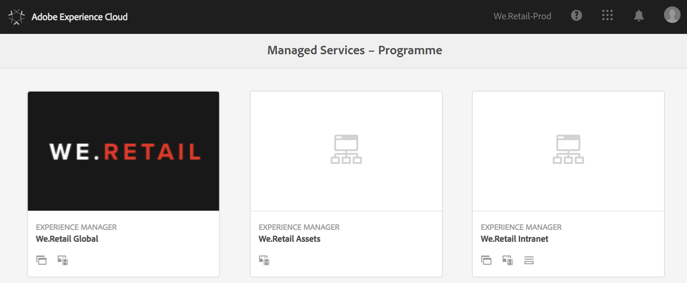
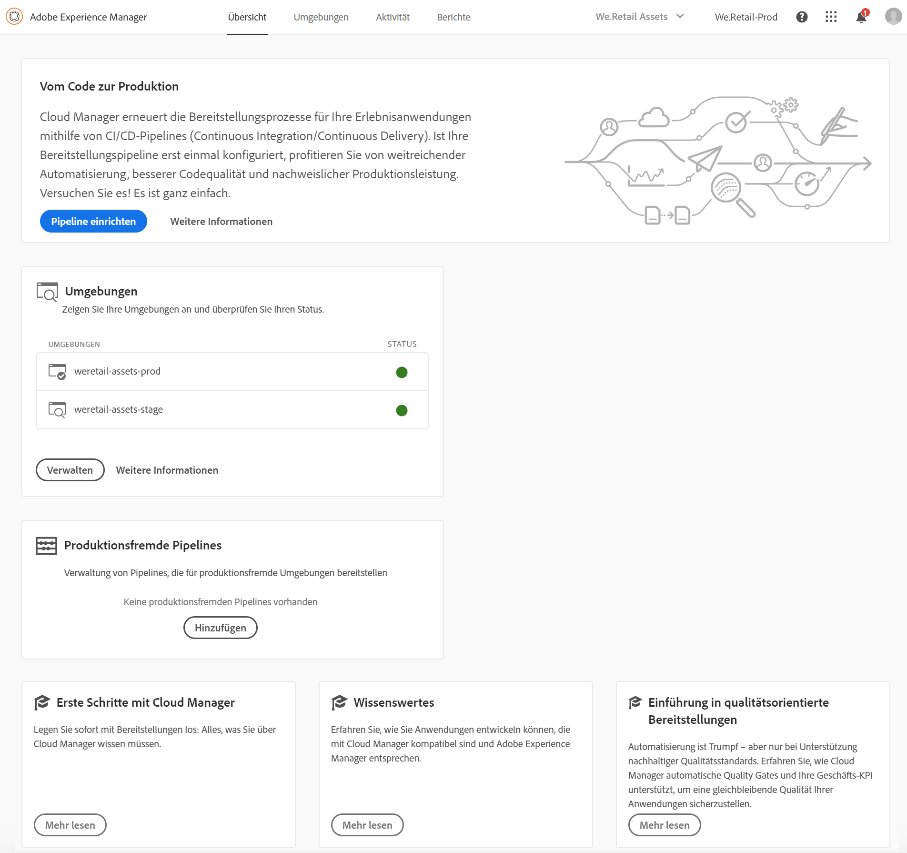

# Erste Anmeldung {#first-time-login}

Sobald Sie die allgemeinen Konfigurationen für [!UICONTROL Cloud Manager] eingerichtet haben, können Sie die [!UICONTROL Cloud Manager]-Benutzeroberfläche verwenden.

>[!NOTE]
>Je nach den in [!UICONTROL Cloud Manager] zugewiesenen Rollen und dem Anwendungsstatus werden bei der Verwendung der [!UICONTROL Cloud Manager]-Benutzeroberfläche unterschiedliche Bildschirme angezeigt.

## Video-Tutorial {#video-tutorial-one}

### Cloud Manager-Programme {#programs-video}

Das folgende Video bietet einen Überblick über Cloud Manager-Programme, die eine Reihe von AEM-Umgebungen repräsentieren, die logische Gruppen von Geschäftsinitiativen unterstützen. Diese entsprechen in der Regel einem erworbenen Service Level Agreement (SLA).

>[!VIDEO](https://video.tv.adobe.com/v/26313/)

## Anmeldung beim ersten Mal {#logging-in-for-the-first-time}

1. Melden Sie sich bei **Adobe [!UICONTROL Experience Cloud]** an und sehen Sie sich die Liste der **Programme** an.

   

1. Wählen Sie das Programm (z. B. **We.Retail Global**) aus und klicken Sie oben links auf das Symbol, um [!UICONTROL Cloud Manager] zu öffnen.

   

1. Das Dashboard für [!UICONTROL Cloud Manager] wird angezeigt.

   

1. Klicken Sie auf **Programm einrichten**, um die Beschreibung für das **Programm** festzulegen und die Key Performance Indicators (KPIs) zu definieren.

   >[!NOTE]
   >
   >Informationen zum Abschließen der nächsten Schritte finden Sie unter [Einrichten Ihres Programms](https://helpx.adobe.com/de/experience-manager/cloud-manager/using/setting-up-program.html).

## Video-Tutorial {#video-tutorial-two}

### Registerkarte „Cloud Manager-Aktivität“ {#activity-video}

Cloud Manager bietet einen Überblick über die Aktivitäten eines Programms, in dem alle CI/CD-Pipeline-Ausführungen aufgelistet werden (Produktion und Nicht-Produktion), sodass Sie die vergangene und aktuelle Aktivität einsehen können. Zu jeder Aktivität lassen sich Details anzeigen.

>[!VIDEO](https://video.tv.adobe.com/v/26313/)