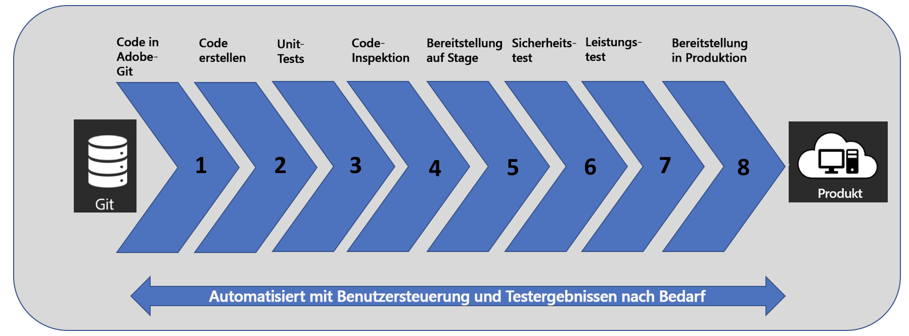

# Einführung in [!UICONTROL Cloud Manager] {#introduction-to-cloud-manager}

>[!CONTEXTUALHELP]
>id="aemcloud_cloudmanager_introduction"
>title="Einführung in Cloud Manager"
>abstract="Ermöglicht Unternehmen die Selbstverwaltung von Experience Manager in der Cloud. Das umfasst ein Framework für die fortlaufende Integration und Bereitstellung (CI/CD), mit dem IT-Teams und Implementierungspartner die Bereitstellung von Anpassungen oder Aktualisierungen beschleunigen können, ohne die Leistung oder Sicherheit zu beeinträchtigen."
>additional-url="https://experienceleague.adobe.com/docs/experience-manager-learn/cloud-service/cloud-manager/programs.html?lang=de#cloud-manager" text="Programme erstellen"
>additional-url="https://experienceleague.adobe.com/docs/experience-manager-learn/cloud-service/cloud-manager/environments.html?lang=de#cloud-manager" text="Umgebungen erstellen"

## Einführung {#introduction}

[!UICONTROL Cloud Manager] für Adobe Experience Manager bietet Entwicklern die Möglichkeit, durch optimierte Workflows, die auf Best Practices von Adobe Experience Manager basieren, überzeugende Kundenerlebnisse zu erstellen. Für Adobe Experience Manager optimierte CI/CD-Pipelines ermöglichen es Ihnen, Entwicklungs-Workflows einfach zusammenzuführen, indem Sie Ihren Code einchecken und bis zur Produktionsbereitschaft führen. Während der Build-Phase werden Ihre benutzerspezifischen Code-Aktualisierungen gründlich nach bewährten Best Practices und gewonnenen Erfahrungen getestet, sodass Ihren Kunden wirkungsvolle digitale Erlebnisse bereitgestellt werden. Cloud Manager arbeitet mit offenen APIs und ermöglicht Ihnen die Integration in Ihre Systeme, ohne bestehende Prozesse und Tools zu stören.

Auf dieser Dokumentations-Website werden speziell die Funktionen von Cloud Manager beschrieben, die für Kunden von Adobe Managed Services (AMS) relevant sind. Die entsprechende Dokumentation für Kunden von AEM as a Cloud Service finden Sie unter [Implementieren von Programmen für AEM as a Cloud Service](https://experienceleague.adobe.com/docs/experience-manager-cloud-service/implementing/home.html?lang=de).

Cloud Manager bietet dem Entwicklungs-Team folgende Möglichkeiten:

* Kontinuierliche Integration/Bereitstellung (CI/CD, Continuous Integration/Continuous Delivery) von Code zur Verkürzung der Markteinführungszeit von Monaten/Wochen auf Tage/Stunden

* Code-Prüfungen, Leistungstests und Sicherheitsprüfungen basierend auf Best Practices, bevor der Code an die Produktion gesendet wird, um Produktionsunterbrechungen zu minimieren

* API-Konnektivität zur Ergänzung vorhandener DevOps-Prozesse

* Automatische Skalierungsfunktion zur intelligenten Erkennung eines erhöhten Kapazitätsbedarfs und automatischen Online-Bereitstellung zusätzlicher Dispatcher-/Veröffentlichungssegmente

Die folgende Abbildung zeigt den CI/CD-Prozessablauf in [!UICONTROL Cloud Manager]:

## Wichtige Funktionen in [!UICONTROL Cloud Manager] {#key-features-in-cloud-manager}

Unternehmen können mit [!UICONTROL Cloud Manager] die folgenden Funktionen nutzen:

### Self-Service-Benutzeroberfläche {#self-service-interface}

Die [!UICONTROL Cloud Manager]-Benutzeroberfläche ermöglicht Kunden den einfachen Zugriff und die Verwaltung der Cloud-Umgebung sowie der CI/CD-Pipeline für ihre Experience Manager-Anwendungen.

Kunden definieren anwendungsspezifische Key Performance Indicators (KPIs) (z. B. maximale Seitenansichten und erwartete Reaktionszeiten für Seitenladevorgänge), die als Grundlage für die Messung einer erfolgreichen Bereitstellung dienen. Rollen und Berechtigungen für verschiedene Teammitglieder können einfach definiert werden. Die neue Self-Service-Benutzeroberfläche gibt Ihnen nicht nur die volle Kontrolle, sondern bietet außerdem Links zu Best Practices und Zugang zu Experten von Adobe, die bei Bedarf die erforderliche Anleitung zur Verfügung stellen.

Weitere Informationen zur Benutzeroberfläche von [!UICONTROL Cloud Manager] und zu den ersten Schritten finden Sie unter [Erste Anmeldung](https://helpx.adobe.com/de/experience-manager/cloud-manager/using/first-time-login.html).

### CI/CD-Pipeline {#ci-cd-pipeline}

Eine der Hauptfunktionen von [!UICONTROL Cloud Manager] ist die Möglichkeit, eine optimierte CI/CD-Pipeline einzurichten, um die Bereitstellung von benutzerspezifischem Code oder Aktualisierungen (z. B. hinzugefügte neue Website-Komponenten) zu beschleunigen.

Über die [!UICONTROL Cloud Manager]-Benutzeroberfläche können Kunden ihre CI/CD-Pipeline konfigurieren und starten. Im Rahmen dieser Pipeline wird ein gründlicher Codescan durchgeführt, um sicherzustellen, dass nur hochwertige Anwendungen in die Produktionsumgebung übertragen werden.

Weitere Informationen zum Konfigurieren der Pipeline in der Benutzeroberfläche von [!UICONTROL Cloud Manager] finden Sie unter [Konfigurieren von Produktions-Pipelines](configuring-production-pipelines.md) und [Konfigurieren von produktionsfremden Pipelines](configuring-non-production-pipelines.md).

### Flexible Bereitstellungsmodi {#flexible-deployment-modes}

[!UICONTROL Cloud Manager] bietet Kunden flexible und konfigurierbare Bereitstellungsmodi, damit sie Erlebnisse entsprechend den sich ändernden Geschäftsanforderungen bereitstellen können.

Im automatischen Auslösermodus wird der Code basierend auf bestimmten Ereignissen (z. B. einem Code-Commit) automatisch in einer Umgebung bereitgestellt. Sie können Codebereitstellungen auch innerhalb bestimmter Zeitrahmen (auch außerhalb der Geschäftszeiten) planen.

Unabhängig vom Bereitstellungsauslöser werden bei einer CI/CD-Pipeline-Ausführung immer Qualitätsprüfungen durchgeführt. Das gilt für jede ausgelöste Bereitstellung. Zu den Qualitätsprüfungen gehören sofort einsatzfähige Codeprüfungen, Sicherheitstests und Leistungstests, die ohne Aufwand seitens der Kunden oder der Partner genutzt werden können.

Weitere Informationen zum Bereitstellen von Code und zu Qualitätsprüfungen finden Sie unter [Bereitstellen Ihres Codes](deploying-code.md).

### Automatische Skalierung {#autoscaling}

[!UICONTROL Cloud Manager] erkennt zusätzlichen Kapazitätsbedarf, wenn die Produktionsumgebung ungewöhnlich stark ausgelastet ist, und stellt über die automatische Skalierungsfunktion automatisch zusätzliche Kapazitäten bereit.

Während die automatische Skalierung durchgeführt wird, löst [!UICONTROL Cloud Manager] automatisch die Skalierung aus, sendet eine Benachrichtigung über die automatische Skalierung und schaltet die zusätzliche Kapazität innerhalb von Minuten aktiv. Die zusätzliche Kapazität wird in der Produktionsumgebung bereitgestellt, und zwar in denselben Regionen und mit denselben Systemspezifikationen wie in laufenden Dispatcher-/Veröffentlichungsknoten.

Die Funktion zur automatischen Skalierung gilt nur für die Dispatcher-/Veröffentlichungsstufe und wird immer mit einer horizontalen Skalierungsmethode durchgeführt, wobei mindestens ein zusätzliches Segment aus Dispatcher-/Veröffentlichungspaar hinzugefügt wird und maximal zehn Segmente verwendet werden. Jede zusätzlich bereitgestellte Kapazität wird innerhalb von zehn Arbeitstagen, wie vom CSE (Customer Success Engineer) bestimmt, manuell zurückgenommen.

>[!NOTE]
>Kunden, die erfahren möchten, ob die automatische Skalierung für ihre Anwendung geeignet ist, müssen sich an ihren CSE oder Adobe-Support-Mitarbeiter wenden.
