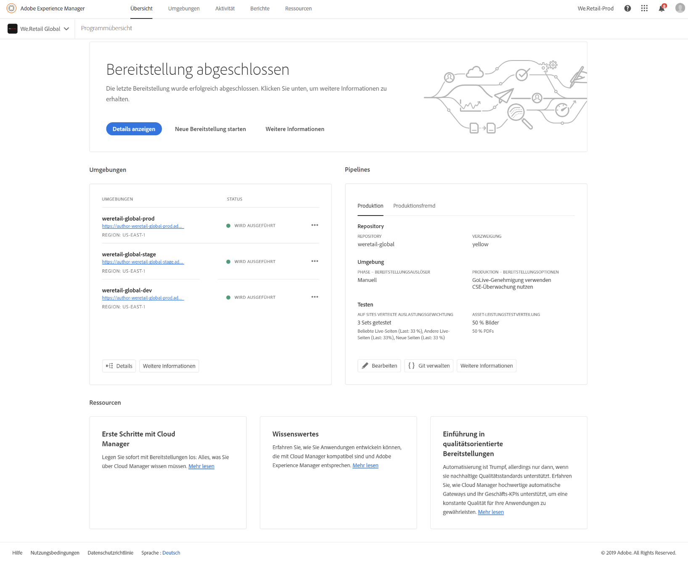
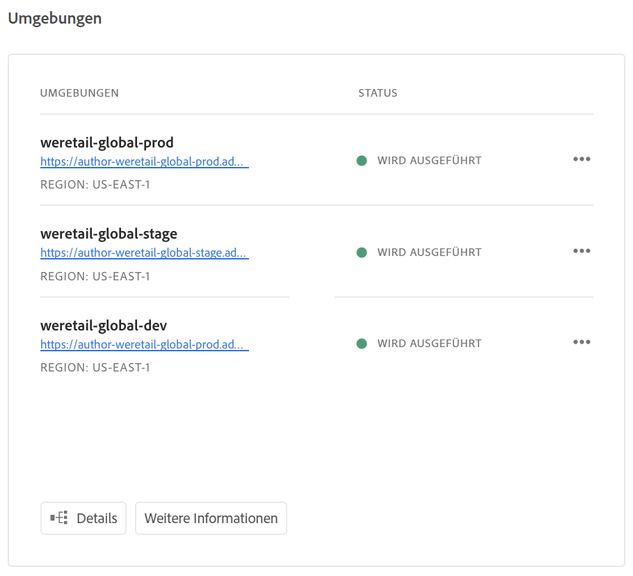
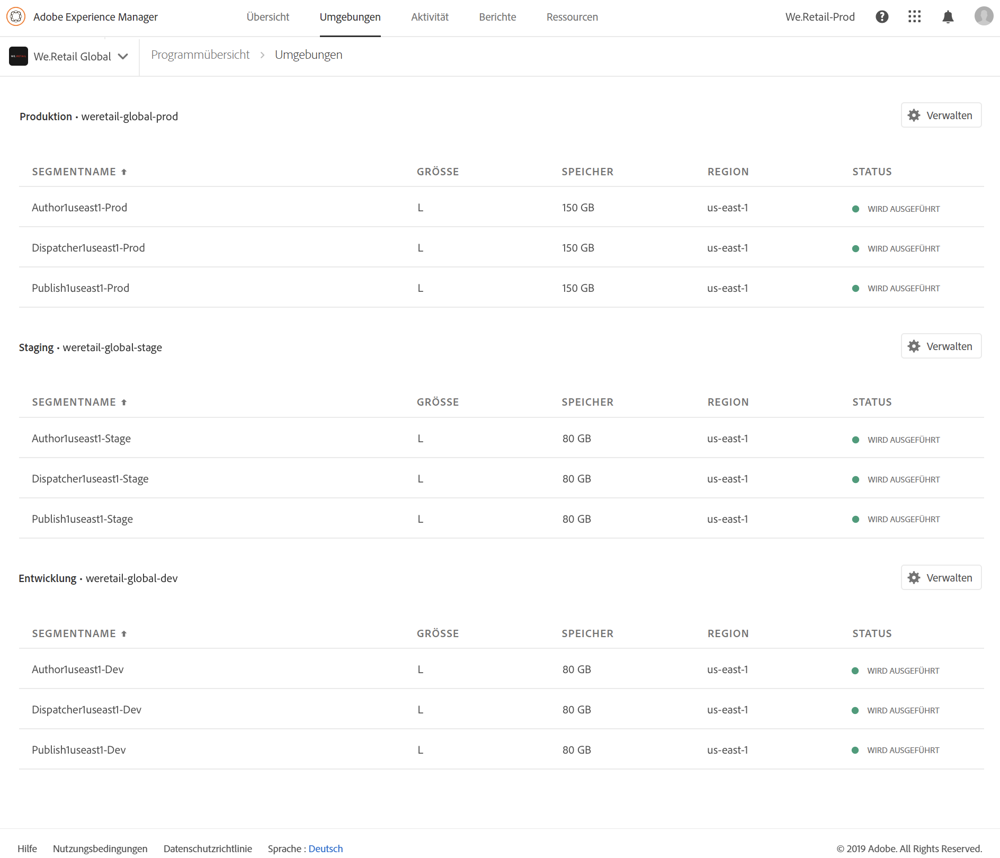

# Verwalten von Umgebungen {#manage-your-environments}

Auf der Seite **Übersicht** von Cloud Manager finden Sie die Kachel **Umgebungen** mit allen verwalteten AEM-Umgebungen.

Jede Umgebung wird mit ihrem zugehörigen Status angezeigt.

## Video-Tutorial {#video-tutorial}

### Überblick über die Cloud Manager-Umgebung {#environ-video}

Das folgende Video bietet einen Überblick über Cloud Manager-Umgebungen, die aus AEM Author-, AEM Publish- und Dispatcher-Instanzen bestehen.

>[!VIDEO](https://video.tv.adobe.com/v/26318/?captions=ger)

## Zugreifen auf Umgebungen in Cloud Manager{#accessing-environments-in-cloud-manager}

Auf der Kachel **Umgebungen** werden die in Ihrem Programm bereitgestellten Produktions- und Staging-Umgebungen zusammen mit dem Status angezeigt.

Der Status entspricht dem aggregierten Leistungsstatus für alle Knoten in der Umgebung. Der Status leuchtet grün, wenn alle Knoten ausgeführt werden, rot, wenn auch nur ein Knoten angehalten wurde, blau, wenn auch nur ein Knoten aktiv wird, und gelb, wenn auch nur für ein Knoten kein Leistungsstatus verfügbar ist (in dieser Prioritätsreihenfolge).

### Umgebungen {#environments}

Klicken Sie auf **Verwalten**, um den Bildschirm **Umgebungen** anzuzeigen.

Auf dem Bildschirm **Umgebungen** wird jeweils eine Karte für *Produktions-* und *Staging-Umgebungen* (sofern zutreffend) in Ihrem Programm angezeigt. Der Name der Umgebung wird über jeder Karte angezeigt. Die Karte enthält eine Tabelle der Knoten in der Umgebung sowie die Größe der CPU, den Speicher, die Region und den Status.

>[!NOTE]
>
>Der **STATUS** des Knotens stellt den Leistungsstatus der VM dar und spiegelt nicht den Status von AEM auf dem Server wider. Der Status kann wie folgt lauten: **Aktiv** (grüner Kreis), **Angehalten** (roter Kreis), **Demnächst aktiv** (blauer Kreis) oder **Nicht verfügbar** (gelber Kreis).

