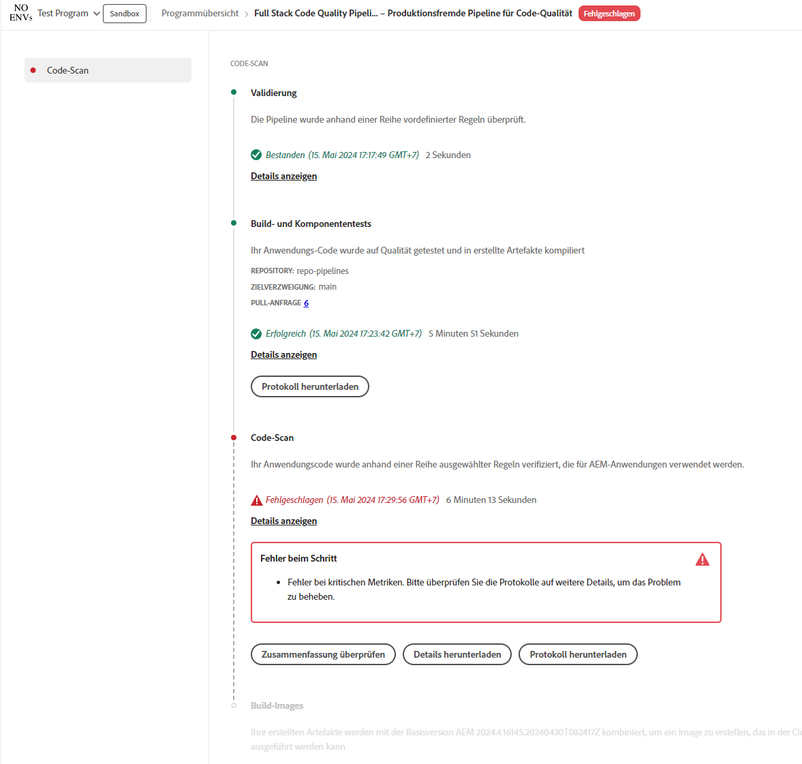

# Verwalten von Pipelines {#managing-pipelines}

Erfahren Sie, wie Sie Ihre vorhandenen Pipelines verwalten, einschließlich ihrer Bearbeitung, Ausführung und Löschung.

## Pipeline-Karte {#pipeline-card}

Die Karte **Pipelines** auf der Seite **Programmübersicht** in Cloud Manager bietet Ihnen einen Überblick über alle Ihre Pipelines und deren aktuellen Status.

Wenn Sie auf die Suchschaltfläche neben jeder Pipeline klicken, können Sie die folgenden Aktionen ausführen:

* [Führen Sie die Pipeline aus](#running-pipelines).
* [Bearbeiten Sie die Pipeline](#editing-pipelines).
* [Löschen Sie die Pipeline](#deleting-pipelines).
* [Details anzeigen](#view-details).

Am unteren Rand der Pipelineliste befinden sich die folgenden allgemeinen Optionen.

* **Hinzufügen** - Fügen Sie [eine neue Produktions-Pipeline hinzu](/help/using/production-pipelines.md) oder [ fügen Sie eine neue Nicht-Produktions-Pipeline hinzu](/help/using/non-production-pipelines.md).
* **Alle anzeigen**: Leitet den Anwender zum Bildschirm **Pipelines**, wo alle Pipelines in einer detaillierteren Tabelle angezeigt werden.
* **Zugriff auf Repo Info** - Zeigt die Informationen an, die für den Zugriff auf das Cloud Manager Git-Repository erforderlich sind.
* **Weitere Infos**: Navigiert zu den Dokumentationsressourcen zur CI/CD-Pipeline.

## Fenster „Pipelines“ {#pipelines}

Das Fenster **Pipelines** zeigt eine vollständige Liste aller Pipelines für das ausgewählte Programm an. Diese Liste ist nützlich, da sie umfassendere Informationen enthält, als auf der [Pipelines-Karte](#pipeline-card) verfügbar sind.

1. Melden Sie sich unter [my.cloudmanager.adobe.com](https://my.cloudmanager.adobe.com/) bei Cloud Manager an und wählen Sie die entsprechende Organisation sowie das entsprechende Programm aus.

1. Klicken Sie auf der Seite **Programmübersicht** auf die Registerkarte **Pipelines**, um zum Fenster **Pipelines** zu wechseln.

1. Hier können Sie eine Liste aller Pipelines für das Programm sehen und die Ausführung von Pipelines starten und stoppen, wie Sie es in der **Pipelines-Karte** tun würden.

Durch Klicken auf das Symbol `i` erhalten Sie Details über die letzte oder aktuelle Ausführung der Pipeline.

Klicken Sie auf **Details anzeigen**, um zu den [Details zur Pipeline-Ausführung](#view-details) zu gelangen.

## Fenster „Aktivität“ {#activity}

Das Fenster **Aktivität** zeigt eine vollständige Liste aller Pipeline-Ausführungen für das ausgewählte Programm an.

1. Melden Sie sich unter [my.cloudmanager.adobe.com](https://my.cloudmanager.adobe.com/) bei Cloud Manager an und wählen Sie die entsprechende Organisation und das entsprechende Programm aus.

1. Klicken Sie auf der Seite **Programmübersicht** auf die Registerkarte **Aktivität**, um zum Fenster **Aktivität** zu wechseln.

1. Hier sehen Sie eine Liste aller Pipeline-Ausführungen für das Programm, einschließlich aktueller und vorheriger Ausführungen.

Durch Klicken auf das Symbol `i` werden Details zur Ausführung des ausgewählten Pipeline-Laufs angezeigt.

Klicken Sie auf **Details anzeigen** , um die [Details der Pipeline-Ausführung zu überprüfen](#view-details).

## Ausführen von Pipelines {#running-pipelines}

1. Melden Sie sich unter [my.cloudmanager.adobe.com](https://my.cloudmanager.adobe.com/) bei Cloud Manager an und wählen Sie die entsprechende Organisation sowie das entsprechende Programm aus.
1. Gehen Sie von Ihrer Seite **Programmübersicht** aus zur Karte **Pipelines**.
1. Klicken Sie auf die Suchschaltfläche neben der von Ihnen ausgeführten Pipeline und wählen Sie dann im Menü **Ausführen** aus.

   Die Spalte Status gibt an, wann die Pipeline-Ausführung beginnt.

   Sie können die Details der Ausführung sehen, indem Sie erneut auf die Schaltfläche mit den Auslassungspunkten klicken und **[Details anzeigen](#view-details)** auswählen.

   Je nach Pipeline-Typ können Sie die Ausführung möglicherweise abbrechen, indem Sie erneut auf die Schaltfläche mit den Auslassungspunkten klicken und **Abbrechen** auswählen.

## Bearbeiten von Pipelines {#editing-pipelines}

1. Melden Sie sich unter [my.cloudmanager.adobe.com](https://my.cloudmanager.adobe.com/) bei Cloud Manager an und wählen Sie die entsprechende Organisation sowie das entsprechende Programm aus.

1. Navigieren Sie auf der Seite **Programmübersicht** zur Karte **Pipelines** und klicken Sie auf die Suchschaltfläche neben der Pipeline, die Sie bearbeiten möchten. Wählen Sie dann im Menü **Bearbeiten** aus.

1. Das Dialogfeld **Produktions-Pipeline bearbeiten** oder **Nicht-Produktions-Pipeline bearbeiten** wird angezeigt. Sie können dieselben Details bearbeiten, die Sie während der Pipeline-Erstellung eingegeben haben.

   Weitere Informationen zu den Feldern und Konfigurationsoptionen für Pipelines finden Sie unter [Konfigurieren von Produktions-Pipelines](/help/using/production-pipelines.md) und [Konfigurieren von Nicht-Produktions-Pipelines](/help/using/non-production-pipelines.md) .

1. Klicken Sie auf **Aktualisieren** , wenn Sie fertig sind.

>[!NOTE]
>
>Pipelines, die gerade ausgeführt werden, können nicht bearbeitet werden.

## Löschen von Pipelines {#deleting-pipelines}

1. Melden Sie sich unter [my.cloudmanager.adobe.com](https://my.cloudmanager.adobe.com/) bei Cloud Manager an und wählen Sie die entsprechende Organisation sowie das entsprechende Programm aus.

1. Navigieren Sie auf der Seite **Programmübersicht** zur Karte **Pipelines** und klicken Sie auf die Suchschaltfläche neben der von Ihnen ausgeführten Pipeline. Wählen Sie dann im Menü **Löschen** aus.

>[!NOTE]
>
>Pipelines, die gerade ausgeführt werden, können nicht gelöscht werden.

## Anzeigen von Details {#view-details}

1. Melden Sie sich unter [my.cloudmanager.adobe.com](https://my.cloudmanager.adobe.com/) bei Cloud Manager an und wählen Sie die entsprechende Organisation sowie das entsprechende Programm aus.

1. Navigieren Sie auf der Seite **Programmübersicht** zur Karte **Pipelines** und klicken Sie auf die Suchschaltfläche neben der von Ihnen ausgeführten Pipeline. Wählen Sie dann im Menü **Details anzeigen** aus.

1. Sie gelangen zur Detailseite der Pipeline, die gerade ausgeführt wird.

Von hier aus können Sie den Status der verschiedenen Schritte der Pipeline sehen und Build-Protokolle zu Diagnosezwecken abrufen. Weitere Informationen finden Sie im Dokument [Bereitstellung von Code](/help/using/code-deployment.md).

Es werden alle Schritte einer Pipeline-Ausführung angezeigt, wobei die Schritte, die noch nicht gestartet wurden, ausgegraut sind. Die abgeschlossenen Schritte werden mit ihrer jeweiligen Dauer angezeigt.

Wenn ein Pipeline-Schritt abgeschlossen ist, wird eine Zusammenfassung angezeigt.

Klicken Sie auf den Link **Details anzeigen**, um den Abschnitt **Dauer** anzuzeigen. Dieser Abschnitt enthält die durchschnittliche Dauer der Pipeline basierend auf dem historischen Trend für dieses Programm.

Wenn Ihre Pipeline den Schritt **Code-Scan** umfasst hat, durch den Probleme aufgetreten sind, können Sie auf die Schaltfläche **Details herunterladen** klicken, um eine Liste von [Code-Qualitätstests](/help/using/code-quality-testing.md) anzuzeigen, die nicht bestanden wurden.

In der CSV-Datei ist eine Spalte **Speicherort der Projektdatei** verfügbar, die den Speicherort des fehlerhaften Codes angibt. Diese Spalte ist der projektrelative Pfad, während die Spalte **Dateispeicherort** von Maven generiert wird.

>[!NOTE]
>
>Sie können nur Details einer Pipeline anzeigen, die gerade ausgeführt wird oder schon mindestens einmal ausgeführt worden ist.
