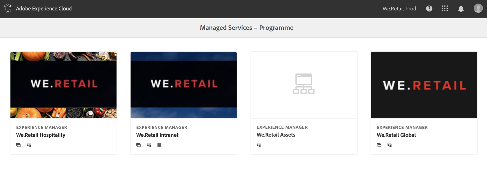
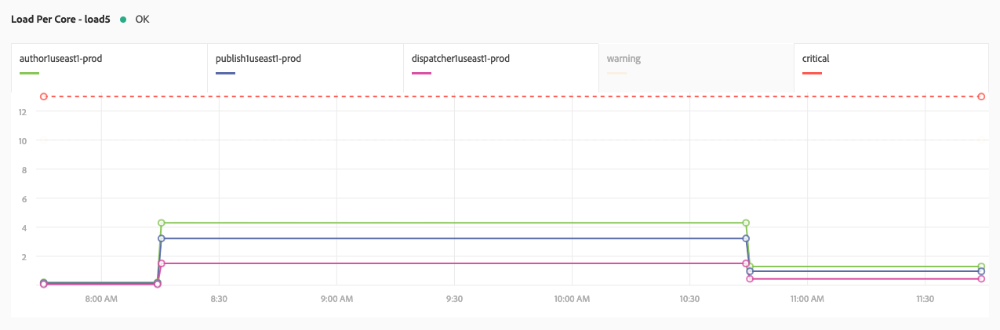

# Systemüberwachung {#system-monitoring}

Die Systemüberwachung in [!UICONTROL Cloud Manager] erfolgt durch Beobachtung der einzelnen Instanzen innerhalb einer Umgebung und Verfolgung verschiedener Metriken für jede Instanz. Jede Metrik hat zwei definierte Schwellenwerte: einen *Warnschwellenwert* und einen *kritischen Schwellenwert*.

Wenn eine Metrik über ihrem kritischen Schwellenwert liegt, wird sie als kritischer Status betrachtet. Wenn eine Metrik über dem Warnschwellenwert liegt (aber unter ihrem kritischen Schwellenwert), wird sie als Warnstatus betrachtet. Die Schwellenwerte werden von Adobe Managed Services festgelegt und können in [!UICONTROL Cloud Manager] visualisiert werden. In den meisten Fällen sind die Schwellenwerte zwischen Kunden konsistent. Es gibt jedoch Fälle, in denen Adobe Managed Services Schwellenwerte für bestimmte Kundenanforderungen anpasst. Fragen zu Schwellenwerten richten Sie bitte an Ihren Customer Success Engineer (CSE).

## Navigieren zur Systemüberwachung {#navigating-system-monitoring}

Um zur Systemüberwachungsfunktion zu navigieren, gibt es zwei Möglichkeiten.

1. Melden Sie sich auf der Landingpage **Managed Services – Programme** an.

   

1. Klicken Sie auf das dritte Symbol auf der Programmkarte.

   

   *Oder*

* Navigieren Sie in [!UICONTROL Cloud Manager] über das globale Navigationsmenüelement **Berichte** zur Landingpage **Systemüberwachung**.

## Seite „Übersicht“ der Systemüberwachung {#system-monitoring-overview-page}

Auf der Seite „Übersicht“ der Systemüberwachung werden die überwachten Umgebungen im Programm aufgelistet und Berichte zu deren allgemeinen Zustand in vier separaten Kategorien erstellt:

* **Host**
* **Speicher**
* **Netzwerk**
* **Anwendung**

Der Status in jeder Kategorie ist eine Zusammenfassung einzelner Metriken. Wenn eine Metrik in einer Kategorie einen kritischen Status aufweist, hat die gesamte Kategorie einen kritischen Status auf der Seite „Übersicht“. Dieselbe Zusammenfassung kann auf Umgebungs- und Instanzebene angezeigt werden.

>[!NOTE]
>
>Beim Navigieren zu dieser Seite werden die Instanzen der Produktionsumgebung standardmäßig angezeigt, aber es können auch andere Umgebungen geöffnet werden.

## Details zur Systemüberwachung {#system-monitoring-detail}

Zum Anzeigen von Details bestimmter Metriken können Sie entweder auf eine der Kategorien im linken Navigationsbereich oder auf eine der Kategorieindikatoren einer bestimmten Instanz klicken. Jede Detailseite präsentiert eine Reihe von Diagrammen für die Metriken in dieser Kategorie. Sie können die Metriken entweder für alle Instanzen in einer Umgebung oder für eine bestimmte Instanz anzeigen. Mithilfe der Dropdownfelder oben rechts können Sie zwischen der Umgebung und den Instanzen wechseln.

Im Navigationsbereich auf der linken Seite finden Sie die verfügbaren Metriken innerhalb der aktuell ausgewählten Kategorie, für die Daten für die aktuell ausgewählte Umgebung und die Instanzen vorhanden sind.

In einem einzelnen Diagramm werden der Status und ein Graph der Daten zusammen mit den Schwellenwerten angezeigt. Wenn mehrere Instanzen angezeigt werden, befinden sich die Daten jeder Instanz in einer separaten Reihe.

Einzelne Reihen können in einem Diagramm ausgeblendet werden, indem Sie auf die Reihe in der Legende klicken.
Wenn Sie beispielsweise auf die Warnschwellenwert-Reihe klicken, wird nur der kritische Schwellenwert angezeigt.

### Metrikdefinitionen {#metric-definitions}

**Host**

* Last pro Kern: Die Anzahl der Prozesse, die von der CPU ausgeführt werden oder sich in einem über einen Zeitraum von einer (load1), fünf (load5) und fünfzehn (load15) Minuten gemittelten Wartestatus befinden.
* Prozessanzahl: Die Anzahl der derzeit geöffneten Prozesse.
* Anwenderanzahl: Die Anzahl der Anwender mit einer aktiven Shell-Sitzung.
* Speicherauslastung: Der Prozentsatz des aktuell zugewiesenen Systemspeichers.
* JVM-Arbeitsspeicher (Heap): Die Größe (in Megabyte) des zugewiesenen Java Heap.
* Bereich für die alte Generation von Objekten (Old Generation Space): Der Prozentsatz, der derzeit dem JVM-Speicher für die alte Generation von Objekten zugewiesen ist.

**Netzwerk**

* CQ-Port-Prüfung: Die Reaktionszeit in Sekunden, um auf den AEM- oder Dispatcherport zuzugreifen. Es gibt verschiedene Metriken für Autor, Veröffentlichung und Dispatcher.

**Speicher**

* Speicherplatz: Der für jeden einzelnen Bereitstellungspunkt auf dem Host belegte Speicherplatz (in Megabyte). Für jeden Bereitstellungspunkt gibt es verschiedene Metriken. Es werden zumindest Metriken für „/“ und „/mnt“ angezeigt. Abhängig von der jeweiligen Instanzkonfiguration können jedoch weitere Bereitstellungspunkt-Metriken verfügbar sein.
* Ordnergröße: AEM-Segmentspeicher: Der für den AEM-Segmentspeicher belegte Speicherplatz (in Gigabyte).

**Anwendung**

* Replizierungsagent: Die Zeit (in Sekunden) für eine Testreplikation. Für jeden Replizierungsagenten gibt es verschiedene Metriken.
* Dispatcherflush: Die Anzahl der sich aktuell in der Dispatcherflush-Warteschlange befindlichen Elemente.

## SLA-Berichte {#sla-reporting}

Kunden können die Leistung ihrer Produktions-AEM-Umgebung im Verhältnis zu ihrem vertraglich vereinbarten Service Level Agreement (SLA) anzeigen. Dies ist über ein Untermenü im Anzeigebereich &quot;Berichte&quot; verfügbar.
Das Diagramm unten zeigt beispielsweise die monatliche SLA-Performance für 2018.

Wie bei den Systemüberwachungsdiagrammen zeigt das Rollover über einen Datenpunkt die spezifischen Werte für diesen Monat an.

Der Abschnitt &quot;Ereignisanalyse&quot; unter diesem Diagramm zeigt die Anzahl von Fällen, die im aktuellen Jahr für das Programm aufgetreten sind. Jeder Vorfall hat einen Zeitraum, eine Ursache und einen Satz von Kommentaren.

## SLA-Metriken {#sla-metrics}

* **Autor-Vertrag**: Dies ist die SLA, die in Ihrem Vertrag mit Adobe Managed Services für die Autorenstufe definiert ist.

* **AMS Author SLA**: Dies ist die gemessene Laufzeit der Produktions-Autorenmetrikfälle, die von Adobe oder unseren Anbietern verursacht werden.

* **Autor SLA**: Dies ist die gemessene Laufzeit der Autorenstufe, die geplante Ausfallzeiten wie Wartungsfenster ignoriert.

* **Endbenutzervertrag**: Dies ist die SLA, die in Ihrem Vertrag mit Adobe Managed Services für die Veröffentlichungsstufe definiert ist.

* **AMS Endbenutzer SLA**: Dies ist die gemessene Laufzeit der von Adobe oder unseren Anbietern verursachten Factoringvorgänge zur Produktionsveröffentlichung.

* **Endbenutzer SLA**: Dies ist die gemessene Laufzeit der Veröffentlichungsstufe, die geplante Ausfallzeiten wie Wartungsfenster ignoriert.