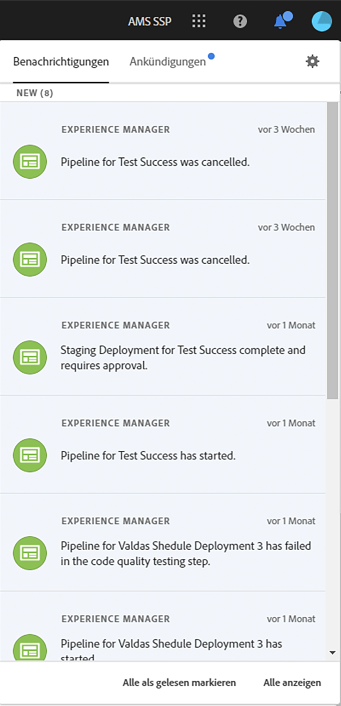
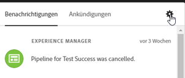
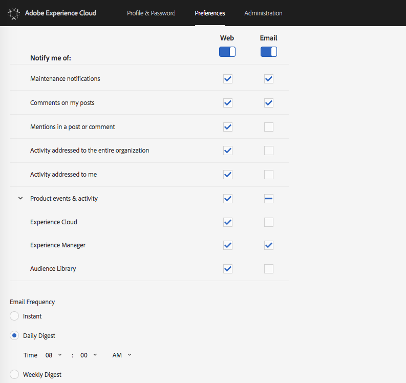

# Benachrichtigungen {#notifications}

Über [!UICONTROL Cloud Manager] können Anwender Benachrichtigungen beim Starten oder Fertigstellen einer Produktions-Pipeline (ob erfolgreich oder nicht), zu Beginn einer Produktionsimplementierung bzw. beim Erreichen der Schritte **GoLive-Genehmigung verwenden** und **Geplant** empfangen. Diese Benachrichtigungen werden über das Adobe [!UICONTROL Experience Cloud]-Benachrichtigungssystem gesendet.

>[!NOTE]
>
>Die Genehmigung und geplanten Benachrichtigungen werden nur an Anwender mit den Rollen „Business Owner“, „Programm-Manager“ und „Implementierungs-Manager“ gesendet.

Die Benachrichtigungen werden in einer Seitenleiste der [!UICONTROL Cloud Manager]-UI (User Interface, Benutzeroberfläche) und überall in Adobe [!UICONTROL Experience Cloud] angezeigt.

Klicken Sie in der Kopfzeile auf das Glockensymbol, um die Seitenleiste zu öffnen und Benachrichtigungen anzuzeigen, wie in der Abbildung unten dargestellt:

Die Seitenleiste listet die neuesten Benachrichtigungen auf.

Wenn Sie zudem auf eine dieser Benachrichtigungen und dann auf **Details anzeigen** klicken, wird die Seite mit den Pipelineausführungsdetails aufgerufen.

## E-Mail-Benachrichtigungen {#email-notifications}

Standardmäßig sind Benachrichtigungen in der Webbenutzeroberfläche aller Adobe [!UICONTROL Experience Cloud]-Lösungen verfügbar. Einzelne Anwender können sich diese Benachrichtigungen auch zusenden lassen, und zwar direkt oder als Digest.

Klicken Sie auf das Zahnradsymbol unten in der Benachrichtigungsseitenleiste, wie in der Abbildung unten dargestellt:

Auf diese Weise gelangen Anwender zum Bildschirm „Benachrichtigungseinstellungen“ von Adobe [!UICONTROL Experience Cloud].

Anwender können E-Mail-Benachrichtigungen aktivieren und (optional) die Typen von Benachrichtigungen auswählen, die sie per E-Mail erhalten möchten.

>[!NOTE]
>
>Sie können auch eine Digest-Option in Adobe [!UICONTROL Experience Cloud] aktivieren, wie unten dargestellt:

