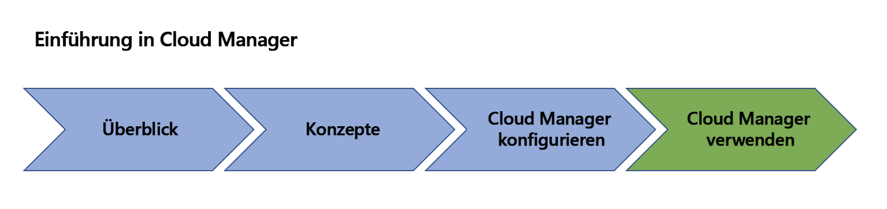

# Übersicht über AEM [!UICONTROL Cloud Manager]{#overview-index}

[!UICONTROL Cloud Manager] ist ein Framework von Tools und Technologien, die für alle Adobe Managed Services-Kunden verfügbar sind.

In diesem Abschnitt finden Sie eine allgemeine Übersicht der Ressourcen für Ihre ersten Schritten mit [!UICONTROL Cloud Manager].

Machen Sie sich zur Vorbereitung auf [!UICONTROL Cloud Manager] mit den unten stehenden Ressourcen vertraut, von den Erläuterungen der Schlüsselkonzepte und Begriffe bis hin zur Einrichtung von Konfigurationen (Voraussetzungen), die Ihnen schließlich die ersten Schritte mit [!UICONTROL Cloud Manager] ermöglichen.

Die folgende Abbildung zeigt Ihren Lernpfad für [!UICONTROL Cloud Manager]:

Machen Sie sich mit den Ressourcen im Abschnitt „Übersicht“ vertraut, um eine Einführung in [!UICONTROL Cloud Manager] zu erhalten:

* **[Einführung in [!UICONTROL Cloud Manager]](introduction-to-cloud-manager.md)**
* **[Schlüsselkonzepte](key-concepts.md)**
* **[[!UICONTROL Customer Journey]](customer-journey.md)**

