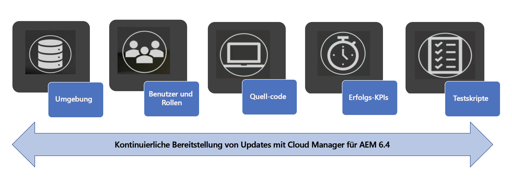
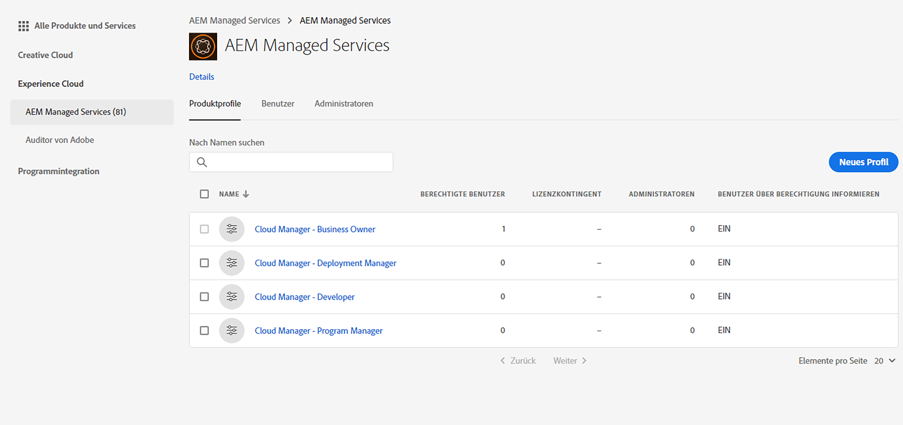
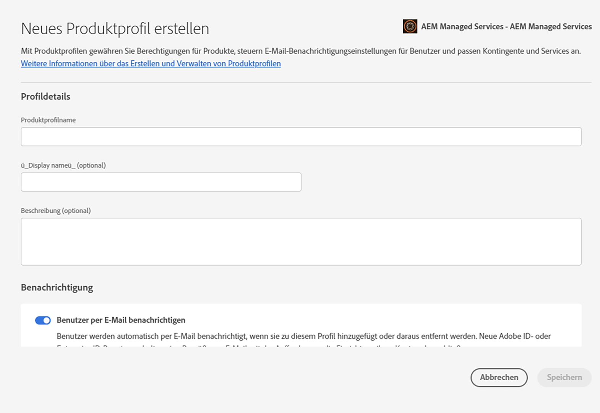

# Einrichten allgemeiner Konfigurationen für [!UICONTROL Cloud Manager]{#setting-up-general-configurations-for-cloud-manager}

Im folgenden Abschnitt finden Sie die Voraussetzungen für die Einrichtung von [!UICONTROL Cloud Manager] und die Verwaltung von Inhalten über die zugehörige Benutzeroberfläche.

Auf dieser Abschnittsseite werden die folgenden Themen behandelt:

* **Einrichten von Anwendern und Rollen**
* **Einrichten von AEM-Anwendungsprojekten**
* **Dispatcherkonfigurationen**
* **Best Practices für die Entwicklung**

Die folgende Abbildung illustriert die verschiedenen Funktionen, durch die [!UICONTROL Cloud Manager] fortlaufend hochwertigen Code bereitstellen kann:



## Einrichten von Anwendern und Rollen {#setting-up-users-and-roles}

Rollen für [!UICONTROL Cloud Manager] werden über Adobe Admin Console verwaltet. Bestimmte Rollenmitgliedschaften werden bereitgestellt, indem der Anwender in Admin Console einem [!UICONTROL Cloud Manager]-Produktprofil hinzugefügt wird.

>[!CAUTION]
>
>Um [!UICONTROL Cloud Manager] verwenden zu können, müssen Sie über eine Adobe ID und den Adobe Managed Services-Produktkontext verfügen.

Sie können bestimmte Rollenmitgliedschaften zuweisen, indem der Anwender in Admin Console einem [!UICONTROL Cloud Manager]-Produktprofil hinzugefügt wird.

Erstellen Sie die folgenden Rollen für [!UICONTROL Cloud Manager] mithilfe von Admin Console:

>[!NOTE]
>
>Adobe Admin Console ermöglicht eine zentrale Verwaltung Ihrer Adobe-Berechtigungen in der gesamten Organisation.
>
>Weitere Informationen über Adobe Admin Console finden Sie in der Dokumentation zu [Admin Console](https://helpx.adobe.com/de/enterprise/using/admin-console.html).

| **[!UICONTROL Cloud Manager]-Rollen** | **Beschreibung** |
|---|---|
| Business Owner | Verantwortlich für die Definition von KPIs, Genehmigung von Produktionsbereitstellungen und Außerkraftsetzung bedeutender 3-Tier-Fehler. |
| Programmmanager | Verwendet [!UICONTROL Cloud Manager], um Teams einzurichten, den Status zu überprüfen und KPIs anzuzeigen. Kann bedeutende 3-Tier-Fehler genehmigen. |
| Bereitstellungsmanager | Verwaltet Bereitstellungsvorgänge. Kann mit [!UICONTROL Cloud Manager] Staging-/Produktionsbereitstellungen ausführen. Kann bedeutende 3-Tier-Fehler genehmigen. Hat Git-Zugriff. |
| Entwickler | Entwickelt und testet anwenderspezifischen Anwendungscode. Nutzt [!UICONTROL Cloud Manager] hauptsächlich, um den Status anzuzeigen. Hat Commitzugriff auf das Git-Repository. |
| Customer Success Engineer | Unterstützt im Allgemeinen den Erfolg von AMS-Kunden. Interagiert mit [!UICONTROL Cloud Manager], um Bereitstellungen auszuführen, die von einem CSE überwacht werden müssen. |
| Inhaltsautor | Interagiert im Allgemeinen nicht mit [!UICONTROL Cloud Manager]. Kann über den [!UICONTROL Cloud Manager]-Programmumschalter (nach Navigation über [!UICONTROL Experience Cloud]) auf AEM zugreifen. |

### Einrichten von Teams mit Admin Console {#using-admin-console-to-set-up-team}

Um die entsprechenden rollenbasierten Berechtigungen für [!UICONTROL Cloud Manager]-Anwender bereitzustellen, muss ein Administrator in der Organisation des Kunden neue Produktprofile unter dem [!UICONTROL AEM Managed Services]-Produktkontext erstellen.

>[!NOTE]
>
>Um auf Admin Console zuzugreifen und Ihr Team (Anwender und Rollen) einzurichten, öffnen Sie einen Browser und rufen Sie [https://adminconsole.adobe.com](https://adminconsole.adobe.com/enterprise) auf.

Anwender (oder Gruppen) werden diesen Produktprofilen über die normale Admin Console-Funktion hinzugefügt, wie in der folgenden Abbildung gezeigt:

1. Melden Sie sich bei Admin Console an und klicken Sie auf **Neues Profil**, um ein neues Profil hinzuzufügen.

   

1. Füllen Sie die Felder aus, um eine neue Rolle für [!UICONTROL Cloud Manager] einzurichten.

   Geben Sie den **Profilnamen** und eine **Beschreibung** ein, um ein neues Profil zu erstellen. Außerdem können Sie eine **Berechtigungsgruppe** für das Profil auswählen.

   Klicken Sie auf **Fertig**, um die Profilerstellung abzuschließen.

   

## Einrichten von AEM-Anwendungsprojekten {#aem-application-project-setup}

Bevor Sie Ihr Anwendungsprojekt in [!UICONTROL Cloud Manager] einrichten, müssen Sie eines der beiden Szenarien berücksichtigen: AEM 6.4 ist völlig neu für Sie oder Sie sind ein Bestandskunde.

>[!NOTE]
>
>Um Zugriff auf [!UICONTROL Cloud Manager] zu erhalten, wenden Sie sich an einen Customer Success Engineer (CSE), der Ihnen eine URL und entsprechende Anmeldeinformationen zur Verfügung stellt.

Sie können ein Anwendungsprojekt für [!UICONTROL Cloud Manager] basierend auf den beiden folgenden Szenarien einrichten:

* **Neues AEM-Projekt**:

Bei einem neuen AEM-Projekt wird Ihr vorhandenes Projekt genutzt und zusammen mit [!UICONTROL Cloud Manager]verwendet.

Weitere Informationen finden Sie unter [Erste Schritte mit AEM 6.4](https://chl-author./content/help/de/experience-manager/6-4/sites/deploying/using/deploy.html). Weitere Informationen finden Sie zudem unter [AEM-Ressourcen](https://www.adobe.com/marketing-cloud/experience-manager/resources.html?promoid=759X6WV8&amp;mv=other).

* **Vorhandenes AEM-Projekt**:

Ein vorhandenes AEM-Projekt muss die Regeln zur Projekteinrichtung einhalten. Sie können Ihre vorhandene AEM-Installation aktualisieren, um die neuen Funktionen und Verbesserungen von AEM 6.4 zu erhalten und [!UICONTROL Cloud Manager] zu nutzen. Diese Kriterien sollten bei minimalen Änderungen funktionieren. Wenden Sie sich an einen Customer Success Engineer (CSE), um Unterstützung zu erhalten.

Weitere Informationen zum Aktualisieren Ihrer AEM-Instanz auf 6.4 finden Sie unter [Aktualisieren auf AEM 6.4](https://helpx.adobe.com/de/experience-manager/6-4/sites/deploying/using/upgrade.html).

### Einrichten des Repositorys {#setting-up-repository}

Ein einziges, zunächst leeres Git-Repository wird für jedes Programm bereitgestellt, das in [!UICONTROL Cloud Manager] eingebunden ist. Entwickler und Bereitstellungsmanager erhalten von ihrem CSE die entsprechende Git-URL und die zugehörigen Anmeldeinformationen.

Mit diesen Informationen können Entwickler ihren Code entsprechend den im nachfolgenden Abschnitt unter „Einrichten von Projekten“ beschriebenen Richtlinien hinzufügen, um die Einrichtungsanforderungen vor Verwendung von [!UICONTROL Cloud Manager] abzuschließen.

## Dispatcherkonfigurationen {#dispatcher-configurations}

[!UICONTROL Cloud Manager] kann Webserver- und Dispatcher-Konfigurationsdateien bereitstellen, sofern diese nicht nur in den normalen AEM-Inhaltspaketen, sondern auch im Git-Repository gespeichert sind.

Um diese Funktion nutzen zu können, erzeugt der Maven-Build eine ZIP-Datei mit zwei Verzeichnissen: ***conf*** und ***conf.d***.

Beim Bereitstellen einer Dispatcherinstanz ersetzt der Inhalt dieser Verzeichnisse den Inhalt dieser Verzeichnisse in der Dispatcherinstanz. Da Webserver- und Dispatcher-Konfigurationsdateien häufig umgebungsspezifische Informationen erfordern, damit diese Funktion auch korrekt verwendet werden kann, müssen Sie zunächst mit Ihrem Customer Success Engineer (CSE) zusammenarbeiten, um diese Umgebungsvariablen in das Verzeichnis /etc/sysconfig/httpd zu extrahieren.

Führen Sie die folgenden Schritte aus, um den ersten Prozess bei der Dispatcherkonfiguration abzuschließen:

1. Beziehen Sie die aktuellen Produktionskonfigurationsdateien von Ihrem CSE.
1. Entfernen Sie hartcodierte umgebungsspezifische Daten (z. B. IP des Veröffentlichungsrenderers) und ersetzen Sie sie durch Variablen.
1. Definieren Sie die erforderlichen Variablen in Schlüssel/Wert-Paaren für jeden Zieldispatcher und bitten Sie den CSE, diese für jede Instanz zu ***/etc/sysconfig/httpd*** hinzuzufügen.
1. Testen Sie die aktualisierten Konfigurationsdateien in der Staging-Umgebung. Bitten Sie dann den CSE, diese für die Produktion bereitzustellen, um eine ordnungsgemäße Funktionsweise sicherzustellen.
1. Führen Sie ein Commit aus, um die Dateien an das Git-Repository zu übergeben.
1. Führen Sie eine Bereitstellung über [!UICONTROL Cloud Manager] durch.

Die eigentliche ZIP-Datei kann mithilfe des maven-assembly-plugin erstellt werden. Projekte, die mit der Lazybones AEM-Multimodulvorlage erstellt wurden, können über die richtige, im Zuge der Projekterstellung angelegte Maven-Projektstruktur verfügen.

>[!NOTE]
>
>Der Dispatcher wird beim Onboarding in [!UICONTROL Cloud Manager] konfiguriert. Dies kann jedoch auch zu einem späteren Zeitpunkt erfolgen.

### Konfigurieren des Dispatchers für Leistungstests {#configuring-dispatcher-for-performance-testing}

Damit [!UICONTROL Cloud Manager] Leistungstests ordnungsgemäß durchführen kann, muss der Staging-Dispatcherserver auf dieselben Hostnamen wie der Produktionsdispatcher reagieren (also antworten), und zwar so, dass dies dem Produktionsserver entspricht.

*Bespiel:* Wenn ein Kunde [www.myco.com](http://www.myco.com/) und [www.myotherco.com](http://www.myotherco.com,/) als Hostnamen für die Produktion und stage-myco.adobecqms.net als Hostnamen für das Staging verwendet, muss eine Anforderung wie diese entsprechend reagieren:

```
curl -H"Host: www.myco.com" http://stage-myco.adobecqms.net/en/home.html
```

Dies setzt nicht nur voraus, dass die Hostnamen ordnungsgemäß in der Dispatcherkonfiguration konfiguriert sind, sondern auch dass ***/etc/map***, alle Apache-Rewrites bzw. alle anderen ***Pfadzuordnungs-/Filterregeln*** konsistent zwischen Staging und Produktion implementiert werden.

## Best Practices für die Entwicklung {#development-best-practices}

Bevor Sie [!UICONTROL Cloud Manager] verwenden, sollten Sie sich mit verschiedenen Best Practices zum Einrichten von Projekten und Konfigurieren von Webservern oder Dispatchern vertraut machen.

### Einrichten von Projekten {#project-set-up}

Ihre Projekte müssen bestimmte Kriterien erfüllen, um mit [!UICONTROL Cloud Manager] verwendet werden zu können.

Befolgen Sie die Best Practices zum Einrichten von Projekten in [!UICONTROL Cloud Manager]:

* Apache Maven ist das einzige Buildtool, das bereitgestellt und unterstützt wird. Apache Maven 3.3.9 ist installiert.
* Builds werden in Linux-Umgebungen in einem Dockercontainer als Rootanwender ausgeführt.
* Die installierte Java-Version ist Oracle JDK 8u161.
* Es sind einige zusätzliche Systempakete installiert, z. B. „bzip2“, „unzip“, „libpng“, „imagemagick“ und „graphicsmagick“. Wenn Sie andere Pakete benötigen, müssen Sie diese über Ihren CSE anfordern.
* Maven wird immer mit dem Befehl „mvn -B clean package“ ausgeführt.
* Sie erhalten genau ein Git-Repository. Im Rootverzeichnis dieses Repositorys muss sich eine pom.xml-Datei befinden. Diese pom.xml-Datei kann ggf. auf beliebig viele Untermodule verweisen (die wiederum weitere Untermodule umfassen usw.), aber es darf nur ein Einstiegspunkt vorhanden sein.
* Maven wird auf Systemebene mit einer settings.xml-Datei konfiguriert, die automatisch das öffentliche Adobe-Artefaktrepository (repo.adobe.com) enthält.
* Sie können in Ihren pom.xml-Dateien weitere Repositorys hinzufügen. Allerdings wird der Zugriff auf kennwortgeschützte oder netzwerkgeschützte Artefakte nicht unterstützt.
* Bereitstellbare Inhaltspakete werden ermittelt, indem nach ZIP-Dateien in einem Verzeichnis namens „target“ gesucht wird. Wie bereits erwähnt, kann eine beliebige Anzahl von Untermodulen Inhaltspakete erstellen.
* Wenn mehrere Inhaltspakete vorhanden sind, ist die Reihenfolge der Paketbereitstellungen nicht garantiert. Wenn eine bestimmte Reihenfolge benötigt wird, können die Abhängigkeiten des Inhaltspakets zum Definieren der Reihenfolge verwendet werden.

<!-- 

Comment Type: annotation
Last Modified By: jsyal
Last Modified Date: 2018-05-02T18:18:15.028-0400

change as per KT

 -->

### Die nächsten Schritte {#the-next-steps}

Sobald Sie die allgemeinen Konfigurationen eingerichtet haben, können Sie [!UICONTROL Cloud Manager] verwenden.

Unter [Verwenden von [!UICONTROL Cloud Manager]](https://helpx.adobe.com/experience-manager/cloud-manager/using/using-cloud-manager.html) finden Sie Informationen zu den ersten Schritten mit [!UICONTROL Cloud Manager].
