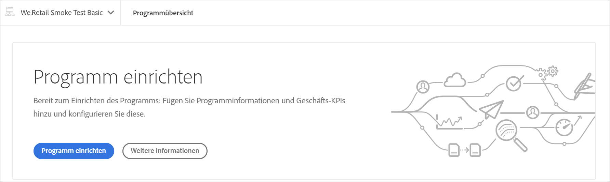
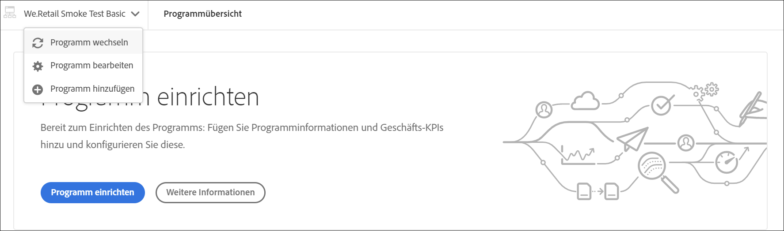
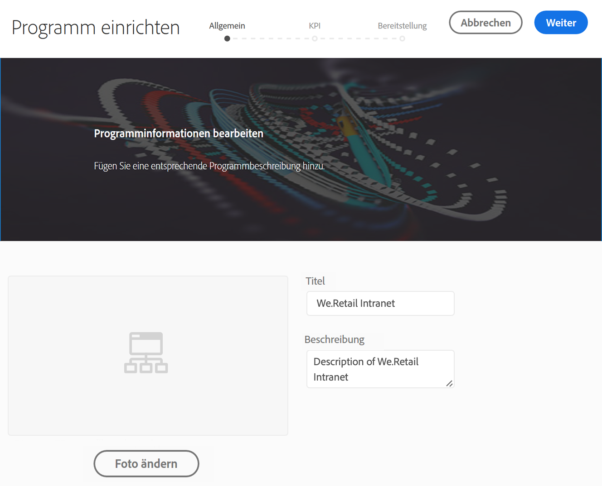
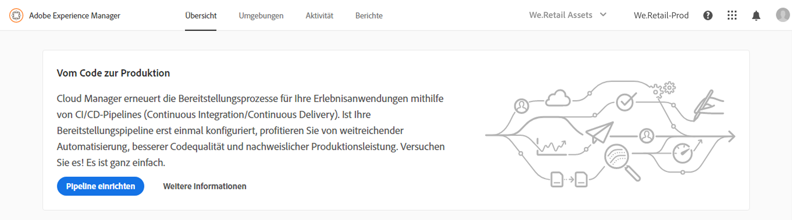
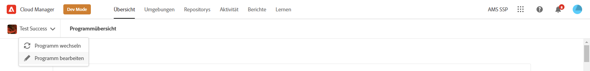
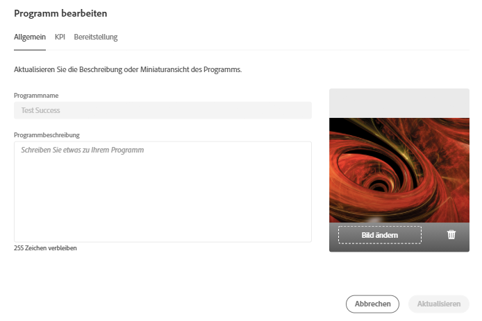
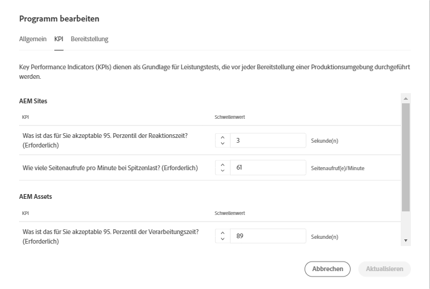
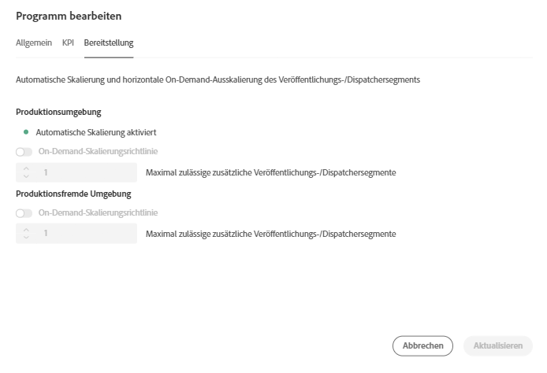

# Einrichten des Programms {#setup-your-program}

Nach dem Onboarding muss der Business Owner verschiedene Ersteinstellungen am Programm abschließen. Hierzu gehören das Festlegen der Programmbeschreibung und das Definieren der für Leistungstests verwendeten KPIs (Key Performance Indicators). Optional kann eine Miniaturansicht hochgeladen werden. Darüber hinaus kann der Business Owner Umgebungen bei der Einrichtung des Programms konfigurieren.

Die definierten KPIs dienen als Grundlage für Leistungstests, die bei jeder Ausführung der Pipeline durchgeführt werden.

>[!NOTE]
>Die definierten KPIs werden durch Tests gemessen, die in der **Staging**-Umgebung ausgeführt werden. Normalerweise werden diese KPIs entsprechend den Funktionen der Staging-Umgebung herunterskaliert.
>Beispiel: Ein Anwender, der von durchschnittlich 1.000 Seitenaufrufen pro Minute in seiner **Produktionsumgebung** ausgeht und über vier Dispatcher-/Veröffentlichungsserver in der Produktion verfügt, sollte eine Skalierung auf 250 Seitenaufrufe pro Minute vornehmen (sofern seine Staging-Umgebung aus nur einem einzigen Dispatcher-/Veröffentlichungsserver-Paar besteht).
>Darüber hinaus verfügen viele Anwender über ein CDN (Content Delivery Network) wie Akamai oder CloudFront, das ihrer Produktionsumgebung vorgeschaltet ist. Da [!UICONTROL Cloud Manager] direkt in Bezug zur Staging-Umgebung getestet wird, sollten die KPIs nur den erwarteten Traffic wiedergeben, der durch das CDN weitergeleitet wird, d. h. ohne Cache. In der Regel handelt es sich dabei um eine relativ kleine Teilmenge des gesamten Produktionstraffics.

## Einrichten des Programms mit [!UICONTROL Cloud Manager] {#using-cloud-manager-to-setup-your-program}

Führen Sie die folgenden Schritte aus, um das Programm einzurichten und KPIs zu definieren:

1. Klicken Sie auf **Programm einrichten**, um den Einrichtungsprozess in [!UICONTROL Cloud Manager] zu starten.

   

   >[!NOTE]
   > Sie können in der Aktionsleiste jederzeit ein Programm wechseln, bearbeiten oder hinzufügen, wie in der Abbildung unten dargestellt.

   

1. Auf dem Bildschirm **Programm einrichten** wird „Programminformationen bearbeiten“ angezeigt.

1. Dort finden Sie drei Optionen in Form der Registerkarten **Allgemein**, **KPI** und **Bereitstellung**.

1. Laden Sie auf der Registerkarte **Allgemein** eine Miniaturansicht in das Programm hoch. Sie können dem Programm auch eine aussagekräftige Beschreibung hinzufügen.

   

1. Unter **KPI** können Sie zwei KPIs definieren (Erwartungen für jede Bereitstellung). Separate KPIs werden für **AEM Sites** und **AEM Assets** definiert. Sie können die KPIs für die von Ihnen lizenzierten Produkte angeben.

   **AEM Sites**

   1. Was ist das für Sie akzeptable 95. Perzentil der Reaktionszeit?

      * Empfohlener Wert: 3 Sekunden
   1. Wie viele Seitenaufrufe pro Minute bei Spitzenlast?

      * Empfohlener Wert: 200 Seitenaufrufe pro Minute

   **AEM Assets**

   Von Anfang an waren in Cloud Manager Leistungstests für AEM Sites-Programme möglich. In dieser Version ist eine Funktion hinzugekommen, mit der auch Leistungstests für AEM Assets-Programme durchgeführt werden können. Assets-Leistungstests erfolgen, indem Assets während eines 30-minütigen Testzeitraums wiederholt hochgeladen und die Verarbeitungszeit für jedes Asset sowie verschiedene Metriken auf Systemebene gemessen werden.
Während der Programmeinrichtung werden Asset-spezifische KPIs angegeben:

   * 95. Perzentil der Verarbeitungszeit
   * Pro Minute hochgeladene Assets

   

1. Unter **Bereitstellung** können Sie die Bereitstellungskonfiguration für Produktions- und Nicht-Produktionsumgebungen in Ihrem Programm anzeigen oder bearbeiten. **Automatische Skalierung aktiviert** wird angezeigt, wenn die automatische Skalierung für das Programm aktiviert wurde.

   >[!NOTE]
   >Die Funktion zur automatischen Skalierung ist nur auf die Produktionsumgebung anwendbar und steht ggf. nicht für alle Kundenprogramme zur Verfügung.

   

1. Klicken Sie auf **Speichern**, um den Einrichtungsassistenten abzuschließen.

   >[!NOTE]
   >Sie können das Programm jederzeit bearbeiten, wenn das Startprogramm bereits eingerichtet wurde. Führen Sie die folgenden Schritte aus, um weitere Details zu erhalten.

## Bearbeiten von Programmen

1. Navigieren Sie zur Lösung auf dem **Cloud Manager**-Startbildschirm.

   

1. Wählen Sie die Lösung aus und klicken Sie auf **Bearbeiten**, um das Programm zu aktualisieren oder zu ändern, wie in der folgenden Abbildung gezeigt.

   

1. Der Bildschirm **Programm bearbeiten** wird angezeigt, mit dem Sie das Programm aktualisieren oder ändern können.

   Sie können Ihren Programmnamen und Ihre Beschreibung im Tab **Allgemein** aktualisieren.

   

   Navigieren Sie zur Registerkarte **KPI** , um Informationen zu AEM Sites und Assets zu aktualisieren.

   

   Darüber hinaus können Sie zur Registerkarte **Bereitstellung** navigieren, um die Bereitstellungskonfiguration für Produktions- und Nicht-Produktionsumgebungen in Ihrem Programm zu bearbeiten.

   

1. Klicken Sie auf **Update** , um Ihre Änderungen zu speichern.

## Die nächsten Schritte {#the-next-steps}

Wenn Sie die Pipeline bereits eingerichtet haben, werden bei der nächsten Ausführung Ihre aktualisierten Einstellungen berücksichtigt. Wenn Sie die Pipeline noch nicht eingerichtet haben, führen Sie zuerst die Schritte aus, um Ihre Pipeline einzurichten.

Weitere Informationen zum Einrichten der Pipeline finden Sie unter [Konfigurieren der CI/CD-Pipeline](https://helpx.adobe.com/de/experience-manager/cloud-manager/using/configuring-pipeline.html).
