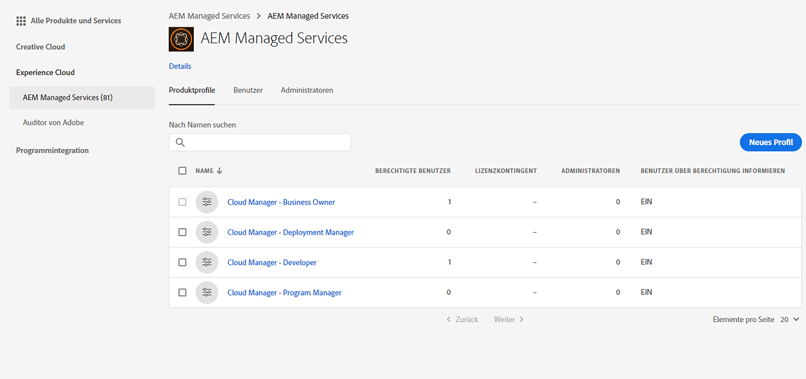
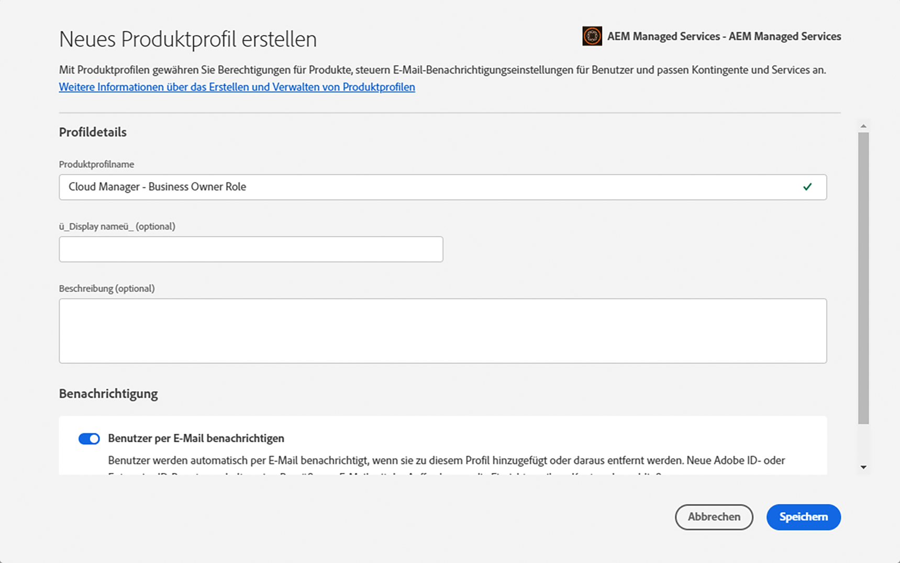
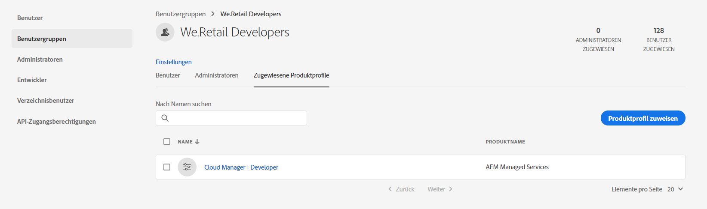

# Hinzufügen von Anwendern und Rollen{#add-users-and-roles}

Für viele Funktionen in [!UICONTROL Cloud Manager] sind spezielle Berechtigungen erforderlich. Beispielsweise dürfen nur bestimmte Anwender die KPIs (Key Performance Indicators) für ein Programm festlegen. Diese Berechtigungen werden logisch in Rollen gruppiert.

In [!UICONTROL Cloud Manager] sind derzeit vier Rollen für Anwender definiert, die die Verfügbarkeit bestimmter Funktionen steuern:

* Business Owner
* Programmmanager
* Bereitstellungsmanager
* Entwickler

>[!CAUTION]
>
>Um [!UICONTROL Cloud Manager] verwenden zu können, müssen Sie über eine Adobe ID und den Adobe Managed Services-Produktkontext verfügen.

## Rollendefinitionen {#role-definitions}

>[!NOTE]
>
>Die Entwicklerrolle in Admin Console ist nicht mit der Entwicklerrolle in [!UICONTROL Cloud Manager] verbunden.

In der folgenden Tabelle finden Sie eine Zusammenfassung der Rollen:

| [!UICONTROL Cloud Manager]-Rollen | Beschreibung |
|--- |--- |
| Business Owner | Verantwortlich für die Definition von KPIs, Genehmigung von Produktionsbereitstellungen und Außerkraftsetzung bedeutender 3-Tier-Fehler. |
| Programmmanager | Verwendet [!UICONTROL Cloud Manager], um Teams einzurichten, den Status zu überprüfen und KPIs anzuzeigen. Kann bedeutende 3-Tier-Fehler genehmigen. |
| Bereitstellungsmanager | Verwaltet Bereitstellungsvorgänge. Kann mit [!UICONTROL Cloud Manager] Staging-/Produktionsbereitstellungen ausführen. Kann CI/CD Pipelines bearbeiten. Kann bedeutende 3-Tier-Fehler genehmigen. Kann Zugriff auf das Git-Repository erhalten. Wenden Sie sich zwecks Anforderung an den für Sie zuständigen CSE/AMS-Mitarbeiter. |
| Entwickler | Entwickelt und testet anwenderspezifischen Anwendungscode. Nutzt [!UICONTROL Cloud Manager] hauptsächlich, um den Status anzuzeigen. Sollte Zugriff auf das Git-Repository für Codecommits erhalten. Wenden Sie sich an den für Sie zuständigen CSE/AMS-Mitarbeiter, wenn Sie einen Anwender mit dieser Rolle hinzufügen, um Zugriff auf das Git-Repository zu gewähren. |
| Customer Success Engineer | Unterstützt im Allgemeinen den Erfolg von AMS-Kunden. Interagiert mit [!UICONTROL Cloud Manager], um Bereitstellungen auszuführen, die von einem CSE überwacht werden müssen. |
| Inhaltsautor | Interagiert im Allgemeinen nicht mit [!UICONTROL Cloud Manager]. Kann über den [!UICONTROL Cloud Manager]-Programmumschalter (nach Navigation über [!UICONTROL Experience Cloud]) auf AEM zugreifen. |

>[!NOTE]
>
>Der Zugriff auf das [!UICONTROL Cloud Manager]-Git-Repository wird von Ihrem CSE verwaltet. Wenden Sie sich an diesen, um Anwender hinzuzufügen und zu entfernen.
>
>Wenn ein neu hinzugefügter Anwender Zugriff auf das Git-Repository benötigt, müssen Sie sich an den für Sie zuständigen CSE/AMS-Mitarbeiter wenden, damit der Zugriff gewährt wird. Diese Rollen bieten keinen automatischen Zugriff auf das Git-Repository. Maximal sind 3 Anwender mit Zugriff auf das Git-Repository möglich.

## Erstellen von Profilen mit Admin Console {#using-admin-console-to-create-a-profile}

Rollen für [!UICONTROL Cloud Manager] werden über Adobe Admin Console verwaltet. Bestimmte Rollenmitgliedschaften werden bereitgestellt, indem der Anwender in Admin Console einem [!UICONTROL Cloud Manager]-Produktprofil hinzugefügt wird.

Sie können bestimmte Rollenmitgliedschaften zuweisen, indem Sie den Anwender in Adobe Admin Console einem [!UICONTROL Cloud Manager]**-Produktprofil** hinzufügen. Admin Console ermöglicht eine zentrale Verwaltung Ihrer Adobe-Berechtigungen in der gesamten Organisation. Weitere Informationen zur Adobe Admin-Konsole finden Sie in der Dokumentation zur [Admin-Konsole](https://helpx.adobe.com/enterprise/using/admin-console.html).

>[!NOTE]
>
>Um auf Admin Console zuzugreifen und Ihr Team (Anwender und Rollen) einzurichten, öffnen Sie einen Browser und rufen Sie [https://adminconsole.adobe.com](https://adminconsole.adobe.com/enterprise) auf.

Um die entsprechenden rollenbasierten Berechtigungen für [!UICONTROL Cloud Manager]-Anwender bereitzustellen, muss ein Administrator in der **Organisation** des Kunden neue Produktprofile unter dem [!UICONTROL AEM Managed Services]-Produktkontext erstellen.

Um die entsprechenden rollenbasierten Berechtigungen für [!UICONTROL Cloud Manager]-Anwender bereitzustellen, müssen Sie als Administrator vier neue Produktprofile im [!UICONTROL AEM Managed Services]-Produktkontext erstellen, die jeweils den vier [!UICONTROL Cloud Manager]-Rollen entsprechen:

* Business Owner
* Bereitstellungsmanager
* Entwickler
* Programmmanager

You can create, or add, users/groups to these Product Profiles with the [Admin Console](https://adminconsole.adobe.com/) for [!UICONTROL Cloud Manager], as shown in the figure below:

1. Melden Sie sich bei Admin Console an und klicken Sie auf **Neues Profil**, um ein neues Profil hinzuzufügen.

   

1. Füllen Sie die Felder aus, um eine neue Rolle für [!UICONTROL Cloud Manager] einzurichten.

   Geben Sie den **Profilnamen** und einen **Anzeigenamen** ein, um ein neues Profil zu erstellen. Außerdem können Sie eine **Berechtigungsgruppe** für das Profil auswählen.

   Klicken Sie auf **Fertig**, um die Profilerstellung abzuschließen.

   >[!NOTE]
   >
   >Beim Erstellen dieser Produktprofile muss der **Anzeigename** dem von [!UICONTROL Cloud Manager] definierten technischen Wert entsprechen (siehe Tabelle unten). Der **Profilname** ist beliebig. Um Verwirrungen zu vermeiden, sollten Sie jedoch die Werte in der unten stehenden Spalte *Empfohlener Profilname* verwenden. Deaktivieren Sie dazu beim Erstellen des Produktprofils die Option **Wie Profilname** und geben Sie den entsprechenden Wert als **Anzeigenamen** an.

   | **Rolle** | **Anzeigename (erforderlich)** | **Empfohlener Profilname** |
   |---|---|---|
   | Business Owner | CM_BUSINESS_OWNER_ROLE_PROFILE | [!UICONTROL Cloud Manager] – Rolle „Business Owner“ |
   | Bereitstellungsmanager | CM_DEPLOYMENT_MANAGER_ROLE_PROFILE | [!UICONTROL Cloud Manager] – Rolle „Bereitstellungsmanager“ |
   | Entwickler | CM_DEVELOPER_ROLE_PROFILE | [!UICONTROL Cloud Manager] – Rolle „Entwickler“ |
   | Programmmanager | CM_PROGRAM_MANAGER_ROLE_PROFILE | [!UICONTROL Cloud Manager] – Rolle „Programmmanager“ |

   

1. Nachdem Sie das Produktprofil erstellt haben, können Sie diesen Produktprofilen Anwender (oder Gruppen) hinzufügen.

   

   

