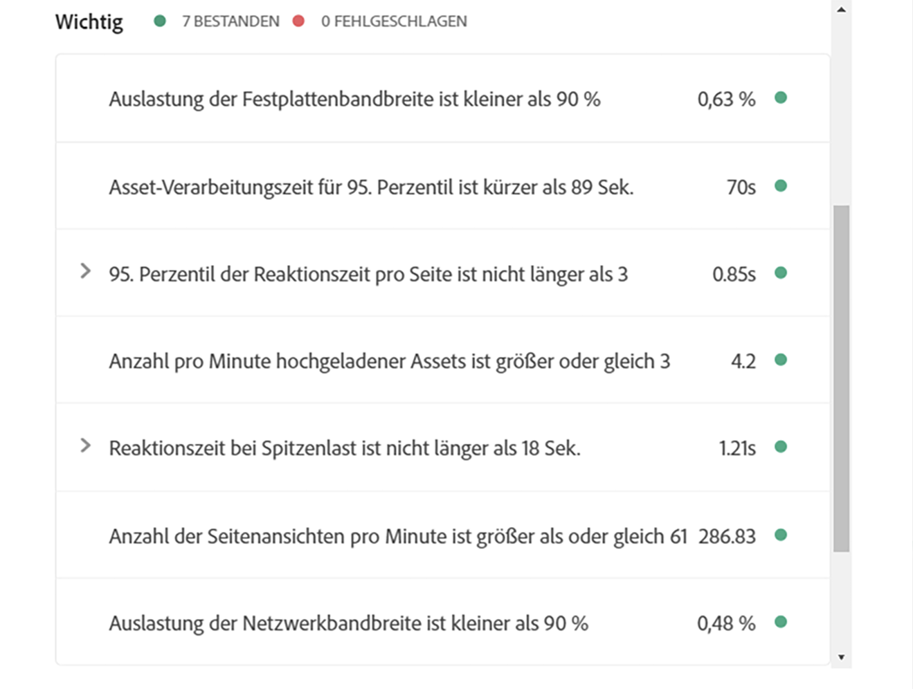
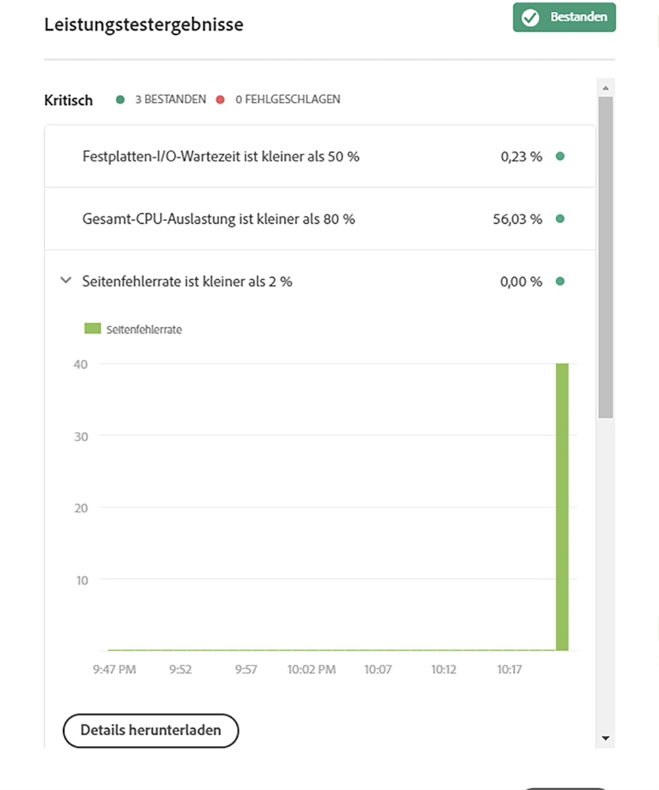

# Wissenswertes zu Testergebnissen {#understand-your-test-results}

Während des **Pipelineprozesses** werden verschiedene Metriken erfasst und entweder mit den vom Business Owner definierten KPIs (Key Performance Indicators) oder mit den von Adobe Managed Services festgelegten Standards verglichen.

Die entsprechende Berichterstattung erfolgt über ein dreistufiges Gatingsystem, so wie in diesem Abschnitt definiert.

## Dreistufige Akzeptanztests bei der Pipelineausführung {#three-tier-gates-while-running-a-pipeline}

Die Pipeline muss drei Akzeptanztests bestehen:

* Codequalität
* Leistungstests
* Sicherheitstests

Für jeden dieser Akzeptanztests gibt es eine dreistufige Struktur für vom Test identifizierte Probleme.

* **Kritisch**: Hierbei handelt es sich um vom Test identifizierte Probleme, die zu einem sofortigen Pipelinefehler führen.
* **Wichtig**: Hierbei handelt es sich um vom Test identifizierte Probleme, durch die die Pipeline angehalten wird. Bereitstellungsmanager, Projektmanager oder Business Owner können die Probleme außer Kraft setzen. In diesem Fall wird die Pipeline fortgesetzt. Sie können die Probleme aber auch akzeptieren. In diesem Fall stoppt die Pipeline mit einem Fehler.
* **Info**: Hierbei handelt es sich um vom Test identifizierte Probleme, die ausschließlich zu Informationszwecken bereitgestellt werden und keine Auswirkungen auf die Pipelineausführung haben.

## Testen der Codequalität {#code-quality-testing}

Im Rahmen der Pipeline wird der Quellcode gescannt, um sicherzustellen, dass Bereitstellungen bestimmte Qualitätskriterien erfüllen. Derzeit wird dies durch eine Kombination aus sonarqube und der Prüfung auf Package Package mithilfe von oakpal implementiert. Es gibt über 100 Regeln, die generische Java-Regeln und AEM-spezifische Regeln kombinieren. In der folgenden Tabelle finden Sie eine Zusammenfassung der Testkriterienbewertung:

| Name | Definition | Kategorie | Fehlerschwellenwert |
|--- |--- |--- |--- |
| Sicherheitsbewertung | A = 0 Schwachstellen <br/>B = mindestens 1 kleinere Schwachstelle<br/> C = mindestens 1 größere Schwachstelle <br/>D = mindestens 1 kritische Schwachstelle <br/>E = mindestens 1 Schwachstelle der Kategorie „Blocker“ | Kritisch | &lt; B |
| Zuverlässigkeitsbewertung | A = 0 Fehler <br/>B = mindestens 1 kleinerer Fehler <br/>C = mindestens 1 größerer Fehler <br/>D = mindestens 1 kritischer Fehler E = mindestens 1 Fehler der Kategorie „Blocker“ | Wichtig | &lt; C |
| Wartbarkeitsbewertung | Wenn die ausstehenden Kosten zur Code-Smell-Behebung …<br/><ul><li>&lt;= 5 % der Zeit ausmachen, die bereits in die Anwendung investiert wurde, lautet die Bewertung A. </li><li>zwischen 6 und 10 % dieser Zeit ausmachen, lautet die Bewertung B. </li><li>zwischen 11 und 20 % dieser Zeit ausmachen, lautet die Bewertung C. </li><li>zwischen 21 und 50 % dieser Zeit ausmachen, lautet die Bewertung D.</li><li>mehr als 50 % dieser Zeit ausmachen, lautet die Bewertung E.</li></ul> | Wichtig | &lt; A |
| Abdeckung | Mix aus Zeilen- und Bedingungsabdeckung mit dieser Formel: <br/>`Coverage = (CT + CF + LC)/(2*B + EL)`  <br/>Dabei gilt Folgendes: CT = Bedingungen, bei denen die Auswertung während der Durchführung von Unit-Tests mindestens einmal „true“ ergeben hat <br/>CF = Bedingungen, bei denen die Auswertung während der Durchführung von Unit-Tests mindestens einmal „false“ ergeben hat <br/>LC = abgedeckte Zeilen = abzudeckende_Zeilen - nicht_abgedeckte_Zeilen <br/><br/> B = Gesamtanzahl der Bedingungen <br/>EL = Gesamtzahl ausführbarer Zeilen (abzudeckende_Zeilen) | Wichtig | &lt; 50% |
| Übersprungene Unit-Tests | Zahl der übersprungenen Unit-Tests | Info | &gt; 1 |
| Offene Probleme | Allgemeine Problemtypen – Schwachstellen (Vulnerability), Fehler (Bug) und Code-Smells (Code Smell) | Info | &gt; 1 |
| Duplizierte Zeilen | Anzahl der Zeilen, die an duplizierten Blöcken beteiligt sind. <br/>Voraussetzungen, damit ein Codeblock als dupliziert gilt: <br/><ul><li>**Nicht-Java-Projekte:**</li><li>Es sollte mindestens 100 aufeinanderfolgende und duplizierte Token geben.</li><li>Diese Token sollten sich mindestens wie folgt verteilen: </li><li>30 Codezeilen für COBOL </li><li>20 Codezeilen für ABAP </li><li>10 Codezeilen für andere Sprachen</li><li>**Java-Projekte:**</li><li> Unabhängig von der Anzahl der Token und Zeilen sollte es mindestens 10 aufeinanderfolgende und duplizierte Anweisungen geben.</li></ul> <br/>Unterschiede bei Einzügen sowie Zeichenfolgenliteralen werden beim Erkennen von Duplizierungen ignoriert. | Info | &gt; 1% |


>[!NOTE]
>
>Refer to [Metric Definitions](https://docs.sonarqube.org/display/SONAR/Metric+Definitions) for more detailed definitions.

You can download the list of rules here [code-quality-rules.xlsx](/help/using/assets/code-quality-rules.xlsx)

>[!NOTE]
>
>To learn more about the custom code quality rules executed by [!UICONTROL Cloud Manager], please refer to [Custom Code Quality Rules](custom-code-quality-rules.md).

### Umgang mit falsch positiven Werten {#dealing-with-false-positives}

Das Verfahren zur Qualitätsprüfung ist nicht perfekt. Mitunter werden fälschlicherweise Probleme identifiziert, die eigentlich nicht problematisch sind. Dies wird als „falsch positiv“ bezeichnet.

In diesen Fällen kann der Quellcode mit der standardmäßigen `@SuppressWarnings`-Java-Anmerkung kommentiert werden. Dabei wird die Regel-ID als Anmerkungsattribut angegeben. Ein häufiges Problem besteht etwa darin, dass die SonarQube-Regel zur Erkennung hartcodierter Kennwörter in Bezug auf die Identifizierung eines hartcodierten Kennworts „aggressiv“ sein kann.

Sehen wir uns ein konkretes Beispiel mit Code an, der in AEM-Projekten relativ häufig vorkommt, wenn eine Verbindung zu einem externen Dienst hergestellt werden soll:

```java
@Property(label = "Service Password")
private static final String PROP_SERVICE_PASSWORD = "password";
```

SonarQube weist dann auf eine Schwachstelle der Kategorie „Blocker“ hin. Nach Prüfung des Codes erkennen Sie, dass es sich nicht um eine Schwachstelle handelt, und kommentieren dies mit der entsprechenden Regel-ID.

```java
@SuppressWarnings("squid:S2068")
@Property(label = "Service Password")
private static final String PROP_SERVICE_PASSWORD = "password";
```

Aber was wäre bei diesem Code?

```java
@Property(label = "Service Password", value = "mysecretpassword")
private static final String PROP_SERVICE_PASSWORD = "password";
```

Dann bestünde die richtige Lösung darin, das hartcodierte Kennwort zu entfernen.

>[!NOTE]
>
>Obwohl sich möglichst spezifische `@SuppressWarnings`-Anmerkungen bewährt haben, also nur eine bestimmte Anweisung oder den Block zu kommentieren, der das Problem verursacht, können Anmerkungen auf Klassenebene hinzugefügt werden.

## Sicherheitstests {#security-testing}

[!UICONTROL Cloud Manager] führt die vorhandenen ***AEM-Sicherheits-Konsistenzprüfungen*** beim Staging nach der Bereitstellung aus und meldet den Status über die UI. Die Ergebnisse werden aus allen AEM-Instanzen in der Umgebung aggregiert.

Wenn eine der **Instanzen** einen Fehler bei einer bestimmten Konsistenzprüfung meldet, schlägt die Konsistenzprüfung für die gesamte **Umgebung** fehl. Wie Codequalitäts- und Leistungstests sind diese Konsistenzprüfungen in Kategorien unterteilt und die zugehörigen Berichte werden über das dreistufige Gatingsystem erstellt. Der einzige Unterschied besteht darin, dass im Falle von Sicherheitstests keine Schwellenwerte vorhanden sind. Alle Konsistenzprüfungen werden entweder bestanden oder schlagen fehl.

In der folgenden Tabelle finden Sie die derzeit verfügbaren Prüfungen:

| **Name** | **Implementierung der Konsistenzprüfung** | **Kategorie** |
|---|---|---|
| Deserialisierungs-Firewall-Attach-API-Bereitschaft befindet sich in einem akzeptablen Zustand | Deserialisierungs-Firewall-Attach-API-Bereitschaft | Kritisch |
| Deserialisierungs-Firewall ist funktionsfähig | Deserialisierungs-Firewall funktionsfähig | Kritisch |
| Deserialisierungs-Firewall wird geladen | Deserialisierungs-Firewall geladen | Kritisch |
| Die AuthorizableNodeName-Implementierung stellt keine autorisierbare ID im Knotennamen/Pfad offen. | Namenserstellung für autorisierbare Knoten | Kritisch |
| Standardkennwörter wurden geändert | Standard-Anmeldekonten | Kritisch |
| Sling-Standard-GET-Servlet ist vor DOS-Angriffen geschützt. | Sling Get Servlet | Kritisch |
| Dispatcher filtert Anfragen ordnungsgemäß | CQ-Dispatcher-Konfiguration | Kritisch |
| Der Adobe Granite HTML Library Manager ist angemessen konfiguriert. | Konfiguration des CQ-HTML-Bibliotheksmanagers | Kritisch |
| Der Sling Java Script Handler ist angemessen konfiguriert. | Sling Java Script Handler | Kritisch |
| Der Sling JSP Script Handler ist angemessen konfiguriert. | Sling JSP Script Handler | Kritisch |
| Der Sling Referrer-Filter ist konfiguriert, um CSRF-Angriffe zu verhindern. | Sling Referrer-Filter | Kritisch |
| SSL ist richtig konfiguriert | SSL-Konfiguration | Kritisch |
| Keine offensichtlich unsicheren Benutzerprofil-Richtlinien gefunden | Standardzugriff auf Benutzerprofil | Kritisch |
| CRXDE-Support  Bundle ist deaktiviert | CRXDE-Support | Wichtig |
| Sling DavEx Bundle und Servlet sind deaktiviert | DavEx-Konsistenzprüfung | Wichtig |
| Beispielinhalt ist nicht installiert. | Pakete mit Beispielinhalt | Wichtig |
| Sowohl der WCM-Anfrage-Filter als auch der WCM-Debug-Filter sind deaktiviert | WCM-Filterkonfiguration | Wichtig |
| Sling WebDAV Bundle und Servlet sind angemessen konfiguriert | WebDAV-Konsistenzprüfung | Wichtig |
| Der Webserver ist so konfiguriert, dass Clickjacking verhindert wird | Webserver-Konfiguration | Wichtig |
| Die Replikation verwendet nicht den Benutzer „admin“ | Benutzerreplikation und -transport | Info |

## Leistungstests {#performance-testing}

*Leistungstests* in [!UICONTROL Cloud Manager] werden mit einem 30-minütigen Test implementiert.

Während der Pipelineeinrichtung kann der Bereitstellungsmanager entscheiden, wie viel Traffic an jeden Bucket weitergeleitet werden soll.

Weitere Informationen zu Bucketsteuerelementen finden Sie unter [Konfigurieren der CI/CD-Pipeline](configuring-pipeline.md).

>[!NOTE]
>
>Weitere Informationen zum Einrichten des Programms und Definieren von KPIs finden Sie unter [Einrichten des Programms](setting-up-program.md).

In der folgenden Tabelle finden Sie eine Zusammenfassung der Leistungstestmatrix anhand des dreistufigen Gatingsystems:

| **Metrik** | **Kategorie** | **Fehlerschwellenwert** |
|---|---|---|
| Seitenanforderungsfehlerrate % | Kritisch | &gt;= 2% |
| CPU-Auslastungsrate | Kritisch | &gt;= 80% |
| Festplatten-I/O-Wartezeit | Kritisch | &gt;= 50% |
| 95. Perzentil der Reaktionszeit | Wichtig | &gt;= KPI auf Programmebene |
| Spitzenreaktionszeit | Wichtig | &gt;= 18 Sekunden |
| Seitenaufrufe pro Minute | Wichtig | &lt; KPI auf Programmebene |
| Festplatten-Bandbreitenauslastung | Wichtig | &gt;= 90% |
| Netzwerk-Bandbreitenauslastung | Wichtig | &gt;= 90% |
| Anforderungen pro Minute | Info | &lt; 6.000 |

### Diagramme mit Leistungstestergebnissen {#performance-testing-results-graphs}

Dem Dialogfeld „Leistungstestergebnisse“ wurden neue Diagramme und Downloadoptionen hinzugefügt.

Wenn Sie das Dialogfeld „Leistungstest“ öffnen, können die Metrikbedienfelder erweitert werden, um ein Diagramm anzuzeigen, einen Downloadlink bereitzustellen oder beides.

In der [!UICONTROL Cloud Manager]-Version 2018.7.0 ist diese Funktion für die folgenden Metriken verfügbar:

* **CPU-Auslastung**
   * Ein Diagramm zur CPU-Auslastung während des Testzeitraums.

* **Festplatten-I/O-Wartezeit**
   * Ein Diagramm zur Festplatten-I/O-Wartezeit während des Testzeitraums.

* **Seitenfehlerrate**
   * Ein Diagramm zu den Seitenfehlern pro Minute während des Testzeitraums.
   * Eine CSV-Datei mit den Seiten, die während des Tests einen Fehler verursacht haben.

* **Festplatten-Bandbreitenauslastung**
   * Ein Diagramm zur Festplatten-Bandbreitenauslastung während des Testzeitraums.

* **Netzwerk-Bandbreitenauslastung**
   * Ein Diagramm zur Netzwerk-Bandbreitenauslastung während des Testzeitraums.

* **Spitzenreaktionszeit**
   * Ein Diagramm zur Spitzenreaktionszeit pro Minute während des Testzeitraums.

* **95. Perzentil der Reaktionszeit**
   * Ein Diagramm zum 95. Perzentil der Reaktionszeit pro Minute während des Testzeitraums.
   * Eine CSV-Datei mit den Seiten, deren 95. Perzentil der Reaktionszeit die definierte KPI überschritten hat.

Die folgenden Abbildungen zeigen Leistungstestdiagramme:





