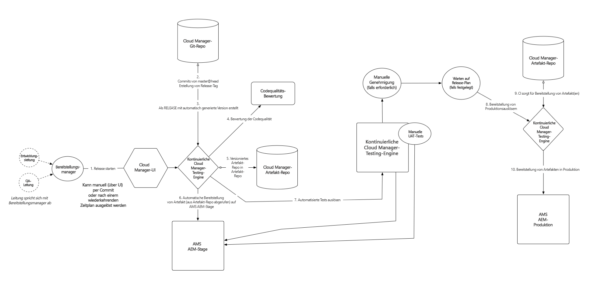

# Wissenswertes zu Konzepten vor Verwendung von Cloud Manager{#understanding-concepts-before-using-cloud-manager}

Dieser Abschnitt informiert über Konzepte und Begriffe, mit denen Sie sich vor der Arbeit mit Cloud Manager vertraut machen sollten, und behandelt die folgenden Themen:

* **Bereitstellungsumgebung**
* **Quellcode-Repository**
* **Sicherheit und Datenschutz**
* **Pipelineübersicht**
* **Hilfe-Ressourcen**

## Bereitstellungsumgebung {#deployment-environment}

Möglicherweise ist Adobe Experience Manager (AEM) 6.4 neu für Sie oder Sie benötigen eine Aktualisierung auf AEM 6.4.

Als neuer AEM 6.4-Kunde haben Sie bereits Zugriff auf Cloud Manager.

Wenn Sie Bestandskunde sind, müssen Sie auf AEM 6.4 aktualisieren, um Zugriff auf Cloud Manager zu erhalten. Sie können Cloud Manager verwenden, sobald Sie die URL und die Anmeldeinformationen von Ihren Customer Success Engineers (CSE) erhalten haben.

<!-- 

Comment Type: annotation
Last Modified By: ptager
Last Modified Date: 2018-05-02T17:19:24.147-0400

Section is redundant with the section in the Overview topic

 -->

## Quellcode-Repository {#source-code-repository}

**Mehrere Git-Server**: Manchmal verfügen Kunden bereits über ein vorhandenes Git-Repository, das sie weiterhin verwenden möchten.

In diesen Fällen können Sie die Git-Unterstützung für mehrere Remoterepositorys verwenden. Die tägliche Entwicklerarbeit erfolgt weiterhin in Ihrem Git-Repository. Wenn eine Bereitstellung gewünscht wird, können Sie den neuesten Code einfach per Push in das Cloud Manager-Git-Repository übertragen.

<!-- 

Comment Type: annotation
Last Modified By: ptager
Last Modified Date: 2018-05-02T17:20:46.002-0400

Looks like we lost some content, compared to the previous version

 -->

## Sicherheit und Datenschutz {#security-and-privacy}

<!-- 

Comment Type: annotation
Last Modified By: jsyal
Last Modified Date: 2018-04-21T02:38:21.417-0400

Query for Brad B.

 -->

## Pipelineübersicht {#pipeline-overview}

Cloud Manager unterstützt eine einzige Pipeline pro Programm (Definition oben), die Bereitstellungen für Staging und Produktion verarbeitet. ****

Die für Staging- und Produktionsbereitstellungen verwendete Git-Verzweigung ist der sogenannte Master.

>[!NOTE]
>
>Es empfiehlt sich, den Master als Git-Verzweigung für Staging und Produktion zu verwenden. Sie können aber auch eine beliebige Verzweigung beim Einrichten der Pipeline nutzen.

Der Prozess mit einer Pipeline wird unten dargestellt:

### Wissenswertes zum Ablauf {#understanding-the-flow}

Sie können die Pipeline in der Cloud Manager-UI über die Kachel [!UICONTROL Pipelineeinstellungen] konfigurieren.

Weitere Informationen finden Sie unter [Verwenden von Cloud Manager](hhttps://helpx.adobe.com/experience-manager/cloud-manager/using/using-cloud-manager.html).

Der Bereitstellungsmanager ist für die Einrichtung der Pipeline verantwortlich, d. h. für Folgendes:

* Zuweisen von Anwendungsverzweigungen
* Zuweisen von Bereitstellungsumgebungen
* Definieren von Testoptionen

Wählen Sie dabei zunächst eine Verzweigung aus dem Git-Repository aus. Definieren Sie als Nächstes den Auslöser zum Starten der Pipeline.

Danach können Sie die Parameter zur Steuerung der Produktionsbereitstellung definieren.

Schließlich können Sie die Leistungstestparameter konfigurieren.

>[!NOTE]
>
>Weitere Informationen zum Konfigurieren des Verhaltens und der Voreinstellungen für die Pipeline finden Sie unter [Verwenden von Cloud Manager](using-cloud-manager.md) im Abschnitt **Konfigurieren von Pipelines**.

### Hilfe-Ressourcen {#help-resources}

Wenden Sie sich an den Customer Success Engineer für Adobe Managed Services, um Unterstützung zu erhalten.

### Die nächsten Schritte {#the-next-steps}

Nun verfügen Sie über ein besseres Verständnis für die Cloud Manager-Konzepte.

Weitere Informationen zum Einrichten von Projekten, Umgebungen und Teams (Anwendern und Rollen) finden Sie unter [Einrichten allgemeiner Konfigurationen für Cloud Manager](setting-configurations-for-cloud-manager.md).
