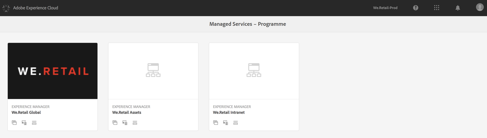
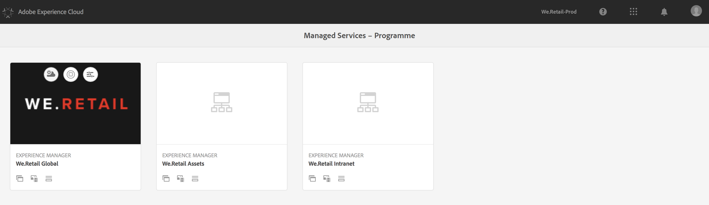
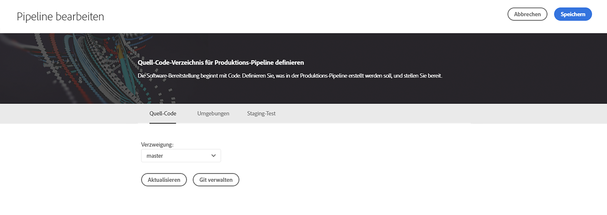
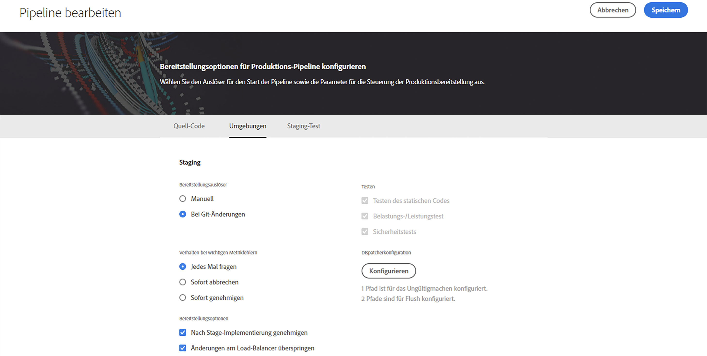
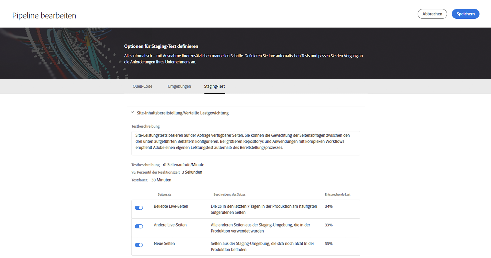
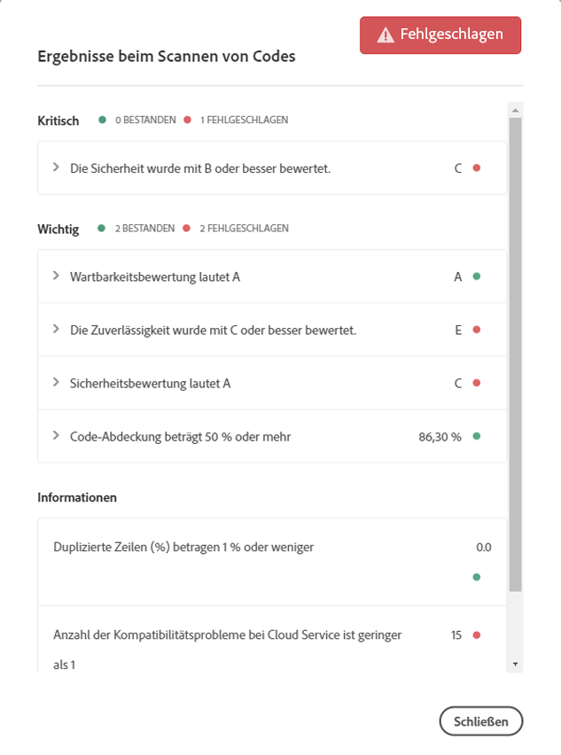
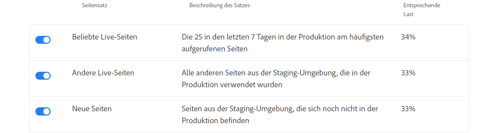

# Verwenden von Cloud Manager{#using-cloud-manager}

In diesem Abschnitt werden die Benutzeroberfläche von [!UICONTROL Cloud Manager] und der Workflow erläutert, angefangen bei der Programmeinrichtung über die Codebereitstellung bis hin zu Qualitätsprüfungen.

## Voraussetzungen {#prerequisites}

Bevor Sie sich mit den Details bei der Verwendung von [!UICONTROL Cloud Manager] befassen, sollten Sie sich mit den folgenden Abschnitten vertraut machen:

* [Wissenswertes zu Konzepten vor Verwendung von [!UICONTROL Cloud Manager]](understanding-concepts.md)
* [Einrichten allgemeiner Konfigurationen für [!UICONTROL Cloud Manager]](setting-configurations-for-cloud-manager.md)

## Erste Schritte mit [!UICONTROL Cloud Manager]{#getting-started-with-cloud-manager}

Sobald Sie die allgemeinen Konfigurationen für [!UICONTROL Cloud Manager] eingerichtet haben, können Sie [!UICONTROL Cloud Manager] verwenden.

1. Melden Sie sich bei Adobe [!UICONTROL Experience Cloud] an. Sie sehen eine Liste der verfügbaren Lösungen.

   

1. Wählen Sie das Programm aus und klicken Sie auf das Symbol oben links, um [!UICONTROL Cloud Manager] zu öffnen.

   

## Einrichten des Programms {#setting-up-program}

Nach dem Onboarding muss der Business Owner verschiedene Ersteinstellungen am Programm vornehmen. Hierzu gehören das Festlegen der Programmbeschreibung und das Definieren der für Leistungstests verwendeten KPIs. Optional kann eine Miniaturansicht hochgeladen werden.

Die definierten KPIs dienen als Grundlage für Leistungstests, die bei jeder Ausführung der Pipeline durchgeführt werden.

>[!NOTE]
>
>Die definierten KPIs werden durch Tests gemessen, die in der **Staging**-Umgebung ausgeführt werden. Normalerweise werden diese KPIs entsprechend den Funktionen der Staging-Umgebung herunterskaliert.
>
>Beispiel: Ein Anwender, der von durchschnittlich 1.000 Seitenaufrufen pro Minute in seiner Produktionsumgebung ausgeht und über vier `dispatcher/publish`-Server in der Produktion verfügt, sollte eine Skalierung auf 250 Seitenaufrufe pro Minute vornehmen (sofern seine Staging-Umgebung aus nur einem einzigen `dispatcher/publish`-Serverpaar besteht).
>
>Darüber hinaus verfügen viele Anwender über ein CDN (wie Akamai oder CloudFront), das ihrer Produktionsumgebung vorgeschaltet ist. Da [!UICONTROL Cloud Manager] direkt in Bezug zur Staging-Umgebung getestet wird, sollten die KPIs nur den erwarteten Traffic wiedergeben, der durch das CDN weitergeleitet wird, d. h. ohne Cache. In der Regel handelt es sich dabei um eine relativ kleine Teilmenge des gesamten Produktionstraffics.

### Definieren von KPIs mit [!UICONTROL Cloud Manager] {#using-cloud-manager-to-define-kpis}

Führen Sie die folgenden Schritte aus, um das Programm einzurichten und KPIs zu definieren:

1. Klicken Sie auf **Programm einrichten**, um den Einrichtungsprozess in [!UICONTROL Cloud Manager] zu starten.
1. Der Bildschirm **Programminformationen bearbeiten** wird angezeigt.

   Laden Sie eine Miniaturansicht in das Programm hoch. Sie können dem Programm auch eine aussagekräftige Beschreibung hinzufügen. Klicken Sie dann auf **Weiter**.

1. Der Bildschirm **Anwender konfigurieren** wird angezeigt.

   Sie können die Rollen und Anwender des Teams konfigurieren. Klicken Sie auf **Weiter**.

1. Der Bildschirm **Allgemeine Geschäfts-KPIs konfigurieren** wird angezeigt.

   Sie können zwei KPIs definieren (Erwartungen für jede Bereitstellung):

   1. Was ist das für Sie akzeptable 95. Perzentil der Reaktionszeit?

      1. Empfohlener Wert: 3 Sekunden
   1. Wie viele Seitenaufrufe pro Minute bei Spitzenlast?

      1. Empfohlener Wert: 200 Seitenaufrufe/Min.


1. Klicken Sie auf **Senden**, um den Einrichtungsassistenten abzuschließen.

   Der [!UICONTROL Cloud Manager]-Startbildschirm wird zum Bildschirm **Bereitstellen**.

## Verfügbare Umgebungen {#available-environments}

Die aufgeführten **verfügbaren Umgebungen** in [!UICONTROL Cloud Manager] entsprechen allen verwalteten AEM-Umgebungen.

Jeder der aufgelisteten Umgebungen ist ein Status zugeordnet.

## Konfigurieren von Pipelines {#configuring-pipeline}

### Einrichten von Pipelines {#setting-up-pipeline}

>[!CAUTION]
>
>Die Pipeline kann erst eingerichtet werden, wenn das Git-Repository mindestens eine Verzweigung aufweist.

Bevor Sie Code bereitstellen, müssen Sie Ihre Pipelineeinstellungen über [!UICONTROL Cloud Manager] konfigurieren.

Weitere Informationen zur Pipelinekonfiguration finden Sie unter [Wissenswertes zu Konzepten vor Verwendung von [!UICONTROL Cloud Manager]](understanding-concepts.md) im Abschnitt **Pipelineübersicht**.

>[!NOTE]
>
>Sie können die Pipelineeinstellungen nach der Ersteinrichtung ändern.

### Konfigurieren von Pipelineeinstellungen über [!UICONTROL Cloud Manager]{#configuring-pipeline-settings-from-the-cloud-manager}

Führen Sie die folgenden Schritte in [!UICONTROL Cloud Manager] aus, um Verhalten und Voreinstellungen für die Pipeline zu konfigurieren:

1. Auf der Registerkarte **Verzweigung** können Sie die Anwendungsverzweigung einrichten.

   Wählen Sie die einzurichtende Git-Verzweigung aus.

   >[!NOTE]
   >
   >Verzweigungen im Git-Repository sind mit Ihrem Programm verknüpft.

   

1. Wählen Sie auf der Registerkarte **Umgebungen** die Optionen **Phase** und **Produktion** aus.

   Sie können Auslöser zum Starten der Pipeline definieren:

   * **Manuell**: Ein Anwender muss manuell in der Benutzeroberfläche klicken, um die Pipeline zu starten.
   Jetzt definieren Sie die Parameter zur Steuerung der Produktionsbereitstellung. Die drei verfügbaren Optionen sind:

   * **GoLive-Genehmigung verwenden**: Für die Bereitstellung ist eine manuelle Genehmigung durch einen Geschäftsinhaber, einen Projektmanager oder Deployment Manager über die [!UICONTROL Cloud Manager]-Benutzeroberfläche erforderlich.
   * **CSE-Überwachung nutzen**: Ein CSE ist involviert, der die eigentliche Bereitstellung startet.
   

1. Definieren Sie auf der Registerkarte **Testen** Ihre Testkriterien für Ihr Programm.

   Jetzt können Sie die Leistungstestparameter konfigurieren.

   

## Bereitstellen von Code {#deploying-code}

Sobald Sie Ihre Pipeline (Repository, Umgebung und Testumgebung) konfiguriert haben, können Sie Ihren Code bereitstellen.

### Bereitstellen von Code mit [!UICONTROL Cloud Manager] {#deploying-code-from-cloud-manager}

Führen Sie die folgenden Schritte aus, um Code in der Produktionsumgebung bereitzustellen:

1. Klicken Sie in [!UICONTROL Cloud Manager] auf **Bereitstellen**, um den Bereitstellungsprozess zu starten.
1. Der Bildschirm **Staging-Bereitstellung** wird angezeigt.

   Klicken Sie auf **Erstellen**, um den Prozess zu starten.

1. Während des gesamten Buildprozesses werden verschiedene Parameter berücksichtigt, um den Code zu prüfen und bereitzustellen.

   Folgende Parameter werden überprüft:

   **Staging-Bereitstellung**

   * Repository
   * Unit-Tests
   * Codescans
   * In Staging-Umgebung bereitgestellt
   **Vorproduktionstests**

   * Sicherheitstests
   * Leistungstests
   >[!NOTE]
   >
   >Darüber hinaus können Sie Protokolle anzeigen oder Ergebnisse für die oben genannten Testkriterien überprüfen.

## Ergebnisse aus Qualitätsprüfungen {#results-from-quality-checks}

Es gibt drei Akzeptanztests in der Pipeline: Codequalität, Leistungstests und Sicherheitstests.

Für jeden dieser Akzeptanztests gibt es eine dreistufige Struktur für vom Test identifizierte Probleme.

* **Kritisch**: Hierbei handelt es sich um vom Test identifizierte Probleme, die zu einem sofortigen Pipelinefehler führen.
* **Wichtig**: Hierbei handelt es sich um vom Test identifizierte Probleme, durch die die Pipeline angehalten wird. Bereitstellungsmanager, Projektmanager oder Business Owner können die Probleme außer Kraft setzen. In diesem Fall wird die Pipeline fortgesetzt. Sie können die Probleme aber auch akzeptieren. In diesem Fall stoppt die Pipeline mit einem Fehler.
* **Info**: Hierbei handelt es sich um vom Test identifizierte Probleme, die ausschließlich zu Informationszwecken bereitgestellt werden und keine Auswirkungen auf die Pipelineausführung haben.

### Codescans {#code-scanning}



### Leistungstests {#performance-testing}

*Leistungstests* in [!UICONTROL Cloud Manager] werden mit einem 30-minütigen Test implementiert.

Während der Pipelineeinrichtung kann der Bereitstellungsmanager entscheiden, wie viel Traffic an jeden Bucket weitergeleitet werden soll. Es können ein bis drei Behälter ausgewählt werden. Die Verteilung des Traffics basiert auf der Anzahl der ausgewählten Buckets. Werden alle drei Buckets ausgewählt, gehen die Seitenaufrufe zu jeweils 33 % an die einzelnen Buckets. Werden zwei Buckets ausgewählt, wird 50 % des Traffics zwischen diesen beiden aufgeteilt. Wird ein Bucket ausgewählt, wird der Traffic zu 100 % an diesen weitergeleitet.

Nehmen wir beispielsweise Folgendes an: Der Traffic ist zu jeweils 50 % auf „Beliebte Live-Seiten“ und „Neue Seiten“ aufgeteilt (in diesem Beispiel wird „Andere Live-Seiten“ nicht verwendet) und der Satz „Neue Seiten“ umfasst 3.000 Seiten. Für Seitenaufrufe pro Minute ist ein Wert von 200 festgelegt. Für den 30-minütigen Testzeitraum gilt in diesem Fall:

* Jede der 25 Seiten im Satz „Beliebte Live-Seiten“ wird 240-mal aufgerufen – `((200 &#42; 0.5) / 25) &#42; 30 = 120`
* Jede der 3.000 Seiten im Satz „Neue Seiten“ wird einmal aufgerufen – `((200 &#42; 0.5) / 3000) &#42; 30 = 1`



### Leistungstestmetriken {#performance-test-metrics}

Während des Testzeitraums werden verschiedene Metriken erfasst und entweder mit den vom Business Owner definierten KPIs oder mit den von AMS festgelegten Standards verglichen.

Die entsprechende Berichterstattung erfolgt wie folgt über ein dreistufiges Akzeptanztestsystem:

### Dreistufige Akzeptanztests bei der Pipelineausführung {#three-tier-gates-while-running-a-pipeline}

Es gibt drei Akzeptanztests in der Pipeline: Codequalität, Leistungstests und Sicherheitstests.

Für jeden dieser Akzeptanztests gibt es eine dreistufige Struktur für vom Test identifizierte Probleme:

* **Kritisch**: Hierbei handelt es sich um vom Test identifizierte Probleme, die zu einem sofortigen Pipelinefehler führen.
* **Wichtig**: Hierbei handelt es sich um vom Test identifizierte Probleme, durch die die Pipeline angehalten wird. Bereitstellungsmanager, Projektmanager oder Business Owner können die Probleme außer Kraft setzen. In diesem Fall wird die Pipeline fortgesetzt. Sie können die Probleme aber auch akzeptieren. In diesem Fall stoppt die Pipeline mit einem Fehler.
* **Info**: Hierbei handelt es sich um vom Test identifizierte Probleme, die ausschließlich zu Informationszwecken bereitgestellt werden und keine Auswirkungen auf die Pipelineausführung haben.

In der folgenden Tabelle finden Sie eine Zusammenfassung der Leistungstestmatrix anhand des dreistufigen Gatingsystems:

| **Metrik** | **Kategorie** | **Fehlerschwellenwert** |
|---|---|---|
| Seitenanforderungsfehlerrate % | Kritisch | &gt;= 2% |
| CPU-Auslastungsrate | Kritisch | &gt;= 80% |
| Festplatten-I/O-Wartezeit | Kritisch | &gt;= 50% |
| 95. Perzentil der Reaktionszeit | Wichtig | &gt;= KPI auf Programmebene |
| Spitzenreaktionszeit | Wichtig | &gt;= 18 Sekunden |
| Seitenaufrufe pro Minute | Wichtig | &lt; KPI auf Programmebene |
| Festplatten-Bandbreitenauslastung | Wichtig | &gt;= 90% |
| Netzwerk-Bandbreitenauslastung | Wichtig | &gt;= 90% |
| Anforderungen pro Minute | Info | &lt; 6.000 |

### Sicherheitstests {#security-testing}

[!UICONTROL Cloud Manager] führt die vorhandenen *AEM-Sicherheits-Konsistenzprüfungen* beim Staging nach der Bereitstellung aus und meldet deren Status über die Benutzeroberfläche. Die Ergebnisse werden aus allen AEM-Instanzen in der Umgebung aggregiert.

Wenn eine der Instanzen einen Fehler bei einer bestimmten Konsistenzprüfung meldet, schlägt die Konsistenzprüfung für die gesamte Umgebung fehl. Wie Codequalitäts- und Leistungstests sind diese Konsistenzprüfungen in Kategorien unterteilt und die zugehörigen Berichte werden über das dreistufige Gatingsystem erstellt. Der einzige Unterschied besteht darin, dass im Falle von Sicherheitstests keine Schwellenwerte vorhanden sind. Alle Konsistenzprüfungen werden entweder bestanden oder schlagen fehl.

Derzeit sind folgende Prüfungen verfügbar:

| **Konsistenzprüfung** | **Kategorie** |
|---|---|
| Deserialisierungs-Firewall Attach API-fähig | Kritisch |
| Deserialisierungs-Firewall funktionsfähig | Kritisch |
| Deserialisierungs-Firewall geladen | Kritisch |
| Namenserstellung für autorisierbare Knoten | Kritisch |
| Standard-Anmeldekonten | Kritisch |
| Sling Get Servlet | Kritisch |
| CQ-Dispatcher-Konfiguration | Kritisch |
| Konfiguration des CQ-HTML-Bibliotheksmanagers | Kritisch |
| Sling Java Script Handler | Kritisch |
| Sling Jsp Script Handler | Kritisch |
| Sling Referrer-Filter | Kritisch |
| SSL-Konfiguration | Kritisch |
| Standardzugriff auf Benutzerprofil | Kritisch |
| CRXDE-Support | Wichtig |
| DavEx-Konsistenzprüfung | Wichtig |
| Pakete mit Beispielinhalt | Wichtig |
| WCM-Filterkonfiguration | Wichtig |
| WebDAV-Konsistenzprüfung | Wichtig |
| Webserver-Konfiguration | Wichtig |
| Benutzerreplikation und -transport | Info |

### Implementierung der Qualitätssicherung durch SonarQube {#quality-check-implementation-by-sonarqube}

Als Rahmen der Pipeline wird der Code, wie oben dargestellt, gescannt. Derzeit wird dies durch SonarQube implementiert. Wir verfügen über 93 Regeln, die eine Kombination aus generischen Java-Regeln und AEM-spezifischen Regeln darstellen (darunter sind einige aus dem vorhandenen Cognifide-Regelsatz). Eine Liste dieser Regeln finden Sie hier: [SonarQube-Regeln](assets/sonarqube-rules.xlsx).

Anhand dieser Regeln wird eine Vielzahl von Metriken berechnet. Einige fungieren dabei als Qualitätstest, bevor eine Bereitstellung in die Staging-Umgebung zugelassen wird.

Dies sind die aktuellen Schwellenwerte:

| Name | Definition | Kategorie | Fehlerschwellenwert |
|--- |--- |--- |--- |
| Sicherheitsbewertung | A = 0 Schwachstellen <br/>B = mindestens 1 kleinere Schwachstelle<br/> C = mindestens 1 größere Schwachstelle <br/>D = mindestens 1 kritische Schwachstelle <br/>E = mindestens 1 Schwachstelle der Kategorie „Blocker“ | Kritisch | &lt; B |
| Zuverlässigkeitsbewertung | A = 0 Fehler <br/>B = mindestens 1 kleinerer Fehler <br/>C = mindestens 1 größerer Fehler <br/>D = mindestens 1 kritischer Fehler E = mindestens 1 Fehler der Kategorie „Blocker“ | Wichtig | &lt; C |
| Wartbarkeitsbewertung | Wenn die ausstehenden Kosten zur Code-Smell-Behebung …<br/><ul><li>&lt; = 5% der Zeit, die bereits in der Anwendung aufgetreten ist, lautet die Bewertung A </li><li>zwischen 6 und 10 % dieser Zeit ausmachen, lautet die Bewertung B. </li><li>zwischen 11 und 20 % dieser Zeit ausmachen, lautet die Bewertung C. </li><li>zwischen 21 und 50 % dieser Zeit ausmachen, lautet die Bewertung D.</li><li>mehr als 50 % dieser Zeit ausmachen, lautet die Bewertung E.</li></ul> | Wichtig | &lt; A |
| Abdeckung | Mix aus Zeilen- und Bedingungsabdeckung mit dieser Formel: <br/>`Coverage = (CT + CF + LC)/(2*B + EL)`  <br/>Dabei gilt Folgendes: CT = Bedingungen, bei denen die Auswertung mindestens einmal „true“ ergeben hat <br/>CF = Bedingungen, bei denen die Auswertung mindestens einmal „false“ ergeben hat <br/>LC = abgedeckte Zeilen = abzudeckende_Zeilen - nicht_abgedeckte_Zeilen <br/><br/> B = Gesamtanzahl der Bedingungen <br/>EL = Gesamtzahl ausführbarer Zeilen (abzudeckende_Zeilen) | Wichtig | &lt; 50% |
| Übersprungene Unit-Tests | Zahl der übersprungenen Unit-Tests | Info | &gt; 1 |
| Offene Probleme | Allgemeine Problemtypen – Schwachstellen (Vulnerability), Fehler (Bug) und Code-Smells (Code Smell) | Info | &gt; 1 |
| Duplizierte Zeilen | Anzahl der Zeilen, die an duplizierten Blöcken beteiligt sind. <br/>Voraussetzungen, damit ein Codeblock als dupliziert gilt: <ul><li> **Nicht-Java-Projekte:**</li><li>Es sollte mindestens 100 aufeinanderfolgende und duplizierte Token geben.</li><li>Diese Token sollten sich mindestens wie folgt verteilen: </li><li>30 Codezeilen für COBOL </li><li>20 Codezeilen für ABAP </li><li>10 Codezeilen für andere Sprachen</li></ul><ul><li>**Java-Projekte:**</li><li> Unabhängig von der Anzahl der Token und Zeilen sollte es mindestens 10 aufeinanderfolgende und duplizierte Anweisungen geben.</li></ul>Unterschiede bei Einzügen sowie Zeichenfolgenliteralen werden beim Erkennen von Duplizierungen ignoriert. | Info | &gt; 1% |

### Falsch positive Werte {#false-positives}

Das Verfahren zur Qualitätsprüfung ist nicht perfekt. Mitunter werden fälschlicherweise Probleme identifiziert, die eigentlich nicht problematisch sind. Dies wird als *falsch positiv* bezeichnet (obwohl *falsch negativ* semantisch eigentlich korrekter wäre). In diesen Fällen kann der Quellcode mit der standardmäßigen `@SuppressWarnings`-Java-Anmerkung kommentiert werden. Dabei wird die Regel-ID als Anmerkungsattribut angegeben. Ein häufiges Problem besteht etwa darin, dass die SonarQube-Regel zur Erkennung hartcodierter Kennwörter in Bezug darauf, was ein hartcodiertes Kennwort ist, äußerst tolerant ist.

Sehen wir uns ein konkretes Beispiel mit Code an, der in AEM-Projekten relativ häufig vorkommt, wenn eine Verbindung zu einem externen Dienst hergestellt werden soll:

```java
@Property(label = "Service Password")
private static final String SERVICE_PASSWORD = "password";
```

SonarQube weist dann hier auf eine Schwachstelle der Kategorie „Blocker“ hin. In diesem Fall kann der Kunde erkennen, dass es sich nicht um eine Schwachstelle handelt, und dies mit der entsprechenden Regel-ID kommentieren:

```java
@SuppressWarnings("squid:S2068")
@Property(label = "Service Password")
private static final String SERVICE_PASSWORD = "password";
```

Aber was wäre bei diesem Code?

```java
@Property(label = "Service Password", value = "mysecretpassword")
private static final String SERVICE_PASSWORD = "password";
```

Dann sollte der Kunde die SonarQube-Warnung ernst nehmen und das hartcodierte Kennwort entfernen. Die `@SuppressWarnings`-Anmerkung muss dennoch hinzugefügt werden, da die SonarQube-Regel tatsächlich durch den Begriff `password` ausgelöst wird.

>[!NOTE]
>
>Obwohl sich möglichst spezifische `@SuppressWarnings`-Anmerkungen bewährt haben, also nur eine bestimmte Anweisung oder den Block zu kommentieren, der das Problem verursacht, können Anmerkungen auf Klassenebene hinzugefügt werden.

